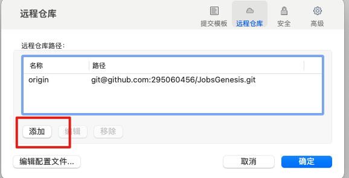
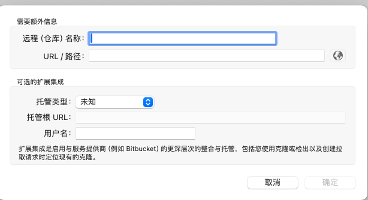

# Git的一些使用说明

[toc]

## 一、实操案例

### 1、同一个文件夹（文件内容相同），但是来自于2个不同的远程仓库

* <font color=red>**fatal: refusing to merge unrelated histories**</font> 表明正在尝试**合并两个没有共同提交历史的分支**

  * 要解决这个问题，你可以使用 `--allow-unrelated-histories` 选项来强制 Git 合并这两个独立的历史记录

    ```shell
    git --no-optional-locks -c color.branch=false -c color.diff=false -c color.status=false -c diff.mnemonicprefix=false -c core.quotepath=false -c credential.helper=sourcetree fetch Jobs.Office 
    From https://git.betzz.cc/fm_ios/fm.ios
     * [new branch]      main       -> Jobs.Office/main
    
    
    git --no-optional-locks -c color.branch=false -c color.diff=false -c color.status=false -c diff.mnemonicprefix=false -c core.quotepath=false -c credential.helper=sourcetree pull --commit --rebase=false Jobs.Office main 
    From https://git.betzz.cc/fm_ios/fm.ios
     * branch            main       -> FETCH_HEAD
    fatal: refusing to merge unrelated histories
    Completed with errors, see above
    ```

  * 分支分叉的问题。Git 需要指定如何合并分支

    ```shell
    Last login: Wed Jul 17 10:27:35 on ttys000
    ➜  Desktop /Users/user/Desktop/q 
    ➜  q git:(main) git pull Jobs.Office main --allow-unrelated-histories
    
    From https://git.betzz.cc/fm_ios/fm.ios
     * branch            main       -> FETCH_HEAD
    hint: You have divergent branches and need to specify how to reconcile them.
    hint: You can do so by running one of the following commands sometime before
    hint: your next pull:
    hint: 
    hint:   git config pull.rebase false  # merge
    hint:   git config pull.rebase true   # rebase
    hint:   git config pull.ff only       # fast-forward only
    hint: 
    hint: You can replace "git config" with "git config --global" to set a default
    hint: preference for all repositories. You can also pass --rebase, --no-rebase,
    hint: or --ff-only on the command line to override the configured default per
    hint: invocation.
    fatal: Need to specify how to reconcile divergent branches.
    ```

#### 1.1、自动合并

* 设置（本地仓库）合并策略为 merge

  ```shell
  git config pull.rebase false
  ```

  或者

  设置（全局所有仓库）合并策略为 merge

  ```shell
  git config --global pull.rebase false
  ```

* ```shell
  git pull Jobs.Office main --allow-unrelated-histories
  ```

#### 1.2、手动合并

* ```shell
  git fetch Jobs.Office
  ```

* ```shell
  git merge Jobs.Office/main --allow-unrelated-histories
  ```


#### 1.3、如果有冲突，解决冲突

```shell
git add .
git commit -m "Resolve merge conflicts"
```

#### 1.4、同步远程仓库

 ```shell
 git push Office main
 ```

### 2、总结

* 远程空仓库有2种方式：

  * （直接推送）直接本地获取到仓库地址，直接本地发起push同步。**如果本地仓库是新创建的，那么之前的远程的历史记录将不会存在**

    * 更适合于：

      * 新创建的本地仓库准备推送到一个空的远程仓库

      * 已有完整代码的本地仓库初次设置远程仓库地址并进行首次推送

  * （先拉取再推送）远程仓库pull以后，本地同步以后，再同步远程仓库

    * 更适合于：
      * 需要确保本地仓库和远程仓库一致性
      * 多人协作开发的项目，确保所有开发者都能获取最新的远程仓库状态
      * 需要保留和获取远程仓库的完整历史记录和分支信息

* 即便是文件内容一致，也需要进行同步（分支等）

* 上述问题是因为虽然本地文件和远程仓库文件一致（没有什么需要合并的冲突），仅仅是**没有共同提交历史**

* <font color =red>**如果是远程仓库已经存在代码，需要和本地仓库进行匹配，就会遇到上述问题**</font>

* 如果是远程仓库为新建的空仓库，那么可以本地通过配置git.config的方式进行（`.git`是隐藏文件夹）

  

  * 或者通过第三方的git.GUI软件，进行添加设置（这里以**sourcetree**为例）

  

  

  

## 二、什么是变基（rebase）

* 变基（rebase）是 Git 中的一种操作，用于在改变分支基础（即分支的起点）的同时，将提交历史重新应用到新的基础上

* 变基的主要作用是使提交历史更加线性和整洁，特别是在处理分支合并和多分支协作时

### 1、变基的基本概念

假设我们有以下提交历史：

```markdown
A---B---C---D  (main)
     \
      E---F---G  (feature)
```

如果我们想将 `feature` 分支变基到 `main` 分支的最新提交（即 `D`），可以使用以下命令：

```shell
git checkout feature
git rebase main
```

变基操作会重新应用 `feature` 分支上的提交（E、F、G），使它们基于 `main` 分支的最新提交（D），结果如下：

```markdown
A---B---C---D  (main)
              \
               E'---F'---G'  (feature)
```

### 2、变基的优点

* **保持提交历史线性**：变基可以消除合并提交，使历史记录看起来更加整洁和直观
* **简化日志查看**：线性的提交历史使 `git log` 更容易阅读和理解
* **冲突处理集中**：变基过程中处理冲突一次性解决，而不是在合并时处理多次冲突

### 3、变基的缺点

* **改变提交哈希**：由于变基重新应用提交，原有提交（E、F、G）的哈希会改变。这意味着变基后的提交（E'、F'、G'）和原来的提交是不同的
* **协作冲突**：如果变基的分支已经被推送到远程仓库，其他开发者基于这些提交工作后进行变基，可能会引起混乱和冲突
* **不可逆性**：变基操作对历史进行了重写，尤其在共享分支上使用时，需要特别小心

### 4、变基的用法

* **变基到另一个分支：**

  ```shell
  git checkout feature
  git rebase main
  ```

* **交互式变基（修改、重排、合并提交）：**

  ```shell
  git rebase -i main
  ```

  使用交互式变基可以更精细地控制每个提交的变基过程。

* **解决冲突后继续变基：** 如果变基过程中发生冲突，可以手动解决冲突，然后使用以下命令继续变基

  ```shell
  git rebase --continue
  ```

* **中止变基：** 如果变基过程中遇到问题，想要取消变基，可以使用：

  ```shell
  git rebase --abort
  ```

## 三、遴选（cherry-pick）

* `git cherry-pick` 是 Git 中的一条命令，用于将某个（或多个）特定提交的更改从一个分支复制到另一个分支
* 与普通的合并或变基操作不同，`cherry-pick` 是选择性地提取单个提交
* 这在需要将某些特定更改应用到另一个分支时非常有用，而不必合并整个分支的所有更改

### 1、基本用法

* 假设我们有以下提交历史：

  ```markdown
  A---B---C---D  (main)
       \
        E---F---G  (feature)
  ```

* 现在，我们想把 `feature` 分支上的提交 `F` 应用到 `main` 分支上。我们可以使用 `git cherry-pick` 来完成这个操作

  #### 1.1、操作步骤

  * **切换到目标分支**（即你希望将提交应用到的分支）：

    ```shell
    git checkout main
    ```

  * **执行 cherry-pick 命令**，将特定提交应用到当前分支：

    ```shell
    git cherry-pick <commit-hash>
    ```

    在这个例子中，如果我们要将 `F` 提交应用到 `main` 分支，我们可以这样做：

    ```shell
    git cherry-pick <hash-of-F>
    ```

  #### 1.2、示例

  * 假设我们有如下的提交历史，并且提交 `F` 的哈希是 `abc123`：

    ```shell
    git checkout main
    git cherry-pick abc123
    ```

  * 执行完上述命令后，`main` 分支的提交历史将变为：

    ```markdown
    A---B---C---D---F  (main)
         \
          E---F---G  (feature)
    ```

  * ```shell
    git add <resolved-files>
    git cherry-pick --continue
    ```

  #### 1.3、解决冲突

  * 如果在执行 `cherry-pick` 时遇到冲突，Git 会暂停操作并提示你解决冲突。你需要手动解决冲突，然后使用以下命令继续：

    ```shell
    git add <resolved-files>
    git cherry-pick --continue
    ```

  * 如果你想中止 `cherry-pick` 操作，可以使用：

    ```shell
    git cherry-pick --abort
    ```

  #### 1.4、批量 Cherry-Pick

  * 可以一次性 `cherry-pick` 多个提交，使用以下命令：

    ```shell
    git cherry-pick <commit-hash-1> <commit-hash-2> ...
    ```

    或者使用提交范围：这将 `cherry-pick` 从 `start-commit-hash` 之后到 `end-commit-hash` 的所有提交。

    ```shell
    git cherry-pick <start-commit-hash>..<end-commit-hash>
    ```

  #### 1.5、注意事项

  * **提交历史变更**：`cherry-pick` 会创建新的提交，并且新提交的哈希与原来的不同
  * **适用于单独更改**：当你只需要将某些特定更改应用到另一个分支时，`cherry-pick` 非常有用。如果需要合并整个分支的更改，使用 `merge` 或 `rebase` 可能更合适
  * **冲突风险**：与所有涉及代码合并的操作一样，`cherry-pick` 也可能导致冲突，特别是在目标分支有不同更改的情况下
  * `git cherry-pick` 是一个强大的工具，允许你选择性地将特定提交从一个分支复制到另一个分支。它在处理特定修复、功能或更改时非常有用，但在使用时需要注意冲突和提交历史的变更

## 四、Git的配置文件`config`

* Git 的配置文件 `.git/config` 存储了关于该仓库的配置信息

* 该文件是纯文本文件，使用 INI 格式

* ```ini
  [core]
  	repositoryformatversion = 0
  	filemode = true
  	bare = false
  	logallrefupdates = true
  	ignorecase = true
  	precomposeunicode = true
  [remote "origin"]
  	url = git@github.com:295060456/JobsOCBaseConfig.git
  	fetch = +refs/heads/*:refs/remotes/origin/*
  [branch "main"]
  	remote = origin
  	merge = refs/heads/main
  ```

  * `[core]` 部分包含了一些核心配置选项，这些选项影响 Git 的基本行为
    * **repositoryformatversion**: 指定仓库的格式版本。默认值是 0
    * **filemode**: 指示 Git 是否追踪文件的可执行权限（即是否追踪文件的权限变化）。如果设置为 `true`，Git 会记录文件权限的变化
    * 表示该仓库是否是裸仓库。裸仓库是没有工作目录的仓库，通常用于远程存储
    * **logallrefupdates**: 如果设置为 `true`，Git 会记录所有引用（refs）的更新情况
    * **ignorecase**: 表示是否忽略文件名的大小写。在不区分大小写的文件系统上应设置为 `true`
    * **precomposeunicode**: 在 MacOS 上，用于处理 Unicode 正规化问题。设置为 `true` 以解决文件名在不同环境下显示不一致的问题
  * `[remote]` 部分定义了远程仓库的信息。可以有多个 `[remote "<name>"]` 部分来定义多个远程仓库
    * **url**: 远程仓库的 URL 地址
    * **fetch**: 指定从远程仓库拉取哪些引用（refs）。`+refs/heads/*:refs/remotes/<remote>/*` 表示**拉取所有分支并在本地创建相应的远程跟踪分支**
  * `[branch]` 部分定义了分支的配置信息，主要包括跟踪的远程分支
    * **remote**: 指定分支关联的远程仓库名
    * **merge**: 指定分支关联的远程分支。当执行 `git pull` 或 `git merge` 时，会合并此远程分支的更改


