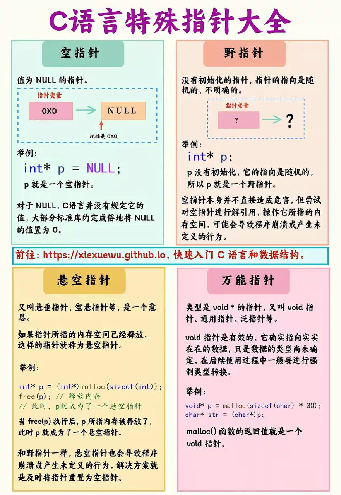
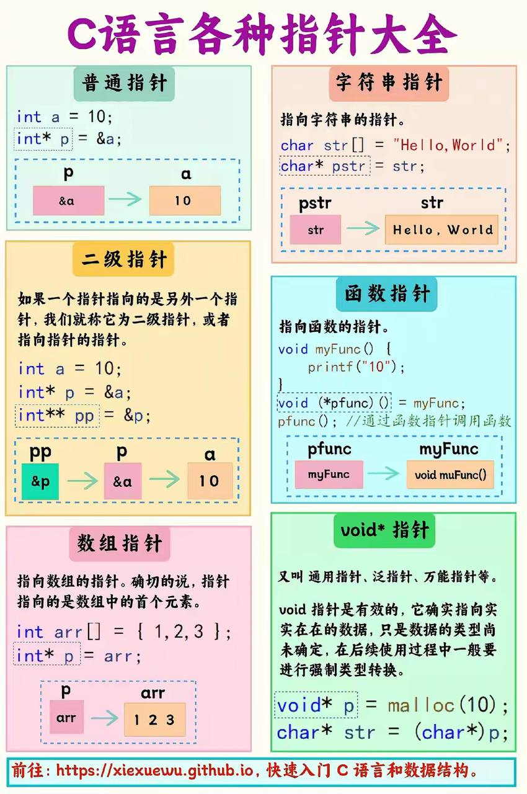

# OC相关经验

[toc]





## <font color="red">***内存分布***</font>

```
 低地址
 +------------------+
 | 代码段 (Text)    |
 +------------------+
 | 数据段 (Data)    |
 +------------------+
 | BSS 段           |
 +------------------+
 | 堆 (Heap)        |  <-- 向高地址增长
 +------------------+
 | 栈 (Stack)       |  <-- 向低地址增长
 +------------------+
 高地址
```

## <font color="red">***atomic/nonatomic***</font>

* 在 iOS 和 Objective-C 中，原子属性（atomic property） 是 @property 的一种属性修饰符，它决定了属性的线程安全性。如果声明为 atomic，编译器会为这个属性的 getter 和 setter 方法生成某种程度的线程安全代码，确保在多线程访问时，属性的值总是返回一个完整的对象。
* 原子属性的特点：
  *  默认行为：如果你不显式声明 nonatomic，@property 默认是 atomic。
  *  线程安全：对于 atomic 的属性，编译器在生成的 getter 和 setter 方法中会使用锁（类似自旋锁或其他锁机制）来确保值的完整性。例如，在 getter 方法中，即使有其他线程正在修改属性值，也不会返回一个“半成品”对象。
  *  影响性能：因为 atomic 属性需要加锁和解锁操作，所以性能比 nonatomic 稍差。尤其是在频繁访问属性时，可能会成为性能瓶颈。
  * 保证的是“值完整性”，而不是“业务逻辑完整性”：atomic 只保证 getter 和 setter 的操作是线程安全的，但不保证多线程间的操作逻辑是安全的。例如，多个线程同时修改属性值时，仍可能产生竞争条件。
* 为什么实际开发中常用 nonatomic？
  * 性能需求：在大多数应用场景下，性能优先于线程安全，尤其是在频繁访问的属性上。相比之下，nonatomic 不会进行加锁操作，性能更高。
  * 线程安全通常由其他机制保证：应用通常通过更高级的同步机制（如 GCD、锁）来保证线程安全，而不是依赖于属性的 atomic。
  * atomic 不完全保证线程安全： 即使使用 atomic，多线程操作仍然可能引发逻辑问题，例如读写操作之间的竞态条件。所以需要额外的同步控制。
* 总结
  * atomic 属性是线程安全的，但在实际开发中很少使用，因为其性能开销较高，而且它并不能解决所有线程安全问题。
  * 开发中推荐使用 nonatomic，同时通过其他手段（如 GCD 或 NSLock）来实现真正的线程安全。 

## <font color="red">***strong/copy***</font>

* 只有对不可变对象进行copy操作是指针复制（浅复制），其它情况都是内容复制（深复制）！

* 使用 `copy` 关键字可以防止对象值的意外修改

  ```objective-c
  #import <Foundation/Foundation.h>
  
  @interface MyClass : NSObject
    
  @property (nonatomic,strong)NSString *strongString;
  @property (nonatomic,copy)NSString *copyString;
  
  @end
  
  @implementation MyClass
  @end
  
  int main(int argc, const char * argv[]) {
      @autoreleasepool {
          NSMutableString *mutableStr = [NSMutableString stringWithString:@"初始值"];
        
          MyClass *obj = [[MyClass alloc] init];
          obj.strongString = mutableStr; // 使用 strong 属性赋值
          obj.copyString = mutableStr;   // 使用 copy 属性赋值
          
          NSLog(@"修改前 - strongString: %@, copyString: %@", obj.strongString, obj.copyString);
          
          // 修改原来的 mutableStr 的值
          [mutableStr appendString:@" - 修改后"];
          
          NSLog(@"修改后 - strongString: %@, copyString: %@", obj.strongString, obj.copyString);
      }return 0;
  }
  ```

  ```
  修改前 - strongString: 初始值, copyString: 初始值
  修改后 - strongString: 初始值 - 修改后, copyString: 初始值
  
  如果用 strong，会有可能意外地共享同一个可变对象，导致外部修改影响到内部数据。
  使用 copy 则确保即使传入的是一个可变对象，属性也只会保留一个不可变的副本，从而避免了这种不确定性。
  ```

## <font color="red">***OC/C.Block***</font>

* ***Block* 的捕获变量：** 当一个 *Block* 被创建时，它会捕获在其内部使用的外部变量。  
  
  * **对于局部变量，*Block* 会在创建时将其复制一份，然后在 *Block* 内部使用。**如果 *Block* 在定义时没有修改该变量，那么这个变量的值在 *Block* 内部是不可变的。这被称为值捕获（*Value Capture*），捕获的变量可以是局部变量或全局变量；
  ```objective-c
  // 定义一个Block
  typedef void (^SimpleBlock)(void);
  
  int main() {
      // 定义一个局部变量
      __block int count = 0;
      // 定义一个Block，并在Block内部使用count变量
      SimpleBlock block = ^{
          NSLog(@"Count inside block: %d", count);
      };
      // 修改count的值
      count = 10;
      // 调用Block
      block(); // 这里的count值在Block内部被捕获，即使count在Block定义之后被修改，但值仍然被捕获
      return 0;
  }
  // 输出将会是：
  Count inside block: 10
  
  /**
  在这个例子中，Block捕获了count变量的值，即使在Block定义之后count的值被修改，Block内部仍然使用了最初捕获的值。
  */
  ```
  * **对于全局变量，*block* 会直接引用其内存地址，而不会复制**；
  
* **`__block` 修饰符**
  
  * 当需要在 *Block* 内部修改局部变量的值时，需要使用 `__block` 修饰符来声明该变量。这样，在 *Block* 内部就可以通过引用来修改外部变量的值；
  * <font color="red">***使用 `__block` 修饰的变量在 Block 内部会被包装为一个结构体，这个结构体中包含了一个指向原始变量的指针。这样 Block 内部就可以通过这个指针来修改变量的值，而不会影响到原始变量的值；***</font>
  
* ❤️**Block 的存储**
  * *Block* 是一个**对象**，它在***[堆](# 堆(Heap))上分配***内存；
  * 当一个 *Block* 捕获了一个 `__block` 修饰的变量时，*Block* 不会直接捕获这个变量的值，而是**捕获了一个指向变量的指针**；
  * 当 *Block* 在创建时，会检查其所引用的外部变量，如果有被 `__block` 修饰的变量， *Block*将这些变量的地址包装到一个结构体中，然后将这个结构体的指针传递给 *Block*；
  
* <font color="red">当在 Block 内部使用 `self` 进行弱引用处理（使用 `__weak` 关键字修饰）</font>

  * 在内存中，`self` 会被作为一个弱引用存储在[堆](# 堆(Heap))上；
  * 具体来说，编译器会生成一个指向 `self` 的弱引用；**这个弱引用不会增加 `self` 的引用计数，也不会阻止 `self` 被释放**。如果 `self` 被释放后，这个弱引用会被自动置为 nil，以避免访问已释放的对象而导致的崩溃；
  * 实际上，当 *Block* 内部访问 `self` 时，会首先检查这个弱引用是否有效（即是否为 nil）。如果有效，则可以继续访问 `self`；如果无效，则说明 `self` 已经被释放，这时候访问 `self` 将不会引发野指针访问错误，而是返回 nil 或者执行一些安全的默认行为，这取决于具体的上下文和实现。
  
* <font color=red>**不可以和属性合用**</font>：因为它与**Objective-C**的内存管理和属性访问语义不兼容

  * **内存管理问题**：`__block`变量会在**block**中被捕获，并且在不同的上下文中可能会被不同的内存管理规则处理（特别是在ARC模式下）。这与属性的内存管理（`strong`、`weak`等）会产生冲突。
  * **访问方法**：属性在**Objective-C**中通过`getter`和`setter`方法访问。使用`__block`修饰符会绕过这些访问方法，直接操作实例变量，破坏了属性的封装性和一致性。

* <font color=red>Block属性化可以用**assign**修饰，但是最好用**copy**</font>

  * 举例：`MJRefreshConfigModel` 是通过分类挂载的，`loadBlock`是它的一个属性。当在其他地方取值的时候，如果是**assign**修饰，会崩溃

    ```objective-c
    @property(nonatomic,copy)JobsReturnIDByIDBlock loadBlock;
    ```

  * 原因：<u>可能这个Block是栈Block</u>

    * **内存管理：** 使用 `copy` 修饰符可以确保在设置 block 属性时，会将 block 复制到堆上，而不是简单地引用。这样可以避免在 block 在栈上分配时出现内存管理问题。
    * **生命周期管理：** 通过使用 `copy` 修饰符，可以保证 block 在被设置到属性时会被正确地复制，并且 block 的生命周期会由属性拥有。这有助于避免在 block 离开作用域后访问悬垂指针的问题。
    * **避免竞态条件：** 使用 `copy` 修饰符可以防止其他对象修改 block 的实现。如果使用 `assign` 修饰符，其他对象可以更改 block 的实现，可能导致不可预测的行为。
    * **保持语义一致性：** 使用 `copy` 修饰符是 Objective-C 中处理 block 属性的常见做法，符合语义和惯例。这样做也有助于代码的可读性和维护性。

* 同理，<font color=red>属性化的`NSString *`可以用**assign**修饰，但是最好用**copy**</font>

  * 原因：
    * **不可变性保护：** 使用 `copy` 可以确保传入一个可变字符串时，属性会复制为不可变字符串，从而防止不可预料的修改。
    * **防止悬垂指针：** 通过使用 `copy`，可以避免在字符串被修改或释放后访问悬垂指针的问题，从而提高代码的安全性。
    * **线程安全：** `NSString` 是不可变类，所以使用 `copy` 不会引发性能问题，并且能够增加线程安全性。
    * **语义一致性：** 在 Objective-C 中，属性化的字符串通常使用 `copy` 修饰符，这符合通用惯例，有助于维持代码的一致性和可读性。

## 固态硬盘可以替代内存进行工作吗？

* 结论
  * <font color=red>**固态硬盘（SSD）不能完全替代内存（RAM）进行工作，但在某些特定情况下，SSD可以用来扩展或补充内存**</font>
* 访问速度
  * **RAM**：内存是非常快的存储介质，提供<u>纳秒级</u>的访问时间，是CPU进行高速数据访问和处理的主要存储器。
  * **SSD**：固态硬盘虽然比传统机械硬盘（HDD）快得多，但其访问时间仍然在<u>微秒级</u>，比RAM慢很多。
* **虚拟内存**：当系统内存不足时，操作系统会将一些不常用的数据从内存转移到SSD上的虚拟内存（或交换空间），这样可以释放内存空间给当前需要的任务。虽然这样可以在内存不足时防止系统崩溃，但由于SSD比RAM慢得多，性能会受到影响
  * Windows操作系统使用分页文件（page file）来管理虚拟内存，可以在系统设置中配置分页文件的大小和位置
  * Linux使用交换空间（swap space）来管理虚拟内存。交换空间可以是一个专用的分区或一个文件
* 其他
  * 由于SSD的速度比RAM慢得多，**使用虚拟内存会导致系统性能下降**
  * **SSD有写入寿命限制**，频繁使用虚拟内存可能会加速SSD的磨损

## 数组指针 和 指针数组

* <font color=red>**数组指针（Pointer to Array）**</font>

  * <u>本质是指针</u>

  * 是指向整个数组的指针

  * 示例

    * ```c
      #include <stdio.h>
      
      int main() {
          int arr[10];
          /// int 表示数组的元素类型是整数。
          /// (*p) 表示 p 是一个指针。
          /// [10] 表示数组的大小是10。
          int (*p)[10] = &arr;
      
          for(int i = 0; i < 10; i++) {
              (*p)[i] = i; // 使用数组指针访问数组元素
          }
      
          for(int i = 0; i < 10; i++) {
              printf("%d ", (*p)[i]);
          }return 0;
      }
      ```

* 指针数组（Array of Pointers）

  * <u>本质是数组</u>

  * 是一个数组，其中的每个元素都是指针

  * 示例

    * ```c
      #include <stdio.h>
      
      int main() {
          int a = 1, b = 2, c = 3;
          /// int * 表示数组的元素是指向整数的指针。
      		/// p[3] 表示数组的大小是3。
          int *p[3];
      
          p[0] = &a;
          p[1] = &b;
          p[2] = &c;
      
          for(int i = 0; i < 3; i++) {
              printf("%d ", *p[i]); // 使用指针数组访问变量的值
          }return 0;
      }
      ```


## 锁

* 互斥锁（Mutex, Mutual Exclusion Lock）：
  * 互斥锁是一种基本的锁，用于确保一次只有一个线程可以访问某资源。
  * 如果一个线程获得了锁，其他线程必须等待锁被释放。

* 读写锁（Read-Write Lock）：
  * 读写锁允许多个线程同时读取，但写操作是排他的，即在写操作进行时，其他读线程或写线程都要等待。

* 递归锁（Recursive Lock）： 
  * 允许同一线程多次加锁，而不会导致死锁。
  * 递归锁对某些场景很有用，比如在递归函数中使用锁。

* 自旋锁（Spin Lock）：
  * 自旋锁是轻量级锁，如果锁被占用，线程不会立即挂起，而是会不断尝试获取锁。
  * 自旋锁适合加锁时间非常短的场景，因为线程在等待时不会切换上下文，效率更高。

## OC里面有没有类似于Java里面的`linkedhashset`的东西

* 在Objective-C中，没有直接类似于Java中*LinkedHashSet*的数据结构；
* 但是，你可以使用*NSOrderedSet*，它是一个有序不可变集合，保留了元素的插入顺序；
* 如果你需要可变版本，可以使用*NSMutableOrderedSet*。这不同于*LinkedHashSet*，但提供了一种有序且不包含重复元素的选择；

## 可能会存在属性没有对应的 `getter` 和 `setter` 方法的情况

* 一个例子是使用 `@dynamic` 关键字来声明属性。在使用 Core Data 框架或者实现了自定义的动态属性存取方法时，你可能会使用 `@dynamic` 来告诉编译器，该属性的 `getter` 和 `setter` 方法由运行时或其他方式动态生成，而不是在编译时静态声明。
* 另一个例子是在 Objective-C 中使用[**关联对象（Associated Objects）**](# OC.AssociatedObjects（关联对象）)。关联对象允许你向已有的类中添加属性，而无需修改类的源代码。这种情况下，你可能不会显式地声明属性的 getter 和 setter 方法，而是通过关联对象来存取属性值。

## ***OC.AssociatedObjects（关联对象）***

* Swift是没有关联对象：因为 Swift 不直接继承自 Objective-C 的运行时机制；
* 允许你向已有的类中添加属性，而无需修改类的源代码；
* 依赖于 Objective-C 运行时机制；
* 可以动态地将一个对象与一个 key 关联起来，然后可以在运行时根据这个 key 来获取或设置关联的对象；**根据key来进行值存取，如果key不是全局唯一，就会出现异常；**
* 基本数据类型，需要包装成NSNumber进行存储
* 关联对象***不会影响类的继承体系***，也***不会改变类的实例变量***，而是将额外的数据***存储在一个全局的关联表***中；
  * 导入 `<objc/runtime.h>` 头文件；
  * 创建一个 key，作为关联对象的唯一标识符。这个 key 是一个静态变量，通常是一个唯一的地址，你可以使用 `static` 关键字来定义；
  * 使用 `objc_setAssociatedObject` 函数将对象与 key 关联起来，并设置关联的策略（如 `OBJC_ASSOCIATION_RETAIN` 或 `OBJC_ASSOCIATION_ASSIGN`）以及要关联的对象；
  * 使用 `objc_getAssociatedObject` 函数根据 key 获取关联的对象；
  * 如果需要，使用 `objc_removeAssociatedObjects` 函数来移除与对象相关的所有关联对象；

***对Block*** <font color="red">存取策略：`OBJC_ASSOCIATION_COPY_NONATOMIC`</font>

```objective-c
#import <Foundation/Foundation.h>
#import <objc/runtime.h>

@interface NSNotificationCenter (JobsBlock)
@property(nonatomic,copy)void (^jobsNotificationBlock)(NSNotification *notification);
@end
  
@implementation NSNotificationCenter (JobsBlock)

-(void (^)(NSNotification *))jobsNotificationBlock {
    return objc_getAssociatedObject(self, _cmd);
}

-(void)setJobsNotificationBlock:(void (^)(NSNotification *))jobsNotificationBlock {
    objc_setAssociatedObject(self,
                             _cmd,
                             jobsNotificationBlock,
                             OBJC_ASSOCIATION_COPY_NONATOMIC);
}

@end
```

***对方法*** *方法用`NSStringFromSelector`包装成字符串对象进行存取。* <font color="red">存取策略：`OBJC_ASSOCIATION_COPY_NONATOMIC`</font>

```objective-c
#import <Foundation/Foundation.h>
#import <objc/runtime.h>

@interface UIViewController (BaseVC)
@property(nonatomic,assign)SEL selector;
@end

@implementation UIViewController (BaseVC)

static char *UIViewController_BaseVC_selector = "UIViewController_BaseVC_selector";

- (SEL)selector {
    return objc_getAssociatedObject(self, UIViewController_BaseVC_selector);
}

- (void)setSelector:(SEL)selector {
    objc_setAssociatedObject(self, UIViewController_BaseVC_selector, NSStringFromSelector(selector), OBJC_ASSOCIATION_COPY_NONATOMIC);
}

@end
```

***对基本数据类型*** *需要封装成NSNumber对象进行存取* <font color="red">存取策略：`OBJC_ASSOCIATION_RETAIN_NONATOMIC`</font>

```objective-c
#import <Foundation/Foundation.h>
#import <objc/runtime.h>

@interface UIViewController (BaseVC)
@property(nonatomic,assign)BOOL setupNavigationBarHidden;
@end

@implementation UIViewController (BaseVC)

static char *UIViewController_BaseVC_setupNavigationBarHidden = "UIViewController_BaseVC_setupNavigationBarHidden";
@dynamic setupNavigationBarHidden;
#pragma mark —— @property(nonatomic,assign)BOOL setupNavigationBarHidden;
-(BOOL)setupNavigationBarHidden{
    BOOL SetupNavigationBarHidden = [objc_getAssociatedObject(self, UIViewController_BaseVC_setupNavigationBarHidden) boolValue];
    return SetupNavigationBarHidden;
}

-(void)setSetupNavigationBarHidden:(BOOL)setupNavigationBarHidden{
    objc_setAssociatedObject(self,
                             UIViewController_BaseVC_setupNavigationBarHidden,
                             [NSNumber numberWithBool:setupNavigationBarHidden],
                             OBJC_ASSOCIATION_RETAIN_NONATOMIC);
}

@end
```

***对结构体属性*** *需要`NSValue`来进行包装* <font color="red">存取策略：`OBJC_ASSOCIATION_RETAIN_NONATOMIC`</font>

```objective-c
#import <Foundation/Foundation.h>
#import <objc/runtime.h>

@interface UIViewController (BaseVC)
@property(nonatomic,assign)CGRect rect;
@property(nonatomic,assign)CGPoint point;
@end

@implementation UIViewController (BaseVC)

static char *UIViewController_BaseVC_rect = "UIViewController_BaseVC_rect";
static char *UIViewController_BaseVC_point = "UIViewController_BaseVC_point";

- (CGRect)rect {
    NSValue *value = objc_getAssociatedObject(self, UIViewController_BaseVC_rect);
    return [value CGRectValue];
}

- (void)setRect:(CGRect)rect {
    NSValue *value = [NSValue valueWithCGRect:rect];
    objc_setAssociatedObject(self, UIViewController_BaseVC_rect, value, OBJC_ASSOCIATION_RETAIN_NONATOMIC);
}

- (CGPoint)point {
    NSValue *value = objc_getAssociatedObject(self, UIViewController_BaseVC_point);
    return [value CGPointValue];
}

- (void)setPoint:(CGPoint)point {
    NSValue *value = [NSValue valueWithCGPoint:point];
    objc_setAssociatedObject(self, UIViewController_BaseVC_point, value, OBJC_ASSOCIATION_RETAIN_NONATOMIC);
}

@end
```

***对一般的对象*** <font color="red">存取策略：`OBJC_ASSOCIATION_RETAIN_NONATOMIC`</font>

```objective-c
#import <Foundation/Foundation.h>
#import <objc/runtime.h>

@interface UIViewController (BaseVC)
@property(nonatomic,strong)UIBarButtonItem *backBtnCategoryItem;
@end

@implementation UIViewController (BaseVC)

static char *BaseVC_BackBtn_backBtnCategoryItem = "BaseVC_BackBtn_backBtnCategoryItem";
@dynamic backBtnCategoryItem;
#pragma mark —— @property(nonatomic,strong)UIBarButtonItem *backBtnCategoryItem;
-(UIBarButtonItem *)backBtnCategoryItem{
    UIBarButtonItem *BackBtnCategoryItem = objc_getAssociatedObject(self, BaseVC_BackBtn_backBtnCategoryItem);
    if (!BackBtnCategoryItem) {
        BackBtnCategoryItem = [UIBarButtonItem.alloc initWithCustomView:self.backBtnCategory];
        [self setBackBtnCategoryItem:BackBtnCategoryItem];
    }return BackBtnCategoryItem;
}

-(void)setBackBtnCategoryItem:(UIBarButtonItem *)backBtnCategoryItem{
    objc_setAssociatedObject(self,
                             BaseVC_BackBtn_backBtnCategoryItem,
                             backBtnCategoryItem,
                             OBJC_ASSOCIATION_RETAIN_NONATOMIC);
}

@end
```

## ViewController的11个生命周期（按照执行顺序排列）

* initWithCoder：通过nib文件初始化时触发。
* awakeFromNib：nib文件被加载的时候，会发生一个awakeFromNib的消息到nib文件中的每个对象。
* loadView：开始加载视图控制器自带的view。
* viewDidLoad：视图控制器的view被加载完成。
* viewWillAppear：视图控制器的view将要显示在window上。
* updateViewConstraints：视图控制器的view开始更新AutoLayout约束。
* viewWillLayoutSubviews：视图控制器的view将要更新内容视图的位置。
* viewDidLayoutSubviews：视图控制器的view已经更新视图的位置。
* viewDidAppear：视图控制器的view已经展示到window上。
* viewWillDisappear：视图控制器的view将要从window上消失。
* viewDidDisappear：视图控制器的view已经从window上消失。

## KVC 和 KVO

### KVC（<font color="red">***K***</font>ey-<font color="red">***V***</font>alue <font color="red">***C***</font>oding）：**键值**<font color="red">存储</font>

* 通过key->对象属性。不需要通过`set/get`方法；
* KVC 和 KVO 的 keyPath 可以是属性、实例变量、成员变量；
* 对于支持 KVC 的对象，可以通过 `setValue:forKey:` 和 `valueForKey:` 等方法来设置和获取属性值；
* KVC 在实现**数据绑定**、**序列化**和其他一些需要**动态地访问属性**的场景中非常有用；
* KVC的底层实现：当一个对象调用setValue方法时，方法内部会做以下操作👇🏻
  * 检查是否存在相应的key的set方法，如果存在，就调用set方法；
  * 如果set方法不存在，就会查找与key相同名称并且带下划线的成员变量，如果有，则直接给成员变量属性赋值；
  * 如果没有找到_key，就会查找相同名称的属性key，如果有就直接赋值；
  * 如果还没有找到，则调用valueForUndefinedKey:和setValue:forUndefinedKey:方法；
  * 这些方法的默认实现都是抛出异常，我们可以根据需要重写它们。
* 也有一些特殊情况下的对象不支持 KVC。例如：
  * 未定义键的属性：如果[***一个属性没有对应的 `getter` 和 `setter` 方法***](# 可能会存在属性没有对应的 `getter` 和 `setter` 方法的情况)，或者不符合 KVC 的命名规范，那么该属性就不支持 KVC。

### KVO（<font color="red">***K***</font>ey-<font color="red">***V***</font>alue <font color="red">***O***</font>bserving）：**属性**<font color="red">观察</font>

* KVO 是一种**观察者模式**的实现，它**允许一个对象（非类）监听另一个对象的属性的变化**；
* KVO只能被KVC触发，包括使用`setValue:forKey:`方法和点语法；
* 不是所有的类都支持KVO：
  * ***类必须直接或间接地继承自NSObject（即，类必须实例为对象）***：这是因为KVO是基于OC.runtime系统的，它利用了OC的动态特性来观察对象属性的变化；一个常见的反例是 Core Graphics（Quartz）框架中的许多类型，如 CGPoint、CGSize、CGRect 等。这些类型是 C 语言结构体，而不是 OC 对象，因此它们不继承自 NSObject，并且不支持 KVO。
  * ***被观察的属性必须是对象的属性，而非标量类型***（例如int、float等）；
  * ***被观察的属性必须使用属性访问器方法***（通常是`set/get`方法），***而不是直接访问实例变量***；
* 当被监听对象的某个属性发生变化时，注册了观察者的对象会收到通知，从而可以采取相应的操作；
* KVO的使用步骤：
  * 先注册观察者
  * 实现相应的观察方法
  * 当被观察的属性值变化时，观察者对象的观察方法会被调用
* 对于 KVO 来说，被观察的属性必须符合一定的**命名规范**，通常以 `@property` 定义的属性都可以被观察；
```
1、KVO 和 KVC 在实际开发中经常一起结合使用，以实现对对象属性的动态访问和监听；
2、这两个特性能够使得代码更加灵活，同时也方便了数据模型和视图之间的通信；
3、在实际应用中，需要注意使用 KVO 和 KVC 时的内存管理和性能问题，以确保应用的稳定性和性能优化；
```
### KVO相应的观察方法
**`observeValueForKeyPath:ofObject:change:context:`**

- 这是 [***KVO***](# KVO（<font color="red">***K***</font>ey-<font color="red">***V***</font>alue <font color="red">***O***</font>bserving）：**属性观察) 观察者对象必须实现的方法之一；
- 当被观察对象的属性值发生变化时，系统会调用这个方法，并传递一些参数，包括被观察的属性的键路径、被观察的对象、属性的改变信息以及上下文信息；
- 观察者对象在实现这个方法时，可以根据传递的信息执行相应的操作，比如更新 UI、处理数据等；
- 观察者对象应该在不需要监听属性变化时取消观察，以防止悬挂指针或野指针的问题；
  * 在观察者对象的 `dealloc` 方法中，需要调用 `removeObserver:forKeyPath:` 或 `removeObserver:forKeyPath:context:` 方法来移除观察者
```objective-c
#import <Foundation/Foundation.h>

@interface MyObject : NSObject
@property (nonatomic, strong) NSString *name;
@end

@implementation MyObject
@end

@interface Observer : NSObject
@end

@implementation Observer
- (instancetype)init {
    if (self = [super init]) {
        MyObject *obj = MyObject.new;
        // 添加观察者
        [obj addObserver:self 
              forKeyPath:@"name"
                 options:NSKeyValueObservingOptionNew | NSKeyValueObservingOptionOld context:nil];
        // 修改属性值
        obj.name = @"New Name";
    }return self;
}
// 实现观察者的回调方法
- (void)observeValueForKeyPath:(NSString *)keyPath ofObject:(id)object change:(NSDictionary<NS
```
### KVC 和 KVO的相互调用问题

#### <font color="red">***在使用KVC的时候会使用的KVO吗？***</font>

* 虽然在使用 [***KVC***](# KVC（<font color="red">***K***</font>ey-<font color="red">***V***</font>alue <font color="red">***C***</font>oding）：**键值存储)时不会直接用到 [***KVO***](# KVO（<font color="red">***K***</font>ey-<font color="red">***V***</font>alue <font color="red">***O***</font>bserving）：**属性观察) ，但是它们通常会**结合使用**。特别是在设计模式中的 MVC（Model-View-Controller）中：
  * Model 层通常会**负责存储应用程序的数据**，并且可能会实现 [***KVC***](# KVC（<font color="red">***K***</font>ey-<font color="red">***V***</font>alue <font color="red">***C***</font>oding）：**键值存储)，以便其他部分可以通过键路径来访问和修改这些数据；
  * 而 View 层通常**负责显示数据**，并且可能会观察（通过  [***KVO***](# KVO（<font color="red">***K***</font>ey-<font color="red">***V***</font>alue <font color="red">***O***</font>bserving）：**属性观察) ）Model 层的一些属性，以便在数据发生变化时更新界面；
  * Controller 层则充当了**数据的处理和业务逻辑的中介**；
* 在这种情况下，当 Model 层的属性通过 [***KVC***](# KVC（<font color="red">***K***</font>ey-<font color="red">***V***</font>alue <font color="red">***C***</font>oding）：**键值存储) 进行更改时，View 层可能会通过  [***KVO***](# KVO（<font color="red">***K***</font>ey-<font color="red">***V***</font>alue <font color="red">***O***</font>bserving）：**属性观察)  接收到通知，并相应地更新界面。因此，尽管在直接的语法上并不会在使用 KVC 时调用  [***KVO***](# KVO（<font color="red">***K***</font>ey-<font color="red">***V***</font>alue <font color="red">***O***</font>bserving）：**属性观察)  的方法，但在应用程序的整体架构中，它们往往是相辅相成的；

#### <font color="red">***在使用KVO的时候会使用的KVC吗？***</font>

* 在使用[***KVO***](# KVO（<font color="red">***K***</font>ey-<font color="red">***V***</font>alue <font color="red">***O***</font>bserving）：**属性观察) 时，通常不会直接使用 [***KVC***](# KVC（<font color="red">***K***</font>ey-<font color="red">***V***</font>alue <font color="red">***C***</font>oding）：**键值存储)，因为**它们是两个独立的特性**。然而，在某些情况下，它们**可能会间接地结合使用**；
  * **注册观察者时的键路径**： 在注册观察者时，需要提供要观察的属性的键路径。这个键路径通常是通过 [***KVC***](# KVC（<font color="red">***K***</font>ey-<font color="red">***V***</font>alue <font color="red">***C***</font>oding）：**键值存储) 的方式指定的，因为它需要准确地指定被观察属性的路径;
  ```objective-c
  [object addObserver:self 
          forKeyPath:@"propertyName" 
          options:NSKeyValueObservingOptionNew 
          context:nil];
  ```
  * **观察者获取属性值**： 在观察者对象中，当收到属性变化的通知时，可能会使用  [***KVC***](# KVC（<font color="red">***K***</font>ey-<font color="red">***V***</font>alue <font color="red">***C***</font>oding）：**键值存储) 来获取被观察对象的属性值;
  ```objective-c
  - (void)observeValueForKeyPath:(NSString *)keyPath
          ofObject:(id)object 
          change:(NSDictionary *)change 
          context:(void *)context {
      if ([keyPath isEqualToString:@"propertyName"]) {
          id newValue = [object valueForKey:@"propertyName"];
          // 处理属性变化后的操作
      }
  }
  ```
    虽然**在实现** [***KVO***](# KVO（<font color="red">***K***</font>ey-<font color="red">***V***</font>alue <font color="red">***O***</font>bserving）：**属性观察)  **时可能会涉及到使用**  [***KVC***](# KVC（<font color="red">***K***</font>ey-<font color="red">***V***</font>alue <font color="red">***C***</font>oding）：**键值存储)  **来指定属性路径和获取属性值**，但是它们本质上是两个不同的概念。 [***KVO***](# KVO（<font color="red">***K***</font>ey-<font color="red">***V***</font>alue <font color="red">***O***</font>bserving）：**属性观察)  是一种观察者模式，用于监听对象属性的变化，而 [***KVC***](# KVC（<font color="red">***K***</font>ey-<font color="red">***V***</font>alue <font color="red">***C***</font>oding）：**键值存储) 则是<u>一种机制</u>，用于通过键（key）来访问对象的属性。
## MVP

* MVP（**M**odel-**V**iew-**P**resenter）模式是一种软件架构模式，用于设计和组织用户界面（UI）代码；
* 它是**基于MVC**（**M**odel-**V**iew-**C**ontroller）模式的变种，***旨在解决 MVC 模式中 Controller 过于臃肿和难以测试的问题***；
* 在 MVP 模式中，UI 层被分为三个主要组件：
  * **Model（模型）**：Model 表示应用程序的数据和业务逻辑。它独立于 UI 和 Presenter，并**负责处理数据的获取、存储和处理**；
  * **View（视图）**：View 是用户界面的可视化部分，负责呈现数据给用户并接收用户的输入操作。View 应该尽量减少业务逻辑，并且**只负责 UI 的展示**；
  * **Presenter（呈现者）**：Presenter 充当了*** View 和 Model 之间的中介***，负责协调用户界面和数据之间的交互。它接收来自 View 的用户输入，并根据需要更新 Model。同时，它也监听 Model 的变化，并相应地更新 View。**Presenter 通常包含了大部分业务逻辑**；
* MVP 模式的主要思想是***将 UI 逻辑从 View 中抽离出来，并将其交给 Presenter 处理***；
  * 这样可以使得 UI 更加简洁；
  * 可测试性更强；
  * 同时也降低了代码的耦合度，使得代码更易于维护和扩展；
* MVP 缺点：
  * **视图和 Presenter 之间的绑定**：视图和 Presenter 之间的交互通常需要通过接口或回调来实现，这会增加一些额外的代码和复杂性；
  * **繁琐**：相比于 MVVM，MVP 中需要手动进行数据绑定，因此可能会显得更加繁琐；
## MVP vs MVVM
````
MVP（Model-View-Presenter）和 MVVM（Model-View-ViewModel）都是常见的软件架构模式，用于设计和组织用户界面（UI）代码。
它们各有优缺点，适用于不同的项目和场景，没有绝对的优劣之分，取决于项目需求和团队偏好。
````
* ***MVP的优点***
  * **清晰分离**：MVP 将用户界面、业务逻辑和数据分离得很清晰，每个组件的职责明确，易于理解和维护；
  * **测试容易**：Presenter 包含了大部分业务逻辑，因此很容易进行单元测试，而且可以独立于 UI 进行测试；
  * **灵活性**：MVP 可以很容易地在不同平台上重用业务逻辑，因为它们与特定的 UI 框架无关；
* ***MVP的缺点***
  * **视图和 Presenter 之间的绑定**：视图和 Presenter 之间的交互通常需要通过接口或回调来实现，这会增加一些额外的代码和复杂性；
  * **繁琐**：相比于 MVVM，MVP 中需要手动进行数据绑定，因此可能会显得更加繁琐；
* ***MVVM的优点***
  * **双向数据绑定**：MVVM 提供了**双向数据绑定**，当数据模型变化时，视图会自动更新，反之亦然，减少了手动更新视图的工作量；
  * **简化视图代码**：由于数据绑定的存在，视图中通常不需要包含大量的逻辑，使得视图代码更加简洁；
  * **可测试性**：ViewModel 中的业务逻辑可以很容易地进行单元测试，因为它们不依赖于 UI 框架；
* ***MVVM的缺点***
  * **学习曲线**：MVVM 模式相对于 MVP 来说，对于新手可能会有一定的学习曲线，尤其是在理解和使用数据绑定的概念上；
  * **框架依赖**：MVVM 通常依赖于特定的框架或库来实现数据绑定，因此可能会增加项目的依赖性。
```
MVP 适合需要更加灵活和可测试的项目，而 MVVM 则适合需要简化视图代码和数据绑定的项目
```
## 字符是由ASCII码一一对应的。那么在内存里面，是如何与整型（Int）进行区分的？
* 在内存中，字符和整数（包括 ASCII 码对应的整数）在**存储和表示上通常是不同的**；
* 在计算机中，每个数据类型都有一定的存储大小和表示方式；
  * **字符 (Character):** 在许多编程语言中，字符通常是使用 Unicode 编码表示的。在Swift中，字符类型是 `Character`，它使用 Unicode 标量来表示字符。Unicode 标量是一个唯一的整数值，用于表示字符在 Unicode 编码中的位置；
  * **整数 (Integer):** 整数是表示整数数字的数据类型。在Swift中，整数类型包括 `Int`、`UInt`、`Int8`、`Int16`、`Int32`、`Int64` 等，它们有不同的大小和符号性质；
* ASCII 码是一种字符编码方案，其中每个字符都被映射到一个整数值。ASCII 码通常使用 `Int` 或其等效的整数类型来表示；
* 在内存中，这两者的存储方式是不同的。***字符通常需要更多的存储空间，因为它们可能涉及 Unicode 编码和支持更广泛的字符集***；
*以下是一个简单的Swift示例，演示了字符和整数在内存中的不同表示：*
```swift
let char: Character = "A"
let asciiValue = char.asciiValue  // 获取字符的ASCII码

let integer: Int = 65  // 整数表示ASCII码

print("Character '\(char)' 在内存中的表示为: \(MemoryLayout.size(ofValue: char)) 字节")
print("整数 \(integer) 在内存中的表示为: \(MemoryLayout.size(ofValue: integer)) 字节")
```
请注意，这只是一个简单的示例，实际上内存中的表示和存储还涉及到字节顺序、对齐等因素，具体取决于编程语言和编译器的实现。
## ASCII码在内存里是用数字表示，但如果一个纯数字在内存怎么表示呢？会不会和ASCII码冲突？
* ASCII码是一种将字符映射到数字的编码方式，而数字本身在内存中以二进制形式表示；
* ASCII码通常用一个字节（8位）来表示，而纯数字也是以二进制形式存储；
* 在内存中，ASCII码和纯数字是以不同的二进制序列表示的，因此它们不会冲突；
## 结构体
* 在大多数编程语言中，结构体的成员会按照声明的顺序依次存储在内存中，这使得结构体的**内存布局是连续的**；
* 结构体通常存放在程序的**数据区域**，这包括栈内存或堆内存，具体取决于结构体是通过值传递还是引用传递；
  * 如果结构体是通过**值传递**，它通常会存储在**调用栈**上；
  * 而如果通过**引用传递**，它可能存储在**堆**上，并且引用传递时通常使用指针；
* 结构体的数据对齐是编译器为了提高存储和访问效率而进行的一种优化；
  * 在结构体中，各个成员的内存对齐**可能会受到硬件架构和编译器的影响**；
  * 一般而言，编译器会***尽量使结构体的起始地址是其最大基本数据类型成员大小的整数倍***
  ```c
  struct Example {
      char a;    // 1字节
      int b;     // 4字节
      double c;  // 8字节
  };
  在这个例子中，编译器可能会在char a后面填充3字节，使得int b从4字节对齐，double c从8字节对齐。这有助于提高结构体在内存中的访问效率。
  可以使用编译器特定的指令或者预处理器指令（例如#pragma pack）来改变结构体的对齐方式，但这样的改变可能会影响性能。
  通常情况下，由编译器自动进行的数据对齐足够满足大多数情况的需求。
  ```
## 雪花算法（Snowflake）
* 雪花算法（Snowflake）是一种分布式唯一ID生成算法；
* 最初**由Twitter开发**用于**生成全局唯一的ID**；
* 它的设计目标是在分布式系统中生成趋势递增且具有唯一性的ID，以便于在分布式环境下准确地排序和定位数据；
* 雪花算法的核心思想是***将64位的ID按照一定规则进行拆分，使得每一部分都可以确保唯一性和递增性，从而保证生成的ID在分布式环境中不会发生冲突，并且能够按照时间顺序进行排序***；
* 雪花算法（Snowflake）算法的ID通常包含以下几个部分：
  * **时间戳（Timestamp）**：占用了64位中的一部分，通常是毫秒级的时间戳，可以精确到毫秒级别；
  * **机器ID**：用来标识不同的机器，确保不同机器生成的ID不会发生冲突。在一些实现中，这个部分通常包括了数据中心ID和机器ID；
  * **序列号（Sequence Number）**：用来解决同一毫秒内生成多个ID时的冲突问题。序列号占用了一定的位数，可以确保在同一毫秒内生成的ID在机器ID相同的情况下是唯一的；
* 10位的机器ID可以表示的不同节点数量为2的10次方，即1024。因此，在雪花算法中，**系统可以容纳最多1024个不同的节点（机器）**，每个节点都被分配一个唯一的10位机器ID。这确保了在同一时间内，最多有1024个不同的节点可以生成唯一的ID，防止ID冲突；
## 计算机内存是怎么去表示浮点数的
* 计算机内存使用**IEEE 754标准**来表示浮点数；
* 这标准规定了浮点数的存储方式，包括单精度（32位）和双精度（64位）两种格式；
  * 单精度浮点数的结构存储为：1位符号位 + 8位指数部分 + 23位尾数部分
  * 双精度浮点数的存储结构为：1位符号位 + 11位指数部分 + 52位尾数部分
  * 这种存储方式允许计算机在有限的内存中表示广泛的浮点数值，并提供了一种平衡精度和存储空间的方法；
* 浮点数通常由三部分组成：符号位、指数部分和尾数部分；
  * 符号位表示正负；
  * 指数部分用于表示数的大小；
  * 尾数部分则包含数值的有效数字；
## IPv6
* IPv6地址空间更大，为128位，这使得有更多的地址组合。
* IPv6中的端口号仍然是16位，因此有2^16（65536）个可能的端口号。
* 与IPv4不同的是，**IPv6不需要像IPv4一样分出专门的私有地址范围**，因为IPv6的地址空间足够大，**允许每个设备都有一个全局唯一的地址**。
* 总的IPv6地址-端口对数目：2<sup>128</sup> x 2<sup>16</sup> = 2<sup>144</sup>  **这是IPv6网络中可能的唯一的地址-端口对的总数**
**与IPv4相比，IPv6具有更大的地址空间和端口数目，而且IPv6中没有像IPv4那样需要特别保留的地址范围，因此它实际上提供了更多的灵活性。**
## 一个IP能有多少个端口
* 每个IPv4地址有**65535**个端口，而每个IPv6地址有2^16次方（约**65,536**）个端口；
  * 0到1023是***系统保留端口***；
  * 1024到49151是***注册端口***；
  * 49152到65535是***动态或私有端口***；
* 端口的使用是通过网络协议来管理的，典型的例子是TCP和UDP；
## int *p = &a
* 这行代码是在C或C++中声明了一个整数指针变量 `p`，并将其初始化为变量 `a` 的地址；
* `&a` 表示取变量 `a` 的地址，然后将这个地址赋给指针变量 `p`；
* 这样，`p` 就指向了变量 `a` 的位置，可以通过 `p` 来访问和操作变量 `a`；
* `int *p` 表示 `p` 是一个整数指针，可以用来存储整数变量的地址；
* 整数指针是指一个指针，其目标是整数类型的变量
## 哈希表（Hash Table）的本质

* 一种数据结构；
* 本质是通过将键（key）映射到一个确定的位置（”哈希桶”或“槽位”）来实现高效的数据存储和检索；
  * **快速查找**：哈希表可以在平均情况下以常量时间复杂度（O(1)）进行查找、插入和删除操作。这是因为哈希函数将键转换成一个固定长度的值，使得每个键都有一个确定的位置，从而可以直接在该位置进行操作；
  * **均匀分布**：良好设计的哈希函数可以使键在哈希表中均匀分布，尽量减少哈希冲突的发生。哈希冲突是指不同的键经过哈希函数后映射到了同一个桶中，解决冲突的方法通常包括链地址法和开放地址法等；
  * **灵活性**：哈希表适用于各种类型的数据，可以存储键值对、对象等各种形式的数据；
  * **空间效率**：尽管哈希表可能会消耗一定的内存空间，但在大多数情况下，哈希表的空间效率是很高的，尤其是在数据量较大时；

## *OC*.非正式协议

是一种约定，用于描述类的方法，***但不要求实现特定的接口或遵循特定的协议***。它允许类在不采用正式协议的情况下，<u>***通过向类添加方法来实现特定功能***</u>。非正式协议在OC 中是一种**常见的设计模式**，特别是在框架和库中。它们使得代码更加灵活，允许开发者通过遵循约定而不是强制性接口来实现特定功能。非正式协议的特点包括：

* 没有明确的接口：与正式协议不同，非正式协议没有明确定义的接口或者协议声明。它仅仅是一组方法的约定。

* 通过类别添加方法：在***OC***中，可以通过类别（Category）的方式向现有的类添加方法。非正式协议通常通过类别来实现，以为类添加特定功能。

* 提供功能性约定：非正式协议提供了一种方式，允许多个类共享相同的方法集合，以实现类似的功能，而无需继承自同一个基类或者实现同一个正式协议。

* 灵活性和简洁性：非正式协议具有很高的灵活性，可以根据需要随时添加新的方法。它们通常用于描述一组相关的行为，而不是完整的类接口。

* ```
  一个常见的非正式协议的例子是 UITableViewDelegate 和 UITableViewDataSource 协议。这两个协议用于定义 UITableView 的行为和数据源，但它们并没有在 OC 中以正式的协议声明的形式存在。
  
  通常情况下，我们不需要显式地声明类符合 UITableViewDelegate 或 UITableViewDataSource 协议，而是在类的实现中直接实现对应的方法。这些方法包括 tableView:numberOfRowsInSection:、tableView:cellForRowAtIndexPath:、tableView:didSelectRowAtIndexPath: 等等。
  
  虽然这些协议没有以正式的方式声明，但是它们仍然是一种非正式的协议，因为它们约定了一组方法，用于与 UITableView 进行交互。开发者可以选择性地实现这些方法，以定制 UITableView 的行为和外观，而无需显式地声明遵循某个协议。
  
  这种非正式的协议使得 UITableView 可以更加灵活地适应不同的使用场景，同时也简化了开发者的代码编写。
  ```

## <font color="red">***OC和JS交互***</font>

* 通常情况下是通过**字符串**进行交流
* **JavaScriptCore 框架:**允许在 *OC* 或 *Swift* 代码中执行 *JavaScript* 代码，**并且还可以在 *JavaScript* 和 *OC/Swift*之间进行对象的相互转换。**
```objective-c
// 引入 JavaScriptCore 框架
#import <JavaScriptCore/JavaScriptCore.h>
// 创建一个 JavaScriptContext 对象
JSContext *context = JSContext.new;
// 定义 JavaScript 函数
NSString *jsCode = @"function add(x, y) { return x + y; }";
[context evaluateScript:jsCode];
// 调用 JavaScript 函数
JSValue *addFunction = context[@"add"];
JSValue *result = [addFunction callWithArguments:@[@10, @20]];
// 获取结果
NSInteger sum = [result toInt32];
NSLog(@"Sum: %ld", (long)sum); // 输出: Sum: 30
```
* **WKScriptMessageHandler**
```objective-c
// ViewController.m

#import "ViewController.h"
#import <WebKit/WebKit.h>

@interface ViewController () <WKNavigationDelegate,WKUIDelegate,WKScriptMessageHandler>
@property (nonatomic, strong) WKWebView *webView;
@end

@implementation ViewController

- (void)viewDidLoad {
    [super viewDidLoad];
    // 创建 WKWebView
    WKWebViewConfiguration *configuration = WKWebViewConfiguration.new;
    // 添加消息处理程序
    [configuration.userContentController addScriptMessageHandler:self name:@"myHandler"];
    
    self.webView = [WKWebView.alloc initWithFrame:self.view.bounds configuration:configuration];
    self.webView.navigationDelegate = self;
    self.webView.UIDelegate = self;
    [self.view addSubview:self.webView];
    
    NSString *htmlPath = [NSBundle.mainBundle pathForResource:@"index" ofType:@"html"];
    NSString *htmlString = [NSString stringWithContentsOfFile:htmlPath
                                                     encoding:NSUTF8StringEncoding
                                                        error:nil];
    [self.webView loadHTMLString:htmlString baseURL:nil];
  
    // OC 调用 JS
    [self.webView.configuration.userContentController addScriptMessageHandler:self // 消息处理程序对象，一般是遵循 WKScriptMessageHandler 协议的 Objective-C 对象
                         																							   name:@"myHandler"];// 消息的名称或标识符，用于区分不同类型的消息
}
// JS 调用 OC
- (void)userContentController:(WKUserContentController *)userContentController 
      didReceiveScriptMessage:(WKScriptMessage *)message{
        
    NSString *messageBody = (NSString *)message.body;
    NSLog(@"Received message from JavaScript: %@", messageBody);
    // 在这里处理 JavaScript 发送过来的消息
}

@end
```
```html
<!-- index.html -->

<!DOCTYPE html>
<html lang="en">
<head>
    <meta charset="UTF-8">
    <meta name="viewport" content="width=device-width, initial-scale=1.0">
    <title>JavaScript Objective-C Interactions</title>
</head>
<body>
    <h1>JavaScript Objective-C Interactions</h1>
    
    <button onclick="sendMessageToObjC()">Send Message to Objective-C</button>
    
    <script>
        function sendMessageToObjC() {
            var message = "Hello from JavaScript!";
            window.webkit.messageHandlers.myHandler.postMessage(message);// 关键代码：向 Objective-C 发送消息
        }
    </script>
</body>
</html>
```
## ***OC.依赖注入***

<font color="red">***在 Objective-C 中，虽然没有像一些现代语言（如Java、C#、Swift等）中那样内置的依赖注入容器，但仍然可以手动实现依赖注入模式。***</font>
***Logger.h：***

```objective-c
#import <Foundation/Foundation.h>

@interface Logger : NSObject
- (void)log:(NSString *)message;
@end
```
***Logger.m：***
```objective-c
#import "Logger.h"

@implementation Logger
- (void)log:(NSString *)message {
    NSLog(@"%@", message);
}
@end
```
***UserService.h：***
```objective-c
#import <Foundation/Foundation.h>
#import "Logger.h"

@interface UserService : NSObject

@property(nonatomic, strong) Logger *logger;
- (instancetype)initWithLogger:(Logger *)logger;
- (void)doSomething;

@end
```
***UserService.m：***
```objective-c
#import "UserService.h"

@implementation UserService
- (instancetype)initWithLogger:(Logger *)logger {
    if (self = [super init]) {
        self.logger = logger;
    }return self;
}

- (void)doSomething {
    // 使用依赖注入的 Logger 对象记录日志
    [self.logger log:@"Something is done in UserService"];
}
@end
```
<span style="color:Blue; font-weight:bold;">***在这个示例中，`UserService` 类在构造函数中接受一个 `Logger` 对象作为参数，然后将其存储在实例变量中。这样，调用 `UserService` 的代码可以提供自己的 `Logger` 实例，从而实现了依赖注入。***</font>
## 函数（方法）签名
* 指函数的声明或定义，其中包含了***函数的名称***、***参数列表***和***返回类型***；
  * **函数名称：** 函数的标识符，用于唯一标识函数；
  * **参数列表：**包含函数接受的参数及其类型。参数列表可以为空，也可以包含一个或多个参数，每个参数包含参数名称和类型。在函数签名中，参数列表的顺序和参数类型是非常重要的，它们决定了函数调用时传递参数的方式；形参的顺序不会影响方法签名的确定。
  * **返回类型：** 指定函数执行完成后返回的值的类型。返回类型可以是任何数据类型，包括基本数据类型（例如整数、浮点数、布尔值等）以及复合数据类型（例如数组、结构体、对象等）；
* 它描述了函数的输入参数以及返回值的类型，用于**确定函数的类型和使用方式，用于唯一标识一个特定的函数或方法**；
## 方法的重载：<font color="red">系统将会识别为2个不同的方法</font>

方法的重载（Overloading）是指在<span style="color:Blue; font-weight:bold;">***同一个类中***</font>定义<span style="color:Blue; font-weight:bold;">***多个同名但参数列表不同的方法***</font>
方法重载的关键是***方法的参数列表必须不同***。参数列表包括参数的类型、数量和顺序。

* Swift 支持方法的重载：***仅仅参数顺序不一致，Swift 不会将其视为方法重载***。因为 Swift 方法的标识符是由方法名和参数类型构成的，**参数顺序不会影响方法的标识符**<font color="red">（相对于Java语言，更加的严格）</font>
```swift
class MathFunctions {
    // 方法重载：参数为两个整数
    func add(_ a: Int, _ b: Int) -> Int {
        return a + b
    }

    // 方法重载：参数为三个整数
    func add(_ a: Int, _ b: Int, _ c: Int) -> Int {
        return a + b + c
    }

    // 方法重载：参数为两个浮点数
    func add(_ a: Double, _ b: Double) -> Double {
        return a + b
    }
}

let math = MathFunctions()

// 调用不同的重载方法
print("Sum of 2 and 3 is: \(math.add(2, 3))")
print("Sum of 2, 3 and 4 is: \(math.add(2, 3, 4))")
print("Sum of 2.5 and 3.5 is: \(math.add(2.5, 3.5))")
```
* OC 没有方法的重载
* Dart 没有方法的重载
* Java 支持方法的重载：***仅仅参数顺序不同，也会被视为重载的不同方法***
```java
public class OverloadExample {
    // 方法重载：参数为两个整数
    public int add(int a, int b) {
        return a + b;
    }

    // 方法重载：参数为三个整数
    public int add(int a, int b, int c) {
        return a + b + c;
    }

    // 方法重载：参数为两个浮点数
    public double add(double a, double b) {
        return a + b;
    }

    public static void main(String[] args) {
        OverloadExample example = new OverloadExample();

        // 调用不同的重载方法
        System.out.println("Sum of 2 and 3 is: " + example.add(2, 3));
        System.out.println("Sum of 2, 3 and 4 is: " + example.add(2, 3, 4));
        System.out.println("Sum of 2.5 and 3.5 is: " + example.add(2.5, 3.5));
    }
}
```
## <font color="red">***OC.定时器***</font>

### GCD

* **优势：**
  * **简单易用：** GCD 提供了简单易用的 API，使得在应用程序中执行并发任务变得非常容易。你只需使用几行代码就可以实现任务的并行执行。
  * **性能优化：** GCD 使用底层系统资源来管理任务的执行，可以根据系统的资源状况来动态调整任务的执行顺序和优先级，从而优化应用程序的性能。
  * **多核支持：** GCD 可以利用多核处理器来并行执行任务，从而提高应用程序的性能和响应速度。
  * **自动管理：** GCD 可以自动管理线程的生命周期和资源，你不需要手动创建和管理线程，从而减少了代码的复杂性和出错的可能性。
  * **灵活性：** GCD 提供了多种不同类型的队列和调度方式，可以满足不同类型任务的需求，例如串行队列、并行队列、同步执行、异步执行等。
* **劣势：**
  * **学习曲线：** 对于初学者来说，GCD 的概念可能比较抽象，需要一定的学习成本才能掌握其使用方法和最佳实践。
  * **调试困难：** 由于 GCD 是基于异步执行的，并且任务的执行顺序和时间不确定，因此在调试时可能会遇到一些困难，特别是涉及到多个并发任务时。
  * **竞争条件：** 如果不正确地使用 GCD，可能会导致竞争条件和死锁等并发问题，因此在编写并发代码时需要特别小心。
  * **不适合所有场景：** 虽然 GCD 可以满足大多数应用程序的并发需求，但并不适用于所有类型的并发任务，特别是涉及到复杂的同步和通信问题时可能需要使用其他并发技术。

### NSTimer

* 优势：
  * **简单易用：** NSTimer 的使用非常简单，只需创建一个实例并指定一个目标方法和触发时间间隔，然后将其添加到运行循环中即可。
  * **灵活性：** NSTimer 可以用于执行一次性任务或周期性任务，你可以根据需要设置重复次数或无限重复。
  * **线程安全：** NSTimer 是线程安全的，可以在主线程或其他线程中使用，而不必担心线程同步的问题。
  * **精确度：** NSTimer 提供了相对较高的精确度，可以满足大多数应用场景的需求。

* **劣势：**
  * **不准确：** NSTimer 并不是实时触发的，它依赖于运行循环和系统资源的可用性，因此在某些情况下可能会出现延迟或不准确的情况。
  * **运行循环依赖：** NSTimer 是依赖于运行循环的，如果运行循环被阻塞或者停止了，NSTimer 的触发也会受到影响。
  * **内存管理：** 如果 NSTimer 持有它的目标对象，而目标对象又持有 NSTimer，可能会导致循环引用和内存泄漏的问题，因此在使用时需要小心管理内存。
  * **不适合高频率任务：** 如果需要执行高频率的任务，例如每秒钟执行多次，使用 NSTimer 可能会影响性能，因为 NSTimer 的触发时间间隔是相对较长的。

### CADisplayLink

是 iOS 中用于实现动画的定时器类。可以让应用程序在下一次屏幕刷新之前执行特定的操作，通常用于实现流畅的动画效果

* **优势：**
  * **同屏幕刷新同步：** CADisplayLink 会在每次屏幕刷新之前调用指定的方法，确保动画更新与屏幕刷新同步，从而实现流畅的动画效果。
  * **精确的时间控制：** CADisplayLink 提供了精确的时间控制，可以设置动画的帧率和持续时间，以实现各种类型的动画效果。
  * **简单易用：** CADisplayLink 的使用非常简单，只需创建一个实例并指定一个目标方法，然后将其添加到主运行循环中即可。
  * **自动管理：** CADisplayLink 会自动根据屏幕的刷新频率调整动画的帧率，确保动画效果在不同设备上表现一致。

* **劣势：**
  * **主线程阻塞：** 使用 CADisplayLink 进行动画更新时，相关的方法会在主线程中执行，如果动画逻辑复杂或者处理时间过长，可能会导致主线程阻塞，影响应用的响应性能。
  * **不适合所有场景：** CADisplayLink 适用于实现基于帧率的动画效果，但并不适用于所有类型的动画，例如复杂的过渡效果或基于物理引擎的动画。
  * **需谨慎管理：** 使用 CADisplayLink 进行动画更新时，需要谨慎管理内存和资源，避免出现内存泄漏或性能问题。

## <font color="red">***OC.多线程***</font>

### pthread

* *pthread（**P**OSIX **Thread**s）*是一套<font color="red">***C语言编写***</font>的**跨平台多线程API**，**使用难度大**，需要**手动管理线程生命周期**。（需要更加谨慎地处理线程的同步和互斥操作，以避免出现死锁、数据竞争等问题）
  * **线程创建和管理**： pthread 库允许程序员创建、销毁、等待和控制线程的执行。通过调用 pthread_create 函数，程序可以创建新的线程并指定线程执行的函数。程序还可以使用 pthread_join 函数等待线程的结束，并使用 pthread_exit 函数退出当前线程；
  * **线程同步**： pthread 提供了一系列的同步机制，如互斥锁（Mutex）、条件变量（Condition Variable）、信号量（Semaphore）等，可以用于多线程之间的同步和互斥操作。这些同步机制可以帮助程序员避免多个线程同时访问共享资源导致的竞态条件和数据不一致性问题；
  * **线程调度和优先级**： pthread 允许程序员设置线程的调度策略和优先级，以及控制线程的调度行为。程序员可以通过设置线程的属性来指定线程的调度策略和优先级，以及其他相关的属性；
  * **线程取消和退出**： pthread 允许程序员取消线程的执行，并在需要时优雅地退出线程。程序员可以使用 pthread_cancel 函数取消指定线程的执行，并使用 pthread_exit 函数主动退出当前线程；
  * **线程局部存储**： pthread 提供了线程局部存储（Thread-Specific Data，TSD）的机制，允许程序员为每个线程分配独立的存储空间。这些存储空间对于每个线程是私有的，可以用于存储线程特定的数据；
### NSThread

* Cocoa 框架中的一部分<font color="red">***（较为底层）***</font>。面向对象操作线程，使用相对简单，需要手动管理线程生命周期；
  * **线程创建和管理**： 使用 `NSThread` 类，您可以创建新的线程，并通过调用 `start` 方法来启动线程的执行。您可以在创建线程时指定线程执行的方法，并传递参数给该方法。通过 `isExecuting` 和 `isFinished` 等属性，您可以查询线程的执行状态；
  * **线程调度和优先级**： `NSThread` 允许您设置线程的调度优先级，以及控制线程的调度行为。您可以使用 `threadPriority` 属性来设置线程的优先级，范围为 0.0 到 1.0，其中 1.0 表示最高优先级。您还可以使用 `sleepForTimeInterval:` 方法来让线程休眠一段时间；
  * **线程同步**： `NSThread` 并没有提供专门的同步机制，但您可以使用其他的同步机制，如互斥锁（`NSLock`）、条件变量（`NSCondition`）等，来确保多个线程之间的同步和互斥操作。您可以在不同的线程中使用这些同步机制来避免竞态条件和数据不一致性问题；
  * **线程退出**： `NSThread` 并没有提供退出线程的方法，但您可以通过让线程执行完其任务后自行退出来实现线程的结束。在线程的执行方法中，您可以使用 `exit` 方法或直接返回来退出线程；
  * **线程局部存储**： `NSThread` 并不直接支持线程局部存储的机制，但您可以使用线程的字典属性来实现类似的功能。每个 `NSThread` 对象都有一个 `threadDictionary` 属性，您可以使用这个属性来存储和访问线程特定的数据；
### GCD

* GCD（***G***rand ***C***entral ***D***ispatch）是苹果（Apple.Inc）多核编程解决方案（多线程处理技术），使用起来非常方便。需要自己实现如：限制并发数，任务间的依赖等功能。自动管理线程生命周期。
  * **队列（Dispatch Queues）**： GCD 使用队列来管理任务的执行。队列可以是串行队列（Serial Queue）或并发队列（Concurrent Queue）。串行队列中的任务按照 FIFO（先进先出）的顺序依次执行，而并发队列中的任务可以同时执行；
  * **任务（Blocks）**： 在 GCD 中，任务以块（Blocks）的形式表示。块是一段代码，可以在队列中异步或同步执行。您可以使用 GCD 提供的函数来创建并提交任务到队列中执行；
  * **同步和异步执行（Sync vs Async）**： 您可以使用同步（Sync）或异步（Async）的方式将任务提交到队列中执行。同步执行会阻塞当前线程，直到任务执行完毕；而异步执行会立即返回，任务在后台线程执行，不会阻塞当前线程；
  * **主队列和全局队列（Main and Global Queues）**： 主队列是一个串行队列，用于在应用程序的主线程上执行任务。全局队列是一个并发队列，由系统提供，可以用于执行后台任务。全局队列分为多个优先级，从高到低分别是高、默认、低和后台；
  * **信号量（Dispatch Semaphores）**： GCD 提供了***信号量机制***，可以控制并发任务的数量。通过信号量，您可以限制同时执行的任务数量，避免过多的并发导致资源竞争或性能问题；
  * **调度组（Dispatch Groups）**： 调度组是一种用于管理多个任务的机制，它可以让您监视一组任务的完成状态。您可以使用调度组来等待一组任务全部完成后再执行其他操作，或者在一组任务完成时执行特定的处理；
* 线程组：`dispatch_group_t`
  * 允许等待一组任务完成后再执行其他操作；
  * 可以向线程组添加任务，并使用`dispatch_group_notify`方法来设置一个回调，该回调将在所有任务完成后被调用；

```objective-c
// 导入必要的头文件
#import <Foundation/Foundation.h>

int main(int argc, const char * argv[]) {
    @autoreleasepool {
        // 创建一个串行队列
        dispatch_queue_t queue = dispatch_queue_create("com.example.queue", DISPATCH_QUEUE_SERIAL);
        // 创建一个线程组
        dispatch_group_t group = dispatch_group_create();
        // 向线程组中添加任务
        dispatch_group_async(group, queue, ^{
            // 第一个异步任务
            NSLog(@"Task 1 started");
            sleep(2); // 模拟耗时操作
            NSLog(@"Task 1 completed");
        });
        dispatch_group_async(group, queue, ^{
            // 第二个异步任务
            NSLog(@"Task 2 started");
            sleep(3); // 模拟耗时操作
            NSLog(@"Task 2 completed");
        });
        // 设置一个回调，在所有任务完成后执行
        dispatch_group_notify(group, queue, ^{
            NSLog(@"All tasks completed");
        });
        // 等待线程组中的任务完成
        dispatch_group_wait(group, DISPATCH_TIME_FOREVER);
        NSLog(@"Main thread continues after all tasks completed");
    }return 0;
}
/**
创建了一个串行队列和一个线程组。
然后，向线程组中添加了两个异步任务，并设置了一个回调，以便在所有任务完成后执行。
最后，调用了dispatch_group_wait函数，使当前线程等待线程组中的任务完成。
*/
```

* GCD的定时器

*创建了一个定时器，每隔1秒执行一次任务。定时器在10秒后被取消，然后程序退出。可以根据需要调整定时器的间隔时间。*

***OC.GCD.Timer***

```objective-c
#import <Foundation/Foundation.h>

int main(int argc, const char * argv[]) {
    @autoreleasepool {
        // 创建DispatchSourceTimer对象
        dispatch_source_t timer = dispatch_source_create(DISPATCH_SOURCE_TYPE_TIMER, 
                                                         0, 
                                                         0, dispatch_get_global_queue(DISPATCH_QUEUE_PRIORITY_DEFAULT, 0));
        // 设置定时器的初始时间、间隔时间和精度
        dispatch_source_set_timer(timer,
                                  dispatch_time(DISPATCH_TIME_NOW, 0), 
                                  1ull * NSEC_PER_SEC, 
                                  100ull * NSEC_PER_MSEC);
        // 设定定时器的执行任务
        dispatch_source_set_event_handler(timer, ^{
            // 这里是定时器触发时执行的任务
            NSLog(@"Timer fired!");
        });
        // 启动定时器
        dispatch_resume(timer);
        // 为了让程序不立即结束，可以让主线程等待一段时间
        // 这里只是为了演示目的，实际中你可能会有其他的需要
        dispatch_after(dispatch_time(DISPATCH_TIME_NOW, 
                                     (int64_t)(10.0 * NSEC_PER_SEC)),
                       dispatch_get_main_queue(), ^{
            // 取消定时器
            dispatch_source_cancel(timer);
            NSLog(@"Timer canceled!");
            // 退出程序
            exit(EXIT_SUCCESS);
        });
        // 让主线程开始运行RunLoop，以便定时器能够工作
        NSRunLoop.mainRunLoop.run;
    }return 0;
}
```

***Swift.GCD.Timer***

```swift
import Foundation

// 创建一个DispatchSourceTimer对象
let timer = DispatchSource.makeTimerSource()
// 设置定时器的初始时间、间隔时间和队列
timer.schedule(deadline: .now(),
               repeating: .seconds(1), 
               leeway: .milliseconds(100))
// 设定定时器的执行任务
timer.setEventHandler {
    // 这里是定时器触发时执行的任务
    print("Timer fired!")
}
// 获取一个全局队列并将定时器事件处理程序调度到该队列上
let queue = DispatchQueue.global()
timer.setEventHandler(handler: {
    queue.async {
        print("Timer fired!")
    }
})
// 启动定时器
timer.activate()
// 为了让程序不立即结束，可以让主线程等待一段时间
// 这里只是为了演示目的，实际中你可能会有其他的需要
let mainQueue = DispatchQueue.main
mainQueue.asyncAfter(deadline: .now() + .seconds(10)) {
    // 取消定时器
    timer.cancel()
    print("Timer canceled!")
    // 退出程序
    exit(EXIT_SUCCESS)
}
// 让主线程开始运行RunLoop，以便定时器能够工作
RunLoop.main.run()
/**
  这段代码创建了一个定时器，每隔1秒执行一次任务。
  你可以根据需要调整定时器的间隔时间。
  在这个例子中，定时器在10秒后被取消，然后程序退出。
*/
```

### NSOperation

* <font color="red">***基于GCD***</font>的封装，面向对象操作线程，提供了比[***GCD***](# GCD)更丰富的API：限制最大并发数，设置任务依赖关系；
* 但是它<font color="red">***它不能直接使用***</font>，因为它是一个抽象类，可以继承它或者使用系统定义*NSInvocationOperation*或*NSBlockOperation*。自动管理线程生命周期；
  * **任务管理**： *NSOperation* 封装了一个执行任务的对象，可以用于执行各种类型的任务。您可以通过子类化 *NSOperation* 类，实现自定义的任务逻辑，并在其中执行所需的操作。
  * **任务依赖**： *NSOperation* 提供了任务依赖的机制，允许您指定任务之间的依赖关系。这样，您可以确保某个任务在其依赖的所有任务完成后才开始执行。通过 `addDependency:` 方法，您可以为一个操作添加一个或多个依赖。
  * **任务队列**： *NSOperationQueue* 是用于管理 *NSOperation* 对象的队列，它负责调度和执行队列中的操作。您可以将操作添加到队列中，并指定执行顺序、并发性等属性。队列可以是串行队列或并发队列，分别用于按顺序执行任务或并行执行任务。
  * **线程管理**： *NSOperation* 可以自动管理线程，无需手动创建线程。*NSOperationQueue* 内部会自动创建并管理线程池，根据需要创建和回收线程，以确保任务的高效执行。
  * **取消和暂停**： *NSOperation* 提供了取消和暂停任务的机制。您可以调用 `cancel` 方法取消任务的执行，或者调用 `setSuspended:` 方法暂停队列的执行。取消任务不会立即终止任务的执行，但会在任务执行下一个检查点时提前结束任务。
  * **KVO 监听**： *NSOperation* 支持 [***KVO（Key-Value Observing）***](# KVO（<font color="red">***K***</font>ey-<font color="red">***V***</font>alue <font color="red">***O***</font>bserving）：**属性观察)，允许您监视操作的执行状态和属性的变化。通过观察操作的 `isExecuting`、`isFinished` 和 `isCancelled` 等属性，您可以了解操作的执行情况。
## ***OC.Runtime.消息转发机制***

Objective-C 中的消息转发机制是一种在***运行时动态处理未知消息***的机制：<font color="red">***当一个对象接收到一个它无法识别的消息时，Objective-C 运行时系统会通过一系列的步骤来处理这个未知消息，并尝试找到合适的接收者来处理该消息***</font>。
消息转发机制一般分为三个阶段：

1. **动态方法解析（Dynamic Method Resolution）**：
   在这个阶段，Objective-C 运行时会调用类方法 `+resolveInstanceMethod:` 或 `+resolveClassMethod:`。通过这些方法，类有机会动态添加方法实现，从而使得接收到的消息可以被处理。如果方法解析成功，消息将被重发，重新执行；
2. **备用接收者（Fallback Recipients）**：
   如果动态方法解析失败，Objective-C 运行时会调用 `-forwardingTargetForSelector:` 方法，以寻找备用接收者来处理消息。在这个方法中，对象有机会返回另一个对象来处理该消息。如果返回了一个非空的对象，则消息将被转发到这个对象，而不再继续后续的步骤；
3. **完整消息转发（Complete Message Forwarding）**：
   如果备用接收者也无法处理消息，最后的选择是使用完整的消息转发机制。Objective-C 运行时会调用 `-forwardInvocation:` 方法，并将消息包装成一个 *NSInvocation* 对象传递给该方法。在 `-forwardInvocation:` 方法中，对象可以选择将消息发送给其他对象，或者抛出异常，或者其他自定义处理。如果 `-forwardInvocation:` 方法没有被实现，或者在其中没有将消息发送给其他对象，那么将会抛出一个 *NSInvalidArgumentException* 异常。
   通过这三个阶段，Objective-C 运行时可以实现动态消息处理的能力，使得对象能够在运行时动态地处理未知消息，从而增强了语言的灵活性和动态性；

## dylib

[**dylib动态库加载过程分析**](# https://zhuanlan.zhihu.com/p/24875905)

* Windows系统的动态库是DLL文件，Linux系统是so文件，macOS系统的动态库则使用dylib文件作为动态库
* dyld是苹果操作系统一个重要组成部分，它是开源的。任何人可以通过苹果官网下载它的源码来阅读理解它的运作方式（下载地址：[Source Browser](https://link.zhihu.com/?target=http%3A//opensource.apple.com/tarballs/dyld)），了解系统加载动态库的细节。
* dylib本质上是一个Mach-O格式的文件，它与普通的Mach-O执行文件几乎使用一样的结构，只是在文件类型上一个是MH_DYLIB，一个是MH_EXECUTE
* 在系统的`/usr/lib`目录下，存放了大量供系统与应用程序调用的动态库文件
* 动态库不能直接运行，而是需要通过系统的动态链接加载器进行加载到内存后执行
* dyld加载时，为了优化程序启动，启用了共享缓存（shared cache）技术
* 共享缓存是以文件形式存放在`/var/db/dyld/`目录下的，生成共享缓存的**update_dyld_shared_cache**程序位于是`/usr/bin/`目录下
* **在没有依赖关系的情况下，动态库的加载顺序由`Link Binary With Libraries`中的顺序决定，当然我们可以通过`Link Binary With Libraries`来控制动态库的加载顺序。**

## `+load` 和 `+initialize` 的区别

[**iOS之 +(void)load与+(void)initialize理解**](# https://blog.csdn.net/C_philadd/article/details/117994960)

[**iOS启动优化--探索load中方法替换迁移到initialize的可行性**](# https://www.jianshu.com/p/62e6709ca171)

| 区别     | `+load`方法                                                  | `+initialize`方法                                            |
| :------- | :----------------------------------------------------------- | :----------------------------------------------------------- |
| 调用时刻 | 在Runtime加载类、分类时调用<br/>不管有没有用到这些类，在程序运行起来的时候都会加载进内存，并调用`+load`方法。<br/>每个类、分类的`+load`方法，在程序运行过程中只调用一次（除非开发者手动调用）。 | 在类第一次接收到消息时调用。<br/>如果子类没有实现`+initialize`方法，会调用父类的`+initialize`方法。<br/>所以父类的`+initialize`方法可能会被调用多次，但不代表父类初始化多次，每个类只会初始化一次。 |
| 调用方式 | ① 系统自动调用`+load`方法的方式为直接通过函数地址调用；<br/>② 开发者手动调用`+load`方法的方式为消息机制`objc_msgSend`函数调用。 | 消息机制`objc_msgSend`函数调用。                             |
| 调用顺序 | ① 先调用类的`+load`方法，按照编译先后顺序调用（先编译，先调用），调用子类的`+load`方法之前会先调用父类的`+load`方法；<br/>② 再调用分类的`+load`方法，按照编译先后顺序调用（先编译，先调用）（注意：分类的其它方法是：后编译，优先调用）。 | ① 先调用父类的`+initialize`，<br/>② 再调用子类的`+initialize`（先初识化父类，再初始化子类）。 |

* `+load`方法 调用时刻：`+load`方法方法会在Runtime加载类、分类时调用（不管有没有用到这些类，在程序运行起来的时候都会加载进内存，并调用+load方法）； 每个类、分类的`+load`方法，在程序运行过程中只调用一次（除非开发者手动调用）。
* `+load`方法 调用方式：系统自动调用+load方式为直接通过函数地址调用，开发者手动调用`+load`方法方式为消息机制objc_msgSend函数调用。
* `+load`方法 调用顺序： 先调用类的`+load`方法，按照编译先后顺序调用（先编译，先调用），调用子类的`+load`方法之前会先调用父类的`+load`方法； 再调用分类的`+load`方法，按照编译先后顺序调用（先编译，先调用）（注意：分类的其它方法是：后编译，优先调用）
* `+load`方法在`Runtime`加载类、分类的时候调用；
* `+load`方法可以继承，但是一般情况下不会手动去调用`+load`方法，都是让系统自动调用。
* **`+load`方法 函数调用栈**
  * objc-os.mm ① `_objc_init`：Runtime的入口函数，进行一些初始化操作
  * objc-runtime-new.mm 
    * ② `load_images` 
    * ③ `prepare_load_methods` `schedule_class_load` `add_class_to_loadable_list` `add_category_to_loadable_list` 
    * ④ `call_load_methods`  `call_class_loads` `call_category_loads` ` (*load_method)(cls, SEL_load) `核心函数
* `+initialize`方法 调用时刻：`+initialize`方法方法会在类第一次接收到消息时调用。
  *  如果子类没有实现`+initialize`方法方法，会调用父类的`+initialize`方法，所以父类的`+initialize`方法方法可能会被调用多次，但不代表父类初始化多次，每个类只会初始化一次。
* `+initialize`方法 调用方式：消息机制`objc_msgSend`函数调用。
* `+initialize`方法 调用顺序： 先调用父类的`+initialize`方法，再调用子类的`+initialize`方法 （先初识化父类，再初始化子类）
* **`+initialize`方法 函数调用栈**
  * objc-msg-arm64.s ① `_objc_msgSend`
  * objc-runtime-new.mm
    * ② `class_getInstanceMethod`：调用方法之前需要先获取方法
    * ③ `lookUpImpOrNil` 
    * ④ `lookUpImpOrForward`
    * ⑤ `_class_initialize`：初始化类的函数
    * ⑥ `callInitialize`
    * ⑦ `objc_msgSend(cls, SEL_initialize)`：给 cls 对象发送 initialize 消息

## [**objc_msgSend 方法调用流程**](https://www.jianshu.com/p/a5d818d90a6e)

* 在`OC`中调用一个方法时，编译器会根据情况调用以下函数中的一个进行消息传递：`objc_msgSend`、`objc_msgSend_stret`、`objc_msgSendSuper`、`objc_msgSendSuper_stret`
  * 当方法调用者为`super`时会调用`objc_msgSendSuper`；
  * 当数据结构作为返回值时会调用`objc_msgSend_stret`或`objc_msgSendSuper_stret`；
  * 其他方法调用的情况都是转换为`objc_msgSend()`函数的调用；
* 给`receiver`（方法调用者/消息接收者）发送一条消息（`SEL`方法名）
  * 参数 1 : `receiver`
  * 参数 2 : `SEL`
  * 参数 3、4、5... : `SEL`方法的参数
* `objc_msgSend()`的执行流程可以分为 3 大阶段：
  * 消息发送
  * 动态方法解析
  * 消息转发

## ***OC.database***

### ***OC.SQLite***

* 零配置：可在无需配置的情况下使用的简单的数据库引擎
* C库：跨平台
* 适用于嵌入式系统、移动应用和小型项目

***需要在Xcode项目中添加`libsqlite3.tbd`库***

```objective-c
#import <sqlite3.h>
// 打开数据库连接
sqlite3 *database;
NSString *databasePath;

NSArray *paths = NSSearchPathForDirectoriesInDomains(NSDocumentDirectory, NSUserDomainMask, YES);
NSString *documentsDirectory = [paths objectAtIndex:0];
databasePath = [documentsDirectory stringByAppendingPathComponent:@"test.db"];

if (sqlite3_open([databasePath UTF8String], &database) == SQLITE_OK) {
    NSLog(@"数据库打开成功！");
    // 创建表格
    const char *sqlStatement = "CREATE TABLE IF NOT EXISTS contacts (id INTEGER PRIMARY KEY AUTOINCREMENT, name TEXT, age INTEGER)";
    char *errorMessage;
    if (sqlite3_exec(database, sqlStatement, NULL, NULL, &errorMessage) != SQLITE_OK) {
        NSLog(@"创建表格失败: %s", errorMessage);
    }
    // 插入数据
    const char *insertStatement = "INSERT INTO contacts (name, age) VALUES (?, ?)";
    sqlite3_stmt *compiledStatement;
    if (sqlite3_prepare_v2(database, insertStatement, -1, &compiledStatement, NULL) == SQLITE_OK) {
        sqlite3_bind_text(compiledStatement, 1, [@"John Doe" UTF8String], -1, SQLITE_TRANSIENT);
        sqlite3_bind_int(compiledStatement, 2, 30);

        if (sqlite3_step(compiledStatement) != SQLITE_DONE) {
            NSLog(@"插入数据失败！");
        }
    }
    sqlite3_finalize(compiledStatement);
    // 查询数据
    const char *selectStatement = "SELECT * FROM contacts";
    if (sqlite3_prepare_v2(database, selectStatement, -1, &compiledStatement, NULL) == SQLITE_OK) {
        while (sqlite3_step(compiledStatement) == SQLITE_ROW) {
            int contactID = sqlite3_column_int(compiledStatement, 0);
            NSString *name = [NSString stringWithUTF8String:(char *)sqlite3_column_text(compiledStatement, 1)];
            int age = sqlite3_column_int(compiledStatement, 2);
            NSLog(@"ID: %d, Name: %@, Age: %d", contactID, name, age);
        }
    }
    sqlite3_finalize(compiledStatement);
    // 关闭数据库连接
    sqlite3_close(database);
} else {
    NSLog(@"数据库打开失败！");
}
```
### ***OC.FMDB***
* **需要使用SQL语言**
* 对***[SQLite](# OC.SQLite)进行封装***的库（纯OC库，跨平台性不佳），***[SQLite](# OC.SQLite)***本身是一个轻量级的数据库引擎，在处理小型数据集时性能良好。但是在<font color="red">***处理大型数据集时可能会出现性能瓶颈***</font>
* 本身不提供实时数据同步功能，如果需要实现实时数据同步，你需要自己编写代码来实现
```objective-c
// ViewController.m
#import "ViewController.h"
#import "FMDB.h"

@interface ViewController ()
@property (nonatomic, strong) FMDatabase *database;
@end

@implementation ViewController

- (void)viewDidLoad {
    [super viewDidLoad];
    // 获取沙盒中数据库文件路径
    NSString *docsDir = [NSSearchPathForDirectoriesInDomains(NSDocumentDirectory, NSUserDomainMask, YES) objectAtIndex:0];
    NSString *databasePath = [docsDir stringByAppendingPathComponent:@"test.db"];
    // 初始化数据库
    self.database = [FMDatabase databaseWithPath:databasePath];
    if (!self.database.open) {
        NSLog(@"Could not open database.");
        return;
    }
    // 创建表格
    BOOL success = [self.database executeUpdate:@"CREATE TABLE IF NOT EXISTS contacts (id INTEGER PRIMARY KEY, name TEXT, age INTEGER)"];
    if (!success) {
        NSLog(@"Error creating table: %@", self.database.lastErrorMessage);
    }
    // 插入数据
    success = [self.database executeUpdate:@"INSERT INTO contacts (name, age) VALUES (?, ?)", @"John Doe", @(30)];
    if (!success) {
        NSLog(@"Error inserting data: %@", self.database.lastErrorMessage);
    }
    // 查询数据
    FMResultSet *resultSet = [self.database executeQuery:@"SELECT * FROM contacts"];
    while (resultSet.next) {
        NSString *name = [resultSet stringForColumn:@"name"];
        NSInteger age = [resultSet intForColumn:@"age"];
        NSLog(@"Name: %@, Age: %ld", name, (long)age);
    }
    // 更新数据
    success = [self.database executeUpdate:@"UPDATE contacts SET age = ? WHERE name = ?", @(35), @"John Doe"];
    if (!success) {
        NSLog(@"Error updating data: %@", self.database.lastErrorMessage);
    }
    // 删除数据
    success = [self.database executeUpdate:@"DELETE FROM contacts WHERE name = ?", @"John Doe"];
    if (!success) {
        NSLog(@"Error deleting data: %@", self.database.lastErrorMessage);
    }
    
    [self.database close];
}

@end
```
### ***OC.Realm（强烈推荐）***
* <font color="red">***不需要会SQL语言***</font>
* 跨平台
* 实时数据同步

```objective-c
#import <Realm/Realm.h>

// 定义数据模型
@interface Person : RLMObject
@property NSString *name;
@property NSInteger age;
@end

@implementation Person
@end

int main(int argc, const char * argv[]) {
    @autoreleasepool {
        // 创建 Realm 数据库实例
        RLMRealm *realm = [RLMRealm defaultRealm];
        
        // 执行数据库操作
        [realm transactionWithBlock:^{
            // 增加数据
            Person *person = Person.new;
            person.name = @"John";
            person.age = 30;
            [realm addObject:person];
            // 查询数据
            RLMResults<Person *> *persons = Person.allObjects;
            NSLog(@"Number of persons: %lu", (unsigned long)persons.count);
            for (Person *person in persons) {
                NSLog(@"Name: %@, Age: %ld", person.name, (long)person.age);
            }
            // 修改数据
            Person *firstPerson = persons.firstObject;
            if (firstPerson) {
                firstPerson.age = 31;
            }
            // 删除数据
            [realm deleteObject:firstPerson];
        }];
    }return 0;
}
```
## 在OC里面NSString用`copy`修饰 还是`Strong`修饰？

在Objective-C中，对于*NSString*这样的不可变对象，通常建议使用 `copy` 修饰符而不是 `strong`。

* 这是因为*NSString*是不可变的，一旦创建就不会被修改；

* 使用 `copy` 修饰符可以确保在设置新值时创建一个新的副本，而不是简单地增加引用计数；

当使用 `strong` 修饰符时，如果将一个*NSMutableString*赋值给一个*NSString*类型的属性，那么它***实际上仍然可以被修改***，这可能会导致意外的行为。因此，为了确保不可变性，通常建议使用 `copy` 修饰符来保护*NSString*对象。

## 其他

* [**iOS封装dylib并调用**](# https://blog.csdn.net/qq_44974089/article/details/130806590)
  
* **如果两个对象都继承了共同的协议，互相包含会造成编译器错误**
  
* <span style="color:purple; font-weight:bold;">**OC热更新**</font>
  
  * **动态下载资源文件**：你可以在应用中集成网络请求功能，使应用能够从服务器上下载资源文件，比如图片、配置文件等。这样，你可以在服务器端更新这些资源文件，然后让应用在需要时下载最新版本的资源文件。
  * **JavaScriptCore 和 JavaScript Bridge**：在 iOS 中，你可以使用 JavaScriptCore 框架和 JavaScript Bridge 技术，将 JavaScript 代码嵌入到你的应用中。通过这种方式，你可以将部分应用逻辑写成 JavaScript，然后在服务器端更新 JavaScript 代码，实现简单的热更新。
  * **应用配置文件更新**：将一些应用配置信息，比如功能开关、UI 配置等存储在服务器上的配置文件中，然后在应用启动时或者在合适的时机，检查服务器上的配置文件是否有更新，如果有更新则下载最新版本的配置文件并应用到应用中。
  * **使用第三方框架或服务**：有一些第三方框架或服务提供了 iOS 应用的热更新解决方案，比如 Microsoft 的 App Center、JSPatch 等。你可以尝试集成这些框架或者服务来实现热更新。
  * 无论采用哪种方式，热更新都需要考虑到安全性和稳定性问题。确保更新的内容没有被篡改，以及在应用更新过程中的错误处理等。同时，应当遵守苹果的规定，确保应用更新的方式符合 App Store 的审核标准。
  
* <span style="color:purple; font-weight:bold;">**为什么有些文件没有后缀名，却依然可以被识别成图片并成功读取**</font>
  
  * 这通常是因为文件系统和操作系统依赖于文件的“魔术数字”（Magic Number）来确定文件类型，而**不仅仅是依赖于文件扩展名**；
  * 魔术数字是文件头的一部分，它是一个固定的字节序列，用于标识文件的类型；
  * 对于图像文件来说，它们的文件头通常包含特定的标识符或字节序列，这些信息告诉操作系统或应用程序这是一个图像文件，以及它的格式是什么（如JPEG、PNG、GIF等）；
  * 因此，即使一个文件没有文件扩展名，只要它的文件头包含了与某种图像格式对应的魔术数字，操作系统或应用程序就能够识别它为图像文件，并相应地进行处理。这使得即使文件名被更改或者缺失，文件仍然可以正确地被识别和处理；
  * 
    以下是几种常见图像格式的典型魔术数字：
  
    * **JPEG/JFIF**：JPEG 文件的典型魔术数字是 `FF D8 FF`。
  
    * **PNG**：PNG 文件的典型魔术数字是 `89 50 4E 47 0D 0A 1A 0A`。
  
    * **GIF**：GIF 文件的典型魔术数字是 `47 49 46 38`（以及后面的 `39` 或 `37`）。
  
    * **BMP**：BMP 文件的典型魔术数字是 `42 4D`。
  
    * **TIFF**：TIFF 文件的典型魔术数字有多种，常见的是 `49 49 2A 00` 或 `4D 4D 00 2A`。
  
    这些魔术数字通常是文件头的开头几个字节，用于识别文件的类型和格式。当操作系统或应用程序读取文件时，它们会检查这些字节序列，以确定文件的类型，并相应地进行处理。
  
* <span style="color:purple; font-weight:bold;">**打开了VPN，使用Charles抓包工具会失灵**</font>

* <span style="color:purple; font-weight:bold;">**Git 不允许在一个仓库中嵌套另一个Git仓库**。</font>这是因为每个Git仓库都需要有一个独特的`.git`目录来存储版本控制相关的信息，而如果嵌套使用，就会导致冲突和混淆。
  在你的情况下，有几个备选的解决方案：
  
  * **子模块（Submodule）：**
  使用 Git 的子模块是一个常见的方法，可以将一个仓库嵌套到另一个仓库中。你可以将每个子文件夹作为一个独立的子模块。子模块允许你将其他Git仓库嵌套到你的项目中，每个子模块有自己的`.git`目录。
  在你的主项目目录中运行：
  ```bash
  git submodule add <repository-url> <path-to-submodule>
  ```
  其中，`<repository-url>` 是子模块的Git仓库地址，`<path-to-submodule>` 是子模块存储的目录路径。
  * **单一仓库：**
  如果你希望这三个子文件夹共享同一个Git仓库，而不是各自有独立的仓库，那么可以将它们合并为一个单一的Git仓库。将这三个子文件夹的内容复制到主项目目录下，然后使用一次性的 `git init` 进行初始化。
  ```bash
  cd /path/to/main/project
  git init
  git add .
  git commit -m "Initial commit"
  ```
  这样，你的整个项目都在同一个仓库中了。
  * **多个独立仓库：**
  如果你希望保持这三个子文件夹的独立性，而且不希望使用子模块，你可以维护这四个仓库（主项目和三个子项目）作为独立的Git仓库。这样，你需要在每个子文件夹中独立进行版本控制。
  选择哪种方法取决于你的具体需求，每个方法都有其优劣之处。子模块通常用于处理外部依赖，而将所有内容放在一个仓库中可能更容易管理，但这也取决于你的项目结构和开发流程。
  
* <span style="color:purple; font-weight:bold;">**`ping`命令不应该包含协议（如HTTP）或端口号**。</font>因为它是一个基于网络层的命令，主要用于测试主机之间的连接。正确的`ping`命令格式是：
  ```bash
  ping 10.242.91.199
  ```
  如果你想测试特定端口的连接，可以使用其他工具，例如`telnet`。例如，要测试特定端口8070的连接，可以使用以下命令：
  ```bash
  telnet 10.242.91.199 8070
  ```
  请注意，`telnet`命令可能需要安装，具体取决于你的操作系统。
  
* <span style="color:purple; font-weight:bold;">**在浏览器中使用IP地址访问网站时，通常可以省略"HTTP://"。**</font>**浏览器会默认使用HTTP协议**，除非指定了其他协议（例如https）。因此，你可以直接在浏览器地址栏中输入IP地址，如下所示：
  ```
  http://123.456.789.123
  ```
  如果网站启用了https，并且你想要通过安全的HTTPS连接进行访问，可以在IP地址前加上`https://`，如下所示：
  ```
  https://123.456.789.123
  ```
  总之，大多数情况下，你可以省略`http://`，但如果需要访问https站点，就需要在IP地址前加上`https://`
  
* <span style="color:purple; font-weight:bold;">**配置GitHub的SSH（Secure Shell）可以帮助您更安全地与GitHub仓库进行通信。**</font>以下是配置GitHub SSH的步骤：
  * **生成SSH密钥：**
    打开终端（在Linux或macOS上）或Git Bash（在Windows上），然后运行以下命令生成SSH密钥：
  ```bash
  ssh-keygen -t rsa -b 4096 -C "your_email@example.com"
  ```
    替换`your_email@example.com`为您在GitHub上注册的电子邮件地址。
  
    按照提示，您可以选择性地输入文件名和密码。
  
    如果您不输入文件名，将使用默认的`id_rsa`和`id_rsa.pub`文件。
  * **将SSH密钥添加到ssh-agent（仅适用于Linux和macOS）：**如果您使用Linux或macOS，可以通过以下命令将SSH密钥添加到ssh-agent：
  ```bash
  eval "$(ssh-agent -s)"
  ssh-add ~/.ssh/id_rsa
  ```
    请注意，`~/.ssh/id_rsa`是您生成的SSH密钥的路径，如果您选择了不同的文件名，则相应地更改。
  * **将SSH密钥添加到GitHub帐户：**复制SSH密钥的内容：
  ```bash
  cat ~/.ssh/id_rsa.pub
  ```
    然后，将输出的公钥复制到GitHub上。
    登录GitHub，转到`Settings` > `SSH and GPG keys` > `New SSH key`，将公钥粘贴到"Key"字段中，并为密钥命名。
  * **测试SSH连接:**运行以下命令测试SSH连接：
  ```bash
  ssh -T git@github.com
  ```
  如果一切设置正确，您将看到一条欢迎消息，并确认连接成功；
  这样，您就成功配置了GitHub的SSH，可以通过SSH安全地与GitHub仓库通信，**而无需每次都输入用户名和密码**；
  请记住，安全性是关键，因此请**妥善保存私钥**，并避免在不受信任的地方使用私钥。
  
  * 其他问题支援
  
    [***Using SSH over the HTTPS port***](# https://docs.github.com/en/authentication/troubleshooting-ssh/using-ssh-over-the-https-port)
  
* <span style="color:purple; font-weight:bold;">**文件数据则可以通过 `multipart/form-data` 格式进行编码，并作为消息体的一部分发送到服务器（用POST）**</font>

* <span style="color:purple; font-weight:bold;">***iOS*推送通知：**</font>**向用户设备发送消息的机制，允许开发者在用户设备上显示提醒、声音和标志等通知**
  * **推送通知类型**：
    - **本地通知**：***由应用程序本身发出，无需连接到远程服务器***。本地通知可以在特定时间触发或在用户进入或退出特定地理位置时触发；

    ```objective-c
    #import "ViewController.h"
    #import <UserNotifications/UserNotifications.h>
    
    @implementation ViewController
    
    - (void)viewDidLoad {
        [super viewDidLoad];
    }
    /**
    	用户点击按钮时，将触发一个本地通知。
    	本地通知的标题和正文内容已经设置，并且在 5 秒后触发。
    	当用户收到通知时，设备将会播放默认提示音
    */
    - (IBAction)scheduleLocalNotification:(UIButton *)sender {
        UNMutableNotificationContent *content = UNMutableNotificationContent.new;
        content.title = @"本地通知标题";
        content.body = @"这是一个本地通知示例";
        content.sound = UNNotificationSound.defaultSound;
        // 触发时间为 5 秒后
        UNTimeIntervalNotificationTrigger *trigger = [UNTimeIntervalNotificationTrigger triggerWithTimeInterval:5 repeats:NO];
        // 创建通知请求
        UNNotificationRequest *request = [UNNotificationRequest requestWithIdentifier:@"localNotification" 
                                                                              content:content
                                                                              trigger:trigger];
        // 将通知请求添加到用户通知中心
        [UNUserNotificationCenter.currentNotificationCenter addNotificationRequest:request 
                                                             withCompletionHandler:^(NSError * _Nullable error) {
    				if (error) {
                NSLog(@"添加本地通知请求出错：%@", error.localizedDescription);
            } else {
                NSLog(@"本地通知请求已添加成功");
            }
        }];
    }
    
    @end
    ```
    ```swift
    import UIKit
    import UserNotifications
    
    @UIApplicationMain
    class AppDelegate: UIResponder, UIApplicationDelegate, UNUserNotificationCenterDelegate {
    
        func application(_ application: UIApplication, didFinishLaunchingWithOptions launchOptions: [UIApplication.LaunchOptionsKey: Any]?) -> Bool {
            // 请求通知权限
            UNUserNotificationCenter.current().requestAuthorization(options: [.alert, .sound, .badge]) { (granted, error) in
                if granted {
                    print("用户已授权通知权限")
                } else {
                    print("用户未授权通知权限")
                }
            }
            // 注册远程通知
            application.registerForRemoteNotifications()
            // 设置 UNUserNotificationCenterDelegate
            UNUserNotificationCenter.current().delegate = self
            return true
        }
        // 处理远程通知注册成功
        func application(_ application: UIApplication, didRegisterForRemoteNotificationsWithDeviceToken deviceToken: Data) {
            print("远程通知注册成功，设备令牌：\(deviceToken)")
            // 将设备令牌发送给后端服务器
        }
        // 处理远程通知注册失败
        func application(_ application: UIApplication, didFailToRegisterForRemoteNotificationsWithError error: Error) {
            print("远程通知注册失败：\(error.localizedDescription)")
        }
        // 接收远程通知
        func userNotificationCenter(_ center: UNUserNotificationCenter, willPresent notification: UNNotification, withCompletionHandler completionHandler: @escaping (UNNotificationPresentationOptions) -> Void) {
            print("接收到远程通知：\(notification.request.content.userInfo)")
            // 在此处理接收到的通知
            // 播放提示音
            completionHandler([.alert, .sound])
        }
        // iOS 10 及以上版本的接收远程通知的方法
        func userNotificationCenter(_ center: UNUserNotificationCenter, didReceive response: UNNotificationResponse, withCompletionHandler completionHandler: @escaping () -> Void) {
            print("接收到远程通知响应：\(response.notification.request.content.userInfo)")
            // 在此处理接收到的通知响应
            completionHandler()
        }
    }
    ```
    
    *在`Info.plist`文件中添加**请求通知权限的配置**代码*
    
    ```xml
    <key>NSUserNotificationAlertStyle</key>
    <string>alert</string>
    <key>UIUserInterfaceStyle</key>
    <string>Light</string>
    ```
    *在 **AppDelegate.m***中的`didFinishLaunchingWithOptions`方法内，添加如下代码：*
    ```objective-c
    [UNUserNotificationCenter.currentNotificationCenter requestAuthorizationWithOptions:(UNAuthorizationOptionAlert | UNAuthorizationOptionSound | UNAuthorizationOptionBadge) completionHandler:^(BOOL granted, NSError * _Nullable error) {
        if (granted) {
            NSLog(@"用户已授权通知权限");
        } else {
            NSLog(@"用户未授权通知权限");
        }
    }];
    ```
    - **远程通知**：***由远程服务器发出，通过苹果的 APNs 服务将通知发送到用户设备上***。远程通知允许开发者在应用程序不在前台时向用户发送消息；
  * **APNs 服务:** ***A***pple ***P***ush ***N***otification ***s***ervice
    
    - 开发者需要在*[苹果开发者中心](https://developer.apple.com/cn/)*注册应用程序的 ***bundle identifier***，并获取一个 ***APNs 证书***来与***APNs***服务器通信；
    - 通过 **APNs** 服务，开发者可以向用户设备发送远程通知，并指定通知的内容、声音、标志等参数；
    ```json
    {
      "aps": {
          "alert": {
              "title": "远程通知标题",
              "body": "这是一个远程通知示例"
          },
          "badge": 1,// 应用程序图标上要显示的徽章数量
          "sound": "default",// 系统缺省值声音
              // 或者
          "sound": "custom_sound.mp3"// 自定义的声音文件（包括文件名和文件扩展名）。如果通知负载中没有指定声音，系统将使用默认的提示音
      }
    }
    ```
  * **推送通知的实现**：
    
    - 在应用程序中配置推送通知的权限，并请求用户允许发送通知；
    - 使用 Apple 提供的 ***UNUserNotificationCenter*** API 来请求用户的推送通知权限，并处理用户对通知的响应；
    - 配置应用程序的通知设置，包括通知内容、声音、标志等；
    - 在应用程序的远程服务器端生成和发送推送通知。服务器端通常使用推送通知服务商提供的 API 来与 APNs 服务器通信，如 ***F***irebase ***C***loud ***M***essaging（FCM）、***OneSignal*** 等；
    - 接收到推送通知后，应用程序可以在前台或后台执行一些自定义逻辑，如更新界面、处理数据等；
  ```objective-c
  #import "AppDelegate.h"
  #import <UserNotifications/UserNotifications.h>
  
  @interface AppDelegate () <UNUserNotificationCenterDelegate>
  
  @end
  
  @implementation AppDelegate
  
  - (BOOL)application:(UIApplication *)application 
  didFinishLaunchingWithOptions:(NSDictionary *)launchOptions {
      // 请求通知权限
      [UNUserNotificationCenter.currentNotificationCenter requestAuthorizationWithOptions:(UNAuthorizationOptionAlert | UNAuthorizationOptionSound | UNAuthorizationOptionBadge) 
       completionHandler:^(BOOL granted, NSError * _Nullable error) {
          if (granted) {
              NSLog(@"用户已授权通知权限");
          } else {
              NSLog(@"用户未授权通知权限");
          }
      }];
      // 注册远程通知
      [UIApplication.sharedApplication registerForRemoteNotifications];
      // 设置 UNUserNotificationCenterDelegate
      UNUserNotificationCenter.currentNotificationCenter.delegate = self;
      return YES;
  }
  // 处理远程通知注册成功
  - (void)application:(UIApplication *)application
  didRegisterForRemoteNotificationsWithDeviceToken:(NSData *)deviceToken {
      NSLog(@"远程通知注册成功，设备令牌：%@", deviceToken);
      // 将设备令牌发送给后端服务器
  }
  // 处理远程通知注册失败
  - (void)application:(UIApplication *)application
  didFailToRegisterForRemoteNotificationsWithError:(NSError *)error {
      NSLog(@"远程通知注册失败：%@", error.localizedDescription);
  }
  // 接收远程通知
  - (void)application:(UIApplication *)application
  didReceiveRemoteNotification:(NSDictionary *)userInfo
  fetchCompletionHandler:(void (^)(UIBackgroundFetchResult))completionHandler {
      NSLog(@"接收到远程通知：%@", userInfo);
      // 在此处理接收到的通知
      completionHandler(UIBackgroundFetchResultNewData);
  }
  // iOS 10 及以上版本的接收远程通知的方法
  - (void)userNotificationCenter:(UNUserNotificationCenter *)center 
  didReceiveNotificationResponse:(UNNotificationResponse *)response
  withCompletionHandler:(void (^)(void))completionHandler {
      NSLog(@"接收到远程通知响应：%@", response.notification.request.content.userInfo);
      // 在此处理接收到的通知响应
      completionHandler();
  }
  
  @end
  ```
  * **推送通知的处理**：
    - 当用户收到推送通知时，通知会显示在设备的通知中心，并发出声音和/或振动。用户可以点击通知来打开应用程序或执行其他操作；
    - 应用程序可以在接收到推送通知时执行自定义操作，如展示特定界面、更新数据等；
  * **注意事项**：
    - 推送通知的发送需要注意用户隐私和数据保护法规，确保用户的个人数据不被滥用；
    - 在发送推送通知时，需要考虑用户体验，避免发送过多或无关紧要的通知，以免打扰用户；
