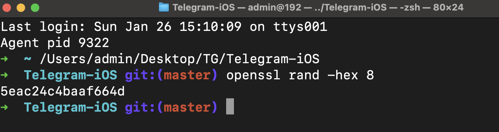

# [**Telegram.iOS**](#https://github.com/TelegramMessenger/Telegram-iOS) 源代码学习笔记

[toc]

## 1、准备工作

* 简介

  * **Telegram.iOS** 项目是一个开源项目，使用了一种模块化的开发方式，这使得其项目结构与普通的 iOS 项目有所不同。且但它的结构和配置相对复杂；
  * 动态依赖和私有模块：Telegram 的项目使用了大量自定义的模块化代码和私有库（如 `TelegramCore`、`Postbox` 等），这些模块的构建也依赖  [**Bazel**](#Bazel) ；
  * <font color=red>**为什么用 Bazel 而不是 Xcode 的原生构建？**</font>
    * 跨平台支持：Telegram 不仅支持 iOS，还支持 Android、macOS、Windows 和 Linux 等平台。Bazel 是一个跨平台构建工具，它允许共享逻辑代码，避免重复开发；
    * 复杂依赖管理：Telegram 的代码库非常庞大，依赖多个自定义模块和库。用 Bazel 可以更高效地管理这些依赖，**而不需要依赖 CocoaPods 或 Swift Package Manager**；
    * 更快的构建速度：Bazel 的增量构建比 Xcode 原生构建更快，特别是在处理大型项目时，可以显著节省时间。
    * 可重复的构建：Bazel 提供更强的构建一致性（Reproducible Builds），保证每次构建产物相同，便于 CI/CD 流程。

* 入口文件

  * 尤其是 Xcode 的入口文件（如 `.xcodeproj` 或 `.xcworkspace`）并不像普通项目那样显而易见（<font color=red>**源代码没有提供直接的普通项目的xcode入口文件**</font>）
  * <u>运行脚本时，[**Bazel**](#Bazel) 会解析项目的 `BUILD` 配置文件并生成 `.xcodeproj`</u>
  * Telegram 的源码中包含许多 `BUILD` 文件，这些是 [**Bazel**](#Bazel)  用来描述项目结构、依赖关系和构建目标的配置文件。这些文件取代了 Xcode 工程中的配置部分

* 获取源代码

  ```shell
  git clone --recursive -j8 https://github.com/TelegramMessenger/Telegram-iOS.git
  ```

* 本地配置

  * 安装必要的软件

    * Python（可以利用[**Homebrew**](https://brew.sh/)）安装
    
      <font color=red>**macOS 自带一个较旧版本的 Python (`/usr/bin/python`)，建议使用 `python3` 指令运行新安装的 Python。**</font>

      ```shell
      brew install python
      python3 --version
      pip3 --version
      ```
    
    * Xcode
    
    * **Xcode Command Line Tools**
    
      安装及验证
    
      ```shell
      xcode-select --install
      xcode-select -p # 验证安装是否成功。如果返回路径 /Library/Developer/CommandLineTools，则表示安装成功。
      ```
    
      在某些情况下需要首先进行移除安装，重置环境
    
      ```shell
      sudo rm -rf /Library/Developer/CommandLineTools
      xcode-select --install
      ```
    
    * <font id=Bazel>[**Bazel**](https://bazel.build/?hl=zh-cn)</font>：是一个快速、可扩展的 **构建工具**，主要用于编译和测试代码，支持各种语言和平台。它最初是由 **Google** 开发的，并被用于构建和管理 Google 的复杂代码库。后来，Google 开源了 Bazel，成为开发者社区中的流行工具
    
      ```shell
      brew install bazel # 安装最新版本
      
      brew install bazel@5 ## 指定版本（5）安装
      brew link --force bazel@5 ## 创建符号链接
      
      brew upgrade bazel # 升级到最新版本
      bazel --version # 验证安装
      
      brew uninstall bazel # 卸载
      ```
    
      ```shell
      bazel build //path/to:target # 构建目标
      bazel test //path/to:test # 测试代码
      bazel clean # 清理构建缓存
      ```
    
      |      特性      | Bazel           | Make/CMake    | Gradle            | Maven              |
      | :------------: | :-------------- | ------------- | ----------------- | ------------------ |
      | **多语言支持** | ✅               | ❌（有限）     | ✅（较好）         | ❌（主要支持 Java） |
      |  **增量构建**  | ✅               | ❌（需要配置） | ✅                 | ✅                  |
      |   **跨平台**   | ✅               | ✅（有限）     | ❌（主要支持 JVM） | ❌（主要支持 JVM）  |
      |  **可扩展性**  | ✅（规则自定义） | ❌（较差）     | ✅（插件体系）     | ✅（插件体系）      |
      | **分布式构建** | ✅               | ❌             | ✅（较弱）         | ❌（无支持）        |
    
  * 生成随机标识符
  
    ```shell
    openssl rand -hex 8
    ```
  
    
    
  *  打开`Keychain Access`（钥匙串访问）：默认钥匙串→证书→双击`Apple Development:XXX`显示证书简介，如下图所示：
  
    <font color=red>`Organizational Unit`（组织单位）。这是团队 ID。</font>
    
    
    
  * 编辑`build-system/template_minimal_development_configuration.json`。使用前面步骤中的数据。
  
* 编译

  * 必须依赖正确安装配置的**Xcode Command Line Tools**（包括系统存在此程序，以及指向的关联路径正确）如若不然，运行下列👇🏻进行修复：

    ```shell
    ➜  ~ sudo xcode-select --switch /Applications/Xcode.app/Contents/Developer
    ```
    
  * 因为脚本是指定Xcode的版本，如果基于某些Xcode预览版，脚本或许无法正确运行，例如：
    
    ```shell
    ➜  Telegram-iOS git:(master) ✗ python3 build-system/Make/Make.py \
        --cacheDir="$HOME/telegram-bazel-cache" \
        generateProject \
        --configurationPath=build-system/template_minimal_development_configuration.json \
        --xcodeManagedCodesigning
    Required Xcode version is 16.0, but 16.2 is reported by 'xcode-select -p'
    ```
    
    
    
    
    
    
    
    
    


