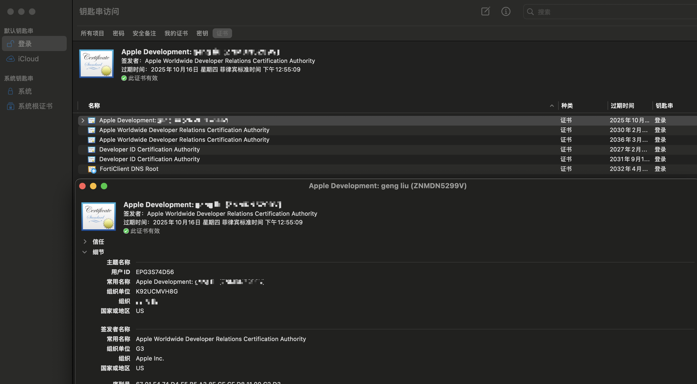
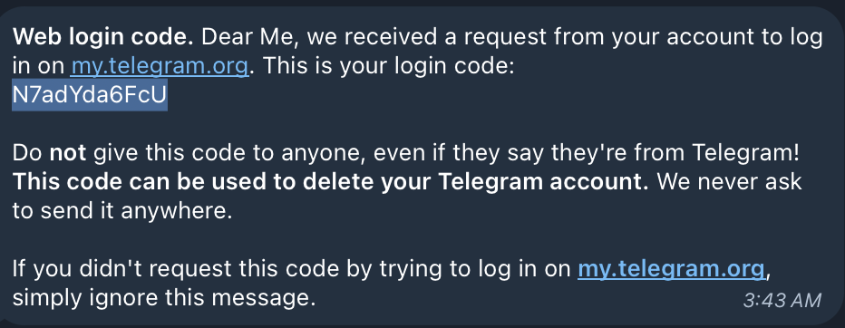
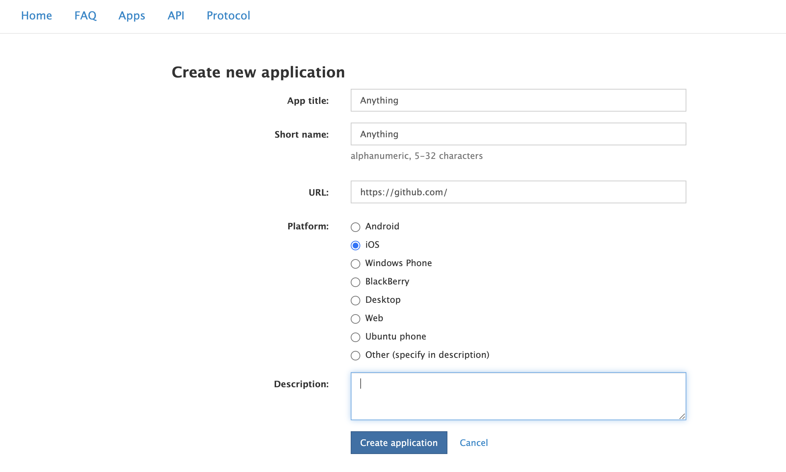
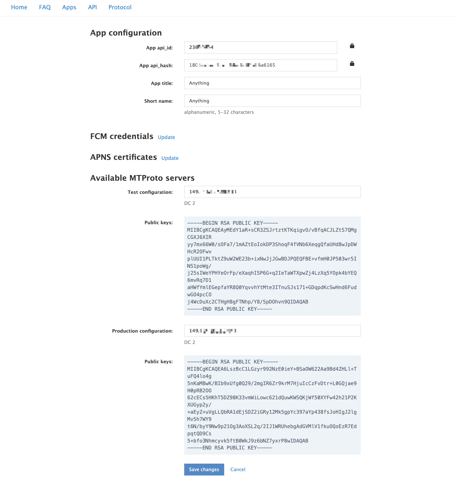
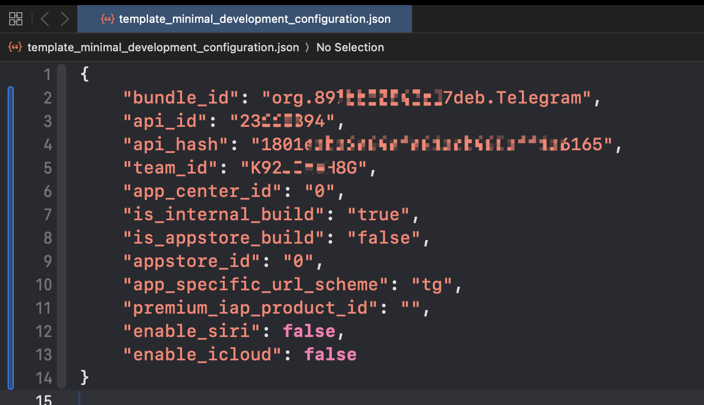
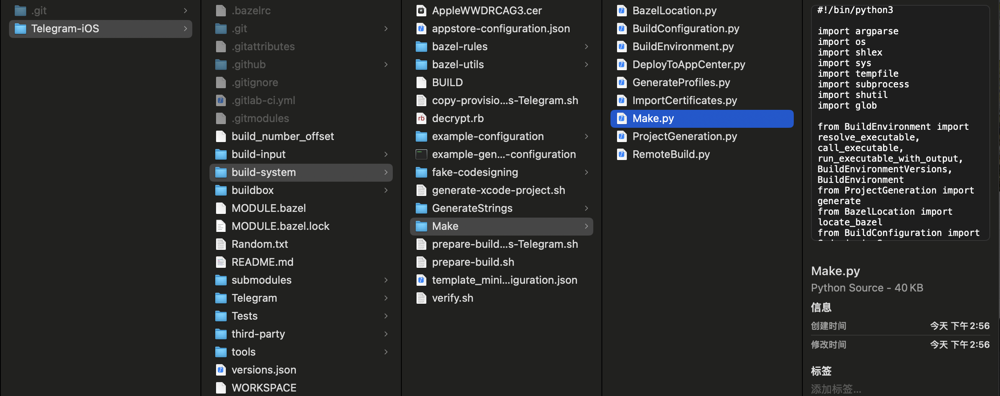
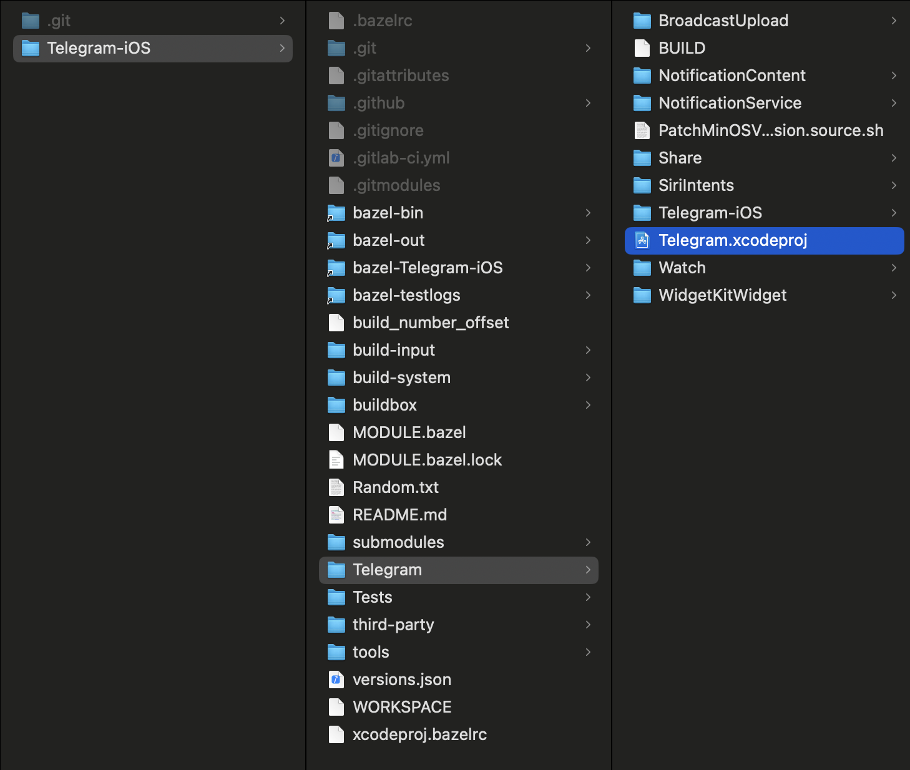

# [**Telegram.iOS**](https://github.com/TelegramMessenger/Telegram-iOS) 源代码学习笔记

[toc]

## 1、准备工作

* 简介

  * **Telegram.iOS** 项目是一个开源项目，使用了一种模块化的开发方式，这使得其项目结构与普通的 iOS 项目有所不同。且但它的结构和配置相对复杂；
  * 在[**Telegram.iOS**](https://github.com/TelegramMessenger/Telegram-iOS) 源代码里面是没有直接的`*.h`、`*.m`以及`*.swift`这种常规化的代码；这么做的原因：
    * 跨平台设计
    * 代码混淆和压缩
  * 最后因为是脚本生成代码，所以脚本可能会有变化，可能与网上教程存在差异化，一切以官方`readme.md`为准；
  * 动态依赖和私有模块：Telegram 的项目使用了大量自定义的模块化代码和私有库（如 `TelegramCore`、`Postbox` 等），这些模块的构建也依赖  [**Bazel**](#Bazel) ；
  * <font color=red>**为什么用 Bazel 而不是 Xcode 的原生构建？**</font>
    * 跨平台支持：Telegram 不仅支持 iOS，还支持 Android、macOS、Windows 和 Linux 等平台。Bazel 是一个跨平台构建工具，它允许共享逻辑代码，避免重复开发；
    * 复杂依赖管理：Telegram 的代码库非常庞大，依赖多个自定义模块和库。用 Bazel 可以更高效地管理这些依赖，**而不需要依赖 CocoaPods 或 Swift Package Manager**；
    * 更快的构建速度：Bazel 的增量构建比 Xcode 原生构建更快，特别是在处理大型项目时，可以显著节省时间。
    * 可重复的构建：Bazel 提供更强的构建一致性（Reproducible Builds），保证每次构建产物相同，便于 CI/CD 流程。
  * 需要有一个iOS的开发者账户

* 相关资料阅读

  * [**Telegram创建API获取Api_id和Api_hash教程**](https://youtu.be/DQe5ias6nlE?t=103)

* 入口文件

  * 尤其是 Xcode 的入口文件（如 `.xcodeproj` 或 `.xcworkspace`）并不像普通项目那样显而易见（<font color=red>**源代码没有提供直接的普通项目的xcode入口文件**</font>）

  * <u>运行脚本时，[**Bazel**](#Bazel) 会解析项目的 `BUILD` 配置文件并生成 `.xcodeproj`</u>

    * ```shell
      python3 build-system/Make/Make.py \
          --cacheDir="$HOME/telegram-bazel-cache" \
          generateProject \
          --configurationPath=build-system/template_minimal_development_configuration.json \
          --xcodeManagedCodesigning
      ```

    * `Telegram_xcodeproj-runner.sh`这个脚本最终会生成<font color=blue>**`Telegram.xcodeproj`**</font>

  * Telegram 的源码中包含许多 `BUILD` 文件，这些是 [**Bazel**](#Bazel)  用来描述项目结构、依赖关系和构建目标的配置文件。这些文件取代了 Xcode 工程中的配置部分

* 获取源代码

  * `--recursive` 会读取 `.gitmodules` 文件，并拉取[子模块](https://link.juejin.cn/?target=https%3A%2F%2Fgit-scm.com%2Fbook%2Fzh%2Fv2%2FGit-%E5%B7%A5%E5%85%B7-%E5%AD%90%E6%A8%A1%E5%9D%97)
  * `-j<n>(-job<n>)` 同时抓取的子模块数。默认为 `submodule.fetchJobs` 选项

  ```shell
  git clone --recursive -j8 https://github.com/TelegramMessenger/Telegram-iOS.git
  ```

* 本地配置

  * 安装必要的软件

    * Python（可以利用[**Homebrew**](https://brew.sh/)）安装
    
      <font color=red>**macOS 自带一个较旧版本的 Python (`/usr/bin/python`)，建议使用 `python3` 指令运行新安装的 Python。**</font>

      ```shell
      brew install python
      python3 --version
      pip3 --version
      ```
    
    * Xcode
    
      * [**xcode官方下载地址**](https://developer.apple.com/download/applications)(处于安全考虑，Apple官方经常会隐藏历史版本，而找不到下载地址)
      * [**Xcode Releases**](https://xcodereleases.com/)(<font color=red>**推荐**</font>)
    
    * **Xcode Command Line Tools**
    
      安装及验证
    
      ```shell
      xcode-select --install
      xcode-select -p # 验证安装是否成功。如果返回路径 /Library/Developer/CommandLineTools，则表示安装成功。
      ```
    
      在某些情况下需要首先进行移除安装，重置环境
    
      ```shell
      sudo rm -rf /Library/Developer/CommandLineTools
      xcode-select --install
      ```
    
    * <font id=Bazel>[**Bazel**](https://bazel.build/?hl=zh-cn)</font>：是一个快速、可扩展的 **构建工具**，主要用于编译和测试代码，支持各种语言和平台。它最初是由 **Google** 开发的，并被用于构建和管理 Google 的复杂代码库。后来，Google 开源了 Bazel，成为开发者社区中的流行工具
    
      ```shell
      brew install bazel # 安装最新版本
      
      brew install bazel@5 ## 指定版本（5）安装
      brew link --force bazel@5 ## 创建符号链接
      
      brew upgrade bazel # 升级到最新版本
      bazel --version # 验证安装
      
      brew uninstall bazel # 卸载
      ```
    
      ```shell
      bazel build //path/to:target # 构建目标
      bazel test //path/to:test # 测试代码
      bazel clean # 清理构建缓存
      ```
      
       清理构建缓存
      
      ```shell
      ➜  Telegram-iOS git:(master) ✗ bazel clean --expunge
      
      Extracting Bazel installation...
      Starting local Bazel server and connecting to it...
      INFO: Starting clean (this may take a while). Consider using --async if the clean takes more than several minutes.
      ```
      
      |      特性      | Bazel           | Make/CMake    | Gradle            | Maven              |
      | :------------: | :-------------- | ------------- | ----------------- | ------------------ |
      | **多语言支持** | ✅               | ❌（有限）     | ✅（较好）         | ❌（主要支持 Java） |
      |  **增量构建**  | ✅               | ❌（需要配置） | ✅                 | ✅                  |
      |   **跨平台**   | ✅               | ✅（有限）     | ❌（主要支持 JVM） | ❌（主要支持 JVM）  |
      |  **可扩展性**  | ✅（规则自定义） | ❌（较差）     | ✅（插件体系）     | ✅（插件体系）      |
      | **分布式构建** | ✅               | ❌             | ✅（较弱）         | ❌（无支持）        |
    
  * <font color=red>**生成随机标识符**</font>
  
    ```shell
    ➜  ~ openssl rand -hex 8
    897bb50843c17deb
    ```
    
  *  打开`Keychain Access`（钥匙串访问）：默认钥匙串→证书→双击`Apple Development:XXX`显示证书简介，如下图所示：
  
    <font color=red>`Organizational Unit`（组织单位）。这是团队 ID。</font>
    
    
    
  * <font color=red>**Telegram创建API获取`api_id`和`api_hash`**</font>
  
    * **第一步** 打开[**官方网址**](https://my.telegram.org/) 并输入你的电报手机号码(记得带+号) 点击：**NEXT**
      
  
    * **第二步** 这时候你的电报会收到一个 **code** 
  
      
  
    * **第三步** 填写到 code 并点击：**Sign IN**
  
    * **第四步** 登录成功后 点击：**API development tools**
  
      
  
    * 页面填写 **App title** 和 **Short name** => `api_id` + `api_hash`
  
      
  
      **页面填写通过以后，会有下列的结果**
  
      
  
  * 编辑`build-system/template_minimal_development_configuration.json`。<font color=green>**使用前面步骤中的数据**</font>
  
    
  
* 编译

  * 必须依赖正确安装配置的**Xcode Command Line Tools**（包括系统存在此程序，以及指向的关联路径正确）如若不然，运行下列👇🏻进行修复：

    ```shell
    ➜  ~ sudo xcode-select --switch /Applications/Xcode.app/Contents/Developer
    ```
    
  * 因为脚本是指定Xcode的版本，如果基于某些Xcode预览版，脚本或许无法正确运行，例如：
    
    ```shell
    ➜  Telegram-iOS git:(master) ✗ python3 build-system/Make/Make.py \
        --cacheDir="$HOME/telegram-bazel-cache" \
        generateProject \
        --configurationPath=build-system/template_minimal_development_configuration.json \
        --xcodeManagedCodesigning
    Required Xcode version is 16.0, but 16.2 is reported by 'xcode-select -p'
    ```
    
    
    
  * 编译成功的日志
    
    ```shell
    ➜  Telegram-iOS git:(master) ✗ python3 build-system/Make/Make.py \
        --cacheDir="$HOME/telegram-bazel-cache" \
        generateProject \
        --configurationPath=build-system/template_minimal_development_configuration.json \
        --xcodeManagedCodesigning
    Starting local Bazel server and connecting to it...
    INFO: Analyzed target //Telegram:Telegram_xcodeproj (9 packages loaded, 21 targets configured).
    INFO: Found 1 target...
    Target //Telegram:Telegram_xcodeproj up-to-date:
      bazel-bin/Telegram/Telegram_xcodeproj-runner.sh
    INFO: Elapsed time: 5.050s, Critical Path: 0.03s
    INFO: 11 processes: 10 internal, 1 local.
    INFO: Build completed successfully, 11 total actions
    INFO: Running command line: bazel-bin/Telegram/Telegram_xcodeproj-runner.sh
    
    Generating "Telegram/Telegram.xcodeproj"
    Starting local Bazel server and connecting to it...
    INFO: Invocation ID: f8fb790a-5482-4431-9952-b512c655ee02
    INFO: Options provided by the client:
      Inherited 'common' options: --isatty=1 --terminal_columns=151
    INFO: Reading rc options for 'run' from /Users/admin/Documents/GitHub/Telegram.iOS/Telegram-iOS/xcodeproj.bazelrc:
      Inherited 'build' options: --announce_rc --features=swift.use_global_module_cache --verbose_failures --experimental_remote_cache_async --features=swift.enable_batch_mode --swiftcopt=-j9 --define=buildNumber=10000 --define=telegramVersion=11.6 --disk_cache=/Users/admin/telegram-bazel-cache --override_repository=build_configuration=/Users/admin/Documents/GitHub/Telegram.iOS/Telegram-iOS/build-input/configuration-repository --//Telegram:disableExtensions --//Telegram:disableStripping --features=-swift.debug_prefix_map
    INFO: Reading rc options for 'run' from /Users/admin/Documents/GitHub/Telegram.iOS/Telegram-iOS/.bazelrc:
      Inherited 'build' options: --action_env=ZERO_AR_DATE=1 --apple_platform_type=ios --enable_platform_specific_config --apple_crosstool_top=@local_config_apple_cc//:toolchain --crosstool_top=@local_config_apple_cc//:toolchain --host_crosstool_top=@local_config_apple_cc//:toolchain --cxxopt=-std=c++17 --per_file_copt=third-party/webrtc/.*.cpp$,@-std=c++17 --per_file_copt=third-party/webrtc/.*.cc$,@-std=c++17 --per_file_copt=third-party/webrtc/.*.mm$,@-std=c++17 --per_file_copt=submodules/LottieMeshSwift/LottieMeshBinding/Sources/.*.mm$,@-std=c++17 --per_file_copt=submodules/LottieCpp/lottiecpp/Sources/.*.mm$,@-std=c++17 --per_file_copt=submodules/LottieCpp/lottiecpp/Sources/.*.cpp$,@-std=c++17 --per_file_copt=submodules/LottieCpp/lottiecpp/PlatformSpecific/Darwin/Sources/.*.mm$,@-std=c++17 --per_file_copt=submodules/LottieCpp/lottiecpp/PlatformSpecific/Darwin/Sources/.*.cpp$,@-std=c++17 --per_file_copt=Tests/LottieMetalTest/SoftwareLottieRenderer/Sources/.*.cpp$,@-std=c++17 --per_file_copt=Tests/LottieMetalTest/SoftwareLottieRenderer/Sources/.*.mm$,@-std=c++17 --swiftcopt=-whole-module-optimization --per_file_copt=.*.m$,@-fno-objc-msgsend-selector-stubs --per_file_copt=.*.mm$,@-fno-objc-msgsend-selector-stubs --features=debug_prefix_map_pwd_is_dot --features=swift.cacheable_swiftmodules --features=swift.debug_prefix_map --features=swift.enable_vfsoverlays --strategy=Genrule=standalone --spawn_strategy=standalone --strategy=SwiftCompile=standalone --define RULES_SWIFT_BUILD_DUMMY_WORKER=1 --noenable_bzlmod
    INFO: Found applicable config definition common:rules_xcodeproj_generator in file /private/var/tmp/_bazel_admin/466e7bf10140e50c663f198d86f49651/execroot/__main__/bazel-out/darwin_arm64-fastbuild/bin/Telegram/Telegram_xcodeproj.bazelrc: --config=rules_xcodeproj
    INFO: Found applicable config definition common:rules_xcodeproj in file /private/var/folders/z8/vw_qs5sn679_j_yhqltmcr3m0000gn/T/tmp.P7venwj1Pl/pre_xcodeproj.bazelrc: --xcode_version=16A242d --repo_env=DEVELOPER_DIR=/Applications/Xcode.app/Contents/Developer --repo_env=USE_CLANG_CL=16A242d --repo_env=XCODE_VERSION=16A242d
    INFO: Found applicable config definition common:rules_xcodeproj in file /private/var/tmp/_bazel_admin/466e7bf10140e50c663f198d86f49651/execroot/__main__/bazel-out/darwin_arm64-fastbuild/bin/Telegram/Telegram_xcodeproj.bazelrc: --verbose_failures --cache_computed_file_digests=500000 --compilation_mode=dbg --experimental_action_cache_store_output_metadata --experimental_convenience_symlinks=ignore --experimental_use_cpp_compile_action_args_params_file --define=apple.experimental.tree_artifact_outputs=1 --features=apple.swizzle_absolute_xcttestsourcelocation --features=oso_prefix_is_pwd --features=relative_ast_path --features=swift.cacheable_swiftmodules --features=swift.index_while_building --features=swift.use_global_index_store --features=swift.use_global_module_cache --nolegacy_important_outputs --show_result=0 --noworker_sandboxing --spawn_strategy=remote,worker,local
    INFO: Analyzed target @@rules_xcodeproj_generated//generator/Telegram/Telegram_xcodeproj:Telegram_xcodeproj (729 packages loaded, 30857 targets configured).
    INFO: From Compiling Swift module @@com_github_apple_swift_argument_parser//:ArgumentParser [for tool]:
    external/com_github_apple_swift_argument_parser/Sources/ArgumentParser/Usage/DumpHelpGenerator.swift:12:22: warning: using '@_implementationOnly' without enabling library evolution for 'ArgumentParser' may lead to instability during execution
     10 | //===----------------------------------------------------------------------===//
     11 | 
     12 | @_implementationOnly import ArgumentParserToolInfo
        |                      `- warning: using '@_implementationOnly' without enabling library evolution for 'ArgumentParser' may lead to instability during execution
     13 | @_implementationOnly import class Foundation.JSONEncoder
     14 | 
    
    external/com_github_apple_swift_argument_parser/Sources/ArgumentParser/Usage/DumpHelpGenerator.swift:13:22: warning: using '@_implementationOnly' without enabling library evolution for 'ArgumentParser' may lead to instability during execution
     11 | 
     12 | @_implementationOnly import ArgumentParserToolInfo
     13 | @_implementationOnly import class Foundation.JSONEncoder
        |                      `- warning: using '@_implementationOnly' without enabling library evolution for 'ArgumentParser' may lead to instability during execution
     14 | 
     15 | internal struct DumpHelpGenerator {
    
    external/com_github_apple_swift_argument_parser/Sources/ArgumentParser/Usage/MessageInfo.swift:12:22: warning: using '@_implementationOnly' without enabling library evolution for 'ArgumentParser' may lead to instability during execution
     10 | //===----------------------------------------------------------------------===//
     11 | 
     12 | @_implementationOnly import protocol Foundation.LocalizedError
        |                      `- warning: using '@_implementationOnly' without enabling library evolution for 'ArgumentParser' may lead to instability during execution
     13 | @_implementationOnly import class Foundation.NSError
     14 | 
    
    external/com_github_apple_swift_argument_parser/Sources/ArgumentParser/Usage/MessageInfo.swift:13:22: warning: using '@_implementationOnly' without enabling library evolution for 'ArgumentParser' may lead to instability during execution
     11 | 
     12 | @_implementationOnly import protocol Foundation.LocalizedError
     13 | @_implementationOnly import class Foundation.NSError
        |                      `- warning: using '@_implementationOnly' without enabling library evolution for 'ArgumentParser' may lead to instability during execution
     14 | 
     15 | enum MessageInfo {
    
    external/com_github_apple_swift_argument_parser/Sources/ArgumentParser/Usage/UsageGenerator.swift:12:22: warning: using '@_implementationOnly' without enabling library evolution for 'ArgumentParser' may lead to instability during execution
     10 | //===----------------------------------------------------------------------===//
     11 | 
     12 | @_implementationOnly import protocol Foundation.LocalizedError
        |                      `- warning: using '@_implementationOnly' without enabling library evolution for 'ArgumentParser' may lead to instability during execution
     13 | 
     14 | struct UsageGenerator {
    INFO: From Compiling Swift module @@com_github_apple_swift_argument_parser//:ArgumentParser [for tool]:
    external/com_github_apple_swift_argument_parser/Sources/ArgumentParser/Usage/DumpHelpGenerator.swift:12:22: warning: using '@_implementationOnly' without enabling library evolution for 'ArgumentParser' may lead to instability during execution
     10 | //===----------------------------------------------------------------------===//
     11 | 
     12 | @_implementationOnly import ArgumentParserToolInfo
        |                      `- warning: using '@_implementationOnly' without enabling library evolution for 'ArgumentParser' may lead to instability during execution
     13 | @_implementationOnly import class Foundation.JSONEncoder
     14 | 
    
    external/com_github_apple_swift_argument_parser/Sources/ArgumentParser/Usage/DumpHelpGenerator.swift:13:22: warning: using '@_implementationOnly' without enabling library evolution for 'ArgumentParser' may lead to instability during execution
     11 | 
     12 | @_implementationOnly import ArgumentParserToolInfo
     13 | @_implementationOnly import class Foundation.JSONEncoder
        |                      `- warning: using '@_implementationOnly' without enabling library evolution for 'ArgumentParser' may lead to instability during execution
     14 | 
     15 | internal struct DumpHelpGenerator {
    
    external/com_github_apple_swift_argument_parser/Sources/ArgumentParser/Usage/MessageInfo.swift:12:22: warning: using '@_implementationOnly' without enabling library evolution for 'ArgumentParser' may lead to instability during execution
     10 | //===----------------------------------------------------------------------===//
     11 | 
     12 | @_implementationOnly import protocol Foundation.LocalizedError
        |                      `- warning: using '@_implementationOnly' without enabling library evolution for 'ArgumentParser' may lead to instability during execution
     13 | @_implementationOnly import class Foundation.NSError
     14 | 
    
    external/com_github_apple_swift_argument_parser/Sources/ArgumentParser/Usage/MessageInfo.swift:13:22: warning: using '@_implementationOnly' without enabling library evolution for 'ArgumentParser' may lead to instability during execution
     11 | 
     12 | @_implementationOnly import protocol Foundation.LocalizedError
     13 | @_implementationOnly import class Foundation.NSError
        |                      `- warning: using '@_implementationOnly' without enabling library evolution for 'ArgumentParser' may lead to instability during execution
     14 | 
     15 | enum MessageInfo {
    
    external/com_github_apple_swift_argument_parser/Sources/ArgumentParser/Usage/UsageGenerator.swift:12:22: warning: using '@_implementationOnly' without enabling library evolution for 'ArgumentParser' may lead to instability during execution
     10 | //===----------------------------------------------------------------------===//
     11 | 
     12 | @_implementationOnly import protocol Foundation.LocalizedError
        |                      `- warning: using '@_implementationOnly' without enabling library evolution for 'ArgumentParser' may lead to instability during execution
     13 | 
     14 | struct UsageGenerator {
    INFO: From Compiling Swift module @@com_github_apple_swift_argument_parser//:ArgumentParser [for tool]:
    external/com_github_apple_swift_argument_parser/Sources/ArgumentParser/Usage/DumpHelpGenerator.swift:12:22: warning: using '@_implementationOnly' without enabling library evolution for 'ArgumentParser' may lead to instability during execution
     10 | //===----------------------------------------------------------------------===//
     11 | 
     12 | @_implementationOnly import ArgumentParserToolInfo
        |                      `- warning: using '@_implementationOnly' without enabling library evolution for 'ArgumentParser' may lead to instability during execution
     13 | @_implementationOnly import class Foundation.JSONEncoder
     14 | 
    
    external/com_github_apple_swift_argument_parser/Sources/ArgumentParser/Usage/DumpHelpGenerator.swift:13:22: warning: using '@_implementationOnly' without enabling library evolution for 'ArgumentParser' may lead to instability during execution
     11 | 
     12 | @_implementationOnly import ArgumentParserToolInfo
     13 | @_implementationOnly import class Foundation.JSONEncoder
        |                      `- warning: using '@_implementationOnly' without enabling library evolution for 'ArgumentParser' may lead to instability during execution
     14 | 
     15 | internal struct DumpHelpGenerator {
    
    external/com_github_apple_swift_argument_parser/Sources/ArgumentParser/Usage/MessageInfo.swift:12:22: warning: using '@_implementationOnly' without enabling library evolution for 'ArgumentParser' may lead to instability during execution
     10 | //===----------------------------------------------------------------------===//
     11 | 
     12 | @_implementationOnly import protocol Foundation.LocalizedError
        |                      `- warning: using '@_implementationOnly' without enabling library evolution for 'ArgumentParser' may lead to instability during execution
     13 | @_implementationOnly import class Foundation.NSError
     14 | 
    
    external/com_github_apple_swift_argument_parser/Sources/ArgumentParser/Usage/MessageInfo.swift:13:22: warning: using '@_implementationOnly' without enabling library evolution for 'ArgumentParser' may lead to instability during execution
     11 | 
     12 | @_implementationOnly import protocol Foundation.LocalizedError
     13 | @_implementationOnly import class Foundation.NSError
        |                      `- warning: using '@_implementationOnly' without enabling library evolution for 'ArgumentParser' may lead to instability during execution
     14 | 
     15 | enum MessageInfo {
    
    external/com_github_apple_swift_argument_parser/Sources/ArgumentParser/Usage/UsageGenerator.swift:12:22: warning: using '@_implementationOnly' without enabling library evolution for 'ArgumentParser' may lead to instability during execution
     10 | //===----------------------------------------------------------------------===//
     11 | 
     12 | @_implementationOnly import protocol Foundation.LocalizedError
        |                      `- warning: using '@_implementationOnly' without enabling library evolution for 'ArgumentParser' may lead to instability during execution
     13 | 
     14 | struct UsageGenerator {
    INFO: From Compiling Swift module @@com_github_apple_swift_argument_parser//:ArgumentParser [for tool]:
    external/com_github_apple_swift_argument_parser/Sources/ArgumentParser/Usage/DumpHelpGenerator.swift:12:22: warning: using '@_implementationOnly' without enabling library evolution for 'ArgumentParser' may lead to instability during execution
     10 | //===----------------------------------------------------------------------===//
     11 | 
     12 | @_implementationOnly import ArgumentParserToolInfo
        |                      `- warning: using '@_implementationOnly' without enabling library evolution for 'ArgumentParser' may lead to instability during execution
     13 | @_implementationOnly import class Foundation.JSONEncoder
     14 | 
    
    external/com_github_apple_swift_argument_parser/Sources/ArgumentParser/Usage/DumpHelpGenerator.swift:13:22: warning: using '@_implementationOnly' without enabling library evolution for 'ArgumentParser' may lead to instability during execution
     11 | 
     12 | @_implementationOnly import ArgumentParserToolInfo
     13 | @_implementationOnly import class Foundation.JSONEncoder
        |                      `- warning: using '@_implementationOnly' without enabling library evolution for 'ArgumentParser' may lead to instability during execution
     14 | 
     15 | internal struct DumpHelpGenerator {
    
    external/com_github_apple_swift_argument_parser/Sources/ArgumentParser/Usage/MessageInfo.swift:12:22: warning: using '@_implementationOnly' without enabling library evolution for 'ArgumentParser' may lead to instability during execution
     10 | //===----------------------------------------------------------------------===//
     11 | 
     12 | @_implementationOnly import protocol Foundation.LocalizedError
        |                      `- warning: using '@_implementationOnly' without enabling library evolution for 'ArgumentParser' may lead to instability during execution
     13 | @_implementationOnly import class Foundation.NSError
     14 | 
    
    external/com_github_apple_swift_argument_parser/Sources/ArgumentParser/Usage/MessageInfo.swift:13:22: warning: using '@_implementationOnly' without enabling library evolution for 'ArgumentParser' may lead to instability during execution
     11 | 
     12 | @_implementationOnly import protocol Foundation.LocalizedError
     13 | @_implementationOnly import class Foundation.NSError
        |                      `- warning: using '@_implementationOnly' without enabling library evolution for 'ArgumentParser' may lead to instability during execution
     14 | 
     15 | enum MessageInfo {
    
    external/com_github_apple_swift_argument_parser/Sources/ArgumentParser/Usage/UsageGenerator.swift:12:22: warning: using '@_implementationOnly' without enabling library evolution for 'ArgumentParser' may lead to instability during execution
     10 | //===----------------------------------------------------------------------===//
     11 | 
     12 | @_implementationOnly import protocol Foundation.LocalizedError
        |                      `- warning: using '@_implementationOnly' without enabling library evolution for 'ArgumentParser' may lead to instability during execution
     13 | 
     14 | struct UsageGenerator {
    INFO: From Compiling Swift module @@rules_xcodeproj//tools/generators/lib/PBXProj:PBXProj [for tool]:
    external/rules_xcodeproj/tools/generators/lib/PBXProj/src/Optional+Extensions.swift:5:1: warning: extension declares a conformance of imported type 'Optional' to imported protocol 'ExpressibleByArgument'; this will not behave correctly if the owners of 'Swift' introduce this conformance in the future
     3 | // MARK: - ExpressibleByArgument
     4 | 
     5 | extension Optional: ExpressibleByArgument where Wrapped: ExpressibleByArgument {
       | |- warning: extension declares a conformance of imported type 'Optional' to imported protocol 'ExpressibleByArgument'; this will not behave correctly if the owners of 'Swift' introduce this conformance in the future
       | `- note: add '@retroactive' to silence this warning
     6 |     public init?(argument: String) {
     7 |         if argument.isEmpty {
    INFO: From Compiling Swift module @@rules_xcodeproj//tools/generators/lib/PBXProj:PBXProj [for tool]:
    external/rules_xcodeproj/tools/generators/lib/PBXProj/src/Optional+Extensions.swift:5:1: warning: extension declares a conformance of imported type 'Optional' to imported protocol 'ExpressibleByArgument'; this will not behave correctly if the owners of 'Swift' introduce this conformance in the future
     3 | // MARK: - ExpressibleByArgument
     4 | 
     5 | extension Optional: ExpressibleByArgument where Wrapped: ExpressibleByArgument {
       | |- warning: extension declares a conformance of imported type 'Optional' to imported protocol 'ExpressibleByArgument'; this will not behave correctly if the owners of 'Swift' introduce this conformance in the future
       | `- note: add '@retroactive' to silence this warning
     6 |     public init?(argument: String) {
     7 |         if argument.isEmpty {
    INFO: Found 1 target...
    INFO: Elapsed time: 58.582s, Critical Path: 27.08s
    INFO: 2777 processes: 186 internal, 2591 local.
    INFO: Build completed successfully, 2777 total actions
    INFO: Running command line: /private/var/tmp/_bazel_admin/466e7bf10140e50c663f198d86f49651/rules_xcodeproj.noindex/build_output_base/execroot/__main__/bazel-out/darwin_arm64-dbg/bin/external/rules_xcodeproj_generated/generator/Telegram/Telegram_xcodeproj/Telegram_xcodeproj-installer.sh --xcodeproj_bazelrc /private/var/tmp/_bazel_admin/466e7bf10140e50c663f198d86f49651/execroot/__main__/bazel-out/darwin_arm64-fastbuild/bin/Telegram/Telegram_xcodeproj-runner.sh.runfiles/__main__/Telegram/Telegram_xcodeproj.bazelrc --extra_flags_bazelrc /private/var/tmp/_bazel_admin/466e7bf10140e50c663f198d86f49651/execroot/__main__/bazel-out/darwin_arm64-fastbuild/bin/Telegram/Telegram_xcodeproj-runner.sh.runfiles/__main__/Telegram/Telegram_xcodeproj-extra-flags.bazelrc --bazel_path /Users/admin/Documents/GitHub/Telegram.iOS/Telegram-iOS/build-input/bazel-7.3.1-darwin-arm64 --execution_root /private/var/tmp/_bazel_admin/466e7bf10140e50c663f198d86f49651/execroot/__main__
    Updated project at "Telegram/Telegram.xcodeproj"
    ➜  Telegram-iOS git:(master) ✗ 
    ```
  
  
  
  
## 2、相关组件

* **T**elegram **D**atabase **Lib**rary (简称 [**TDLib**](https://github.com/tdlib/td))：
  * `.tl` 为后缀的文件
  * 面向第三方开发人员的工具，可让您轻松构建快速、安全且功能丰富的 Telegram 应用；
  * TDLib 负责所有**网络实现**细节、**加密**和**本地数据存储**，以便您可以投入更多时间进行设计、响应式界面和精美的动画；
  * TDLib 支持所有 Telegram 功能，使在任何平台上开发 Telegram 应用变得轻而易举；
  * **跨平台**。TDLib 可用于 Android、iOS、Windows、macOS、Linux、WebAssembly、FreeBSD、Windows Phone、watchOS、tvOS、Tizen、Cygwin。它还应该可以在其他 *nix 系统上运行，无论是否需要付出最少的努力。
  * **多语言**。TDLib 可轻松与任何能够执行 C 函数的**编程语言配合使用。此外，它已经与 Java（使用 JNI）和 C#（使用 C++/CLI）进行了本机绑定。**
  * **易于使用**。TDLib 负责所有**网络实施细节**、**加密**和**本地数据存储**。
  * **高性能**。在 Telegram Bot API 中，每个 TDLib 实例可同时处理超过**24,000 个**活跃机器人。
  * **记录详尽**。所有 TDLib API 方法和公共接口均有[**完整记录**](https://core.telegram.org/tdlib/docs/)。
  * **一致。TDLib 保证所有更新都按照正确的顺序**传递。
  * **可靠**。TDLib在缓慢且不可靠的互联网连接上仍然保持**稳定。**
  * **安全**：所有本地数据均使用用户提供的加密密钥**进行加密。**
  * **完全异步**。对 TDLib 的请求不会互相阻塞或任何其他阻塞，响应将在可用时发送。
* Telegram Gateway API （网关 API）
  * 允许任何企业、应用或网站通过 Telegram 发送授权代码，而不是通过传统的短信发送授权代码，这是一种强大而便捷的方式，可以**降低成本**，同时提高代码的**安全性**和向 Telegram 每月 9.5 亿活跃用户**发送代码的速度。用户将****立即**在 Telegram 内的特殊聊天中收到带有代码的消息。


