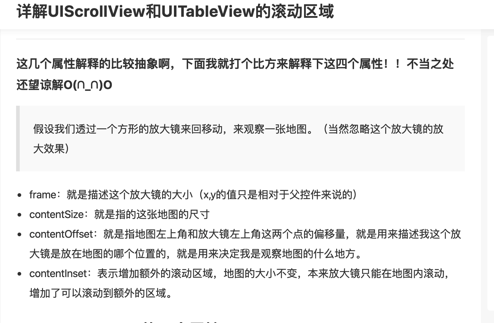
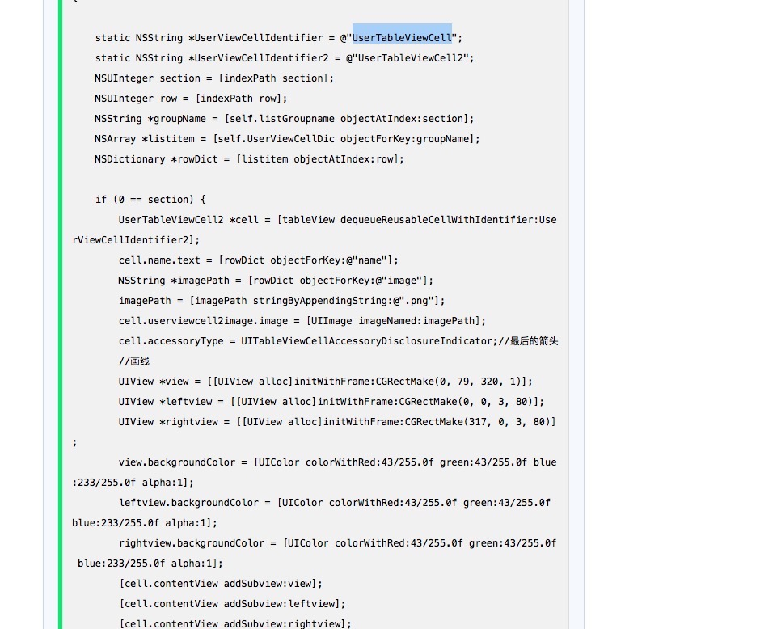

# UITableView 的使用指南

[toc]

## 1、详解UIScrollView 和UITabableView的滚动区域



## 2、UITableViewCell的重用



## 3、只刷新某一行或某一组的UITableViewCell

*一个section刷新*

```objective-c
NSIndexSet *indexSet=[[NSIndexSet alloc]initWithIndex:2];
[tableview reloadSections:indexSet withRowAnimation:UITableViewRowAnimationAutomatic];
```

*一个cell刷新*

```objective-c
NSIndexPath *indexPath = [NSIndexPath indexPathForRow:3 inSection:0];
[tableView reloadRowsAtIndexPaths:[NSArray arrayWithObjects:indexPath,nil] withRowAnimation:UITableViewRowAnimationNone];
```

## 4、UITableView 禁止下拉 + 允许上拉

```objective-c
-(void)scrollViewDidScroll:(UIScrollView *)scrollView {
	CGPoint offset = self.mainTableView.contentOffset;
  if (offset.y <= 0) {
      offset.y = 0;
  }self.mainTableView.contentOffset = offset;
}
```

## 5、UITableViewCell 自适应

```objective-c
1、- (CGFloat)tableView:(UITableView *)tableView
heightForRowAtIndexPath:(NSIndexPath *)indexPath{
    return 50;
}//这个方法注销，不予实现

2、整个cell上面加与cell同样大小的label，make.edges.equalTo(self.contentView);_lab.lineBreakMode = NSLineBreakByWordWrapping;
_lab.numberOfLines = 0;

//调用系统浏览器打开 标准写法
if (@available(iOS 10.0, *)) {
    if ([UIApplication.sharedApplication respondsToSelector:@selector(openURL:options:completionHandler:)]) {
        [UIApplication.sharedApplication openURL:[NSURL URLWithString:model.advertUrl]
																				 options:@{}
                               completionHandler:^(BOOL success) {
                   }];
               }
}else [UIApplication.sharedApplication openURL:[NSURL URLWithString:model.advertUrl]];
```

## 6、tableHeaderView 和 tableFooterView

```objective-c
如果想在整个TableView的头部或者尾部出现一个View
注意区别于viewForHeaderInSection

需要涉及的相关属性:
_tableView.tableHeaderView;
_tableView.tableFooterView;
```

## 7、viewForHeaderInSection 的使用记录

**UITableView的每个Section的头部出现一个view，涉及到复用机制**

*定义 BaiShaETProjMembersBoardView 文件*

*BaiShaETProjMembersBoardView.h*

```
@interface BaiShaETProjMembersBoardView : BaseTableViewHeaderView

BaiShaETProjMembersBoardView.m
#pragma mark —— BaseProtocol
/// 单例化和销毁
+(void)destroySingleton{
    static_membersBoardViewOnceToken = 0;
    static_membersBoardView = nil;
}

static BaiShaETProjMembersBoardView *static_membersBoardView = nil;
static dispatch_once_t static_membersBoardViewOnceToken;
+(instancetype)sharedInstance{
    dispatch_once(&static_membersBoardViewOnceToken, ^{
        static_membersBoardView = BaiShaETProjMembersBoardView.jobsInitWithReuseIdentifier;
    });return static_membersBoardView;
}

-(instancetype)init{
    if (self = [super init]) {
        self.backgroundColor = UIColor.whiteColor;
    }return self;
}

- (instancetype)initWithReuseIdentifier:(NSString *)reuseIdentifier{
    if(self == [super initWithReuseIdentifier:reuseIdentifier]){

    }return self;
}

-(void)drawRect:(CGRect)rect{
    [super drawRect:rect];
}

-(void)layoutSubviews{
    [super layoutSubviews];
}
#pragma mark —— BaseViewProtocol
/// 具体由子类进行复写【数据定UI】【如果所传参数为基本数据类型，那么包装成对象NSNumber进行转化承接】
-(void)richElementsInViewWithModel:(UIViewModel *_Nullable)model{
    self.viewModel = model;
    MakeDataNull
}
/// 具体由子类进行复写【数据尺寸】【如果所传参数为基本数据类型，那么包装成对象NSNumber进行转化承接】
+ (CGRect)viewFrameWithModel:(UIViewModel *)model{
    return CGRectMake(0, 0, JobsMainScreen_WIDTH(), JobsWidth(39 + 64));
}
#pragma mark —— lazyLoad
...
```
在使用UITableView的主类,关联下列协议
```
- (CGFloat)tableView:(UITableView *)tableView heightForHeaderInSection:(NSInteger)section;

- (UIView *)tableView:(UITableView *)tableView viewForHeaderInSection:(NSInteger)section;
```
在UITableView初始化部分进行注册
```
1、[_tableView registerTableViewClass];
        
2、在UITableView+RegisterClass.m添加如下
-(void)registerTableViewClass{
    [self registerHeaderFooterViewClass:BaiShaETProjMembersBoardView.class];
}
```

