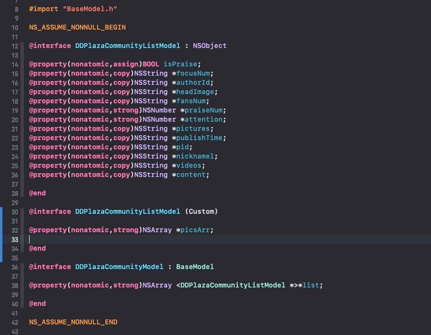
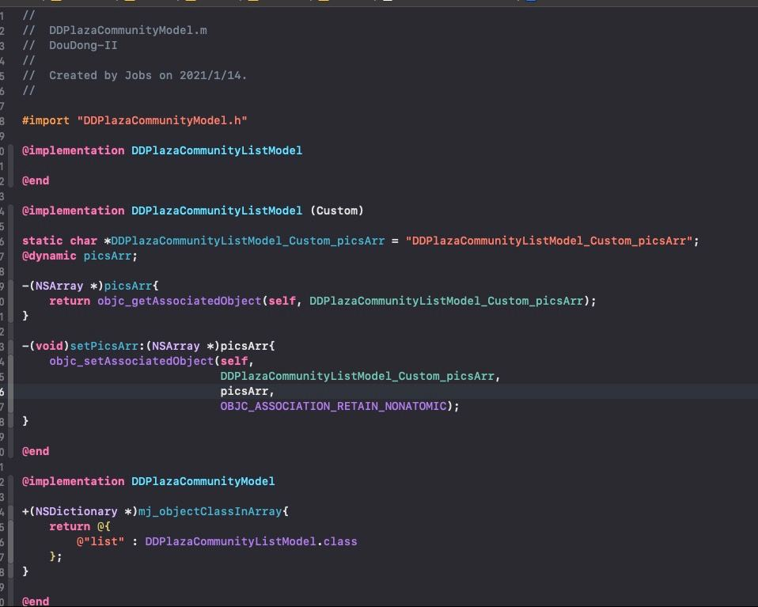
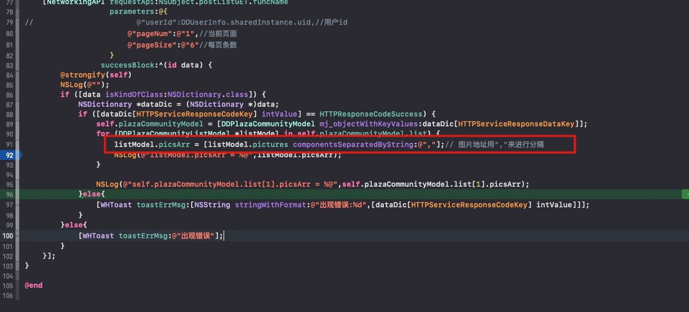

#  模型解析







## 参见JobsComment

*关注 @implementation BaseModel*

```objective-c
//装载本地假数据
-(void)loadData{
    NSDictionary *dic = [NSString readLocalFileWithName:@"CommentData"];
    self.mjModel = [MKCommentModel mj_objectWithKeyValues:dic[@"data"]];
    self.yyModel = [MKCommentModel yy_modelWithDictionary:dic[@"data"]];
    NSLog(@"");
    [MKRankListModel mj_objectArrayWithKeyValuesArray:dataDic[@"data"]]//如果是数组 MKRankListModel是具体的最后的一个子核心类 必须和外界的数组里面装的元素的类型保持一致
}
```

```objective-c
@implementation MKFirstCommentModel
#pragma mark —— YYModel
+ (NSDictionary *)modelCustomPropertyMapper{
  return @{
      @"ID" : @"id",
      @"childMutArr":@"child"
  };
}

+ (NSDictionary *)modelContainerPropertyGenericClass {
  return @{
      @"childMutArr" : MKChildCommentModel.class
  };
}
  #pragma mark —— MJExtention
+(NSDictionary *)mj_replacedKeyFromPropertyName{
  /* 返回的字典，key为模型属性名，value为转化的字典的多级key */
  return @{
      @"ID" : @"id",
      @"childMutArr":@"child"
  };
}

+(NSDictionary *)mj_objectClassInArray{
    return @{
        @"childMutArr" : MKChildCommentModel.class
    };
}

@end
```

**值得注意的一点：如果是直接model网络数据的模型，无法手动在本类添加自定义的属性，则，必须用分类！**

*比如：*

**.h**

```objective-c
#import "BaseModel.h"

NS_ASSUME_NONNULL_BEGIN

@interface DDPlazaCommunityListModel : NSObject

@property(nonatomic,assign)BOOL isPraise;
@property(nonatomic,copy)NSString *focusNum;
@property(nonatomic,copy)NSString *authorId;
@property(nonatomic,copy)NSString *headImage;
@property(nonatomic,copy)NSString *fansNum;
@property(nonatomic,strong)NSNumber *praiseNum;
@property(nonatomic,strong)NSNumber *attention;
@property(nonatomic,copy)NSString *pictures;
@property(nonatomic,copy)NSString *publishTime;
@property(nonatomic,copy)NSString *pid;
@property(nonatomic,copy)NSString *nicknamel;
@property(nonatomic,copy)NSString *videos;
@property(nonatomic,copy)NSString *content;

@end

@interface DDPlazaCommunityListModel (Custom)

@property(nonatomic,strong)NSArray *picsArr;

@end

@interface DDPlazaCommunityModel : BaseModel

@property(nonatomic,strong)NSArray <DDPlazaCommunityListModel *>*list;

@end

NS_ASSUME_NONNULL_END
```

**.m**

```objective-c
#import "DDPlazaCommunityModel.h"

@implementation DDPlazaCommunityListModel

@end

@implementation DDPlazaCommunityListModel (Custom)

static char *DDPlazaCommunityListModel_Custom_picsArr = "DDPlazaCommunityListModel_Custom_picsArr";
@dynamic picsArr;

-(NSArray *)picsArr{
    return objc_getAssociatedObject(self, DDPlazaCommunityListModel_Custom_picsArr);
}

-(void)setPicsArr:(NSArray *)picsArr{
    objc_setAssociatedObject(self,
                             DDPlazaCommunityListModel_Custom_picsArr,
                             picsArr,
                             OBJC_ASSOCIATION_RETAIN_NONATOMIC);
}

@end

@implementation DDPlazaCommunityModel

+(NSDictionary *)mj_objectClassInArray{
    return @{
        @"list" : DDPlazaCommunityListModel.class
    };
}

@end
```


