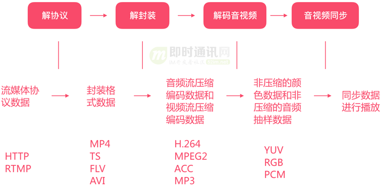
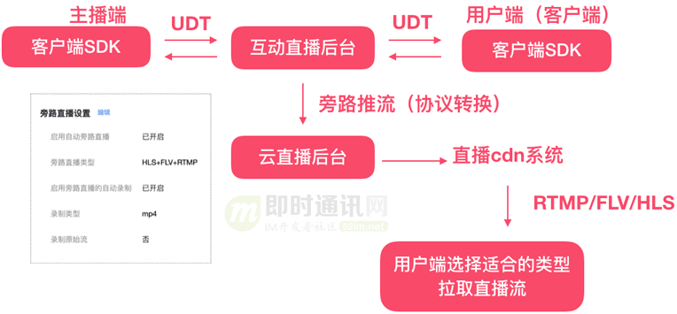
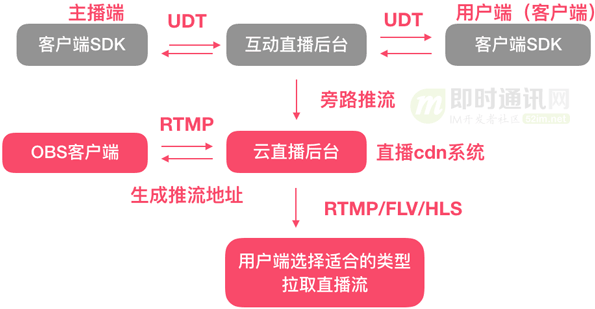
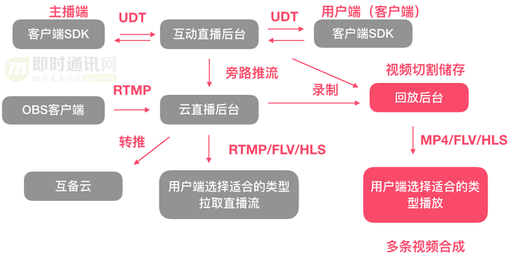

# 音视频

[toc]

## 1、相关协议

### 1.1、HTML 和 HTML5

* HTML（最初版本发布于 1991 年） 和 HTML5（ 2014 年成为 W3C 标准） **并不是严格意义上的继承关系**，更确切地说，HTML5 是 **HTML（超文本标记语言的总称） 的一个版本**，是对 HTML 的升级和扩展。它们之间的关系更像是 **迭代** 和 **升级** 的关系，并非继承；

* HTML5 是向下兼容的，这意味着以前版本的 HTML 标签在 HTML5 中大多仍然可以使用（尽管部分标签被废弃或不推荐）；
  
* 在继承 HTML 基本功能的基础上，HTML5 增加了许多新特性。特别是在多媒体、语义化和移动端适配方面；
  
  * HTML5 增删了许多语义化标签，提升了网页内容的可读性和结构化
    
    * HTML5 删除标签对比：
    
      |    标签名    |             描述             |              替代方案              |
      | :----------: | :--------------------------: | :--------------------------------: |
      | `<acronym>`  |       表示首字母缩略词       |         使用 `<abbr>` 代替         |
      |  `<applet>`  |    定义 Java Applet 嵌入     |    使用 `<object>` 或 `<embed>`    |
      | `<basefont>` |       定义基准字体大小       |           使用 CSS 代替            |
      |   `<big>`    |         定义大号字体         |    使用 CSS 的 `font-size` 代替    |
      |  `<center>`  |       定义内容居中对齐       |   使用 CSS 的 `text-align` 代替    |
      |   `<dir>`    |         定义目录列表         |          使用 `<ul>` 代替          |
      |   `<font>`   |       定义字体相关样式       |    使用 CSS 的字体样式属性代替     |
      |  `<frame>`   |           定义框架           |  使用 `<iframe>` 或 CSS 布局代替   |
      | `<frameset>` |          定义框架集          |         使用 CSS 布局代替          |
      | `<isindex>`  |  定义单行文本输入（已废弃）  |       使用 `<form>` 元素代替       |
      | `<noframes>` | 为不支持框架的浏览器定义内容 |             已不再需要             |
      |    `<s>`     |      定义加删除线的文本      | 使用 CSS 的 `text-decoration` 代替 |
      |  `<strike>`  |  和 `<s>` 类似，表示删除线   | 使用 CSS 的 `text-decoration` 代替 |
      |    `<tt>`    |      定义打字机样式文本      |   使用 CSS 的 `font-family` 代替   |
      |    `<u>`     |        表示下划线文本        | 使用 CSS 的 `text-decoration` 代替 |
      |   `<xmp>`    |       定义预格式化文本       |         使用 `<pre>` 代替          |
    
    * HTML5 新增标签对比：
    
      |       类别       |       标签名        |                   描述                    |
      | :--------------: | :-----------------: | :---------------------------------------: |
      |  **语义化标签**  |     `<article>`     |   表示独立的内容块，如新闻、博客文章等    |
      |                  |      `<aside>`      | 表示与主要内容相关性较小的内容，如侧边栏  |
      |                  |     `<details>`     |    创建交互式控件，用于显示或隐藏内容     |
      |                  |   `<figcaption>`    |          定义 `<figure>` 的标题           |
      |                  |     `<figure>`      |       用于分组图像或图表等独立内容        |
      |                  |     `<footer>`      |         表示文档或部分内容的页脚          |
      |                  |     `<header>`      |         表示文档或部分内容的页头          |
      |                  |      `<main>`       |          定义文档的主要内容部分           |
      |                  |      `<mark>`       |        表示需要高亮显示的重要文本         |
      |                  |       `<nav>`       |            表示页面的导航部分             |
      |                  |     `<section>`     |         表示文档中一个主题的分区          |
      |  **多媒体标签**  |      `<audio>`      |               定义音频内容                |
      |                  |      `<video>`      |               定义视频内容                |
      |                  |     `<source>`      |    定义媒体资源 `<audio>` 或 `<video>`    |
      |                  |      `<track>`      |          为媒体提供字幕或元数据           |
      | **图形相关标签** |     `<canvas>`      |         用于绘制图像和图形的画布          |
      |   **表单增强**   |    `<datalist>`     |          定义输入控件的选项列表           |
      |                  | `<keygen>` *(废弃)* | 定义密钥生成控件（为 Web 表单提供安全性） |
      |                  |     `<output>`      |           显示计算或脚本的结果            |
      |   **交互控件**   |    `<progress>`     |               定义任务进度                |
      |                  |      `<meter>`      |            定义范围内的度量值             |
      |     **其他**     |      `<time>`       |                 表示时间                  |
      |                  |       `<wbr>`       |          定义可添加换行符的位置           |
    
  *  多媒体支持：HTML5 原生支持音视频播放，无需额外插件（如 Flash）
    
    * `<audio>` 和 `<video>` 标签，用于嵌入音频和视频内容。
    
    * ```html
      <audio controls>
          <source src="example.mp3" type="audio/mpeg">
          您的浏览器不支持 audio 标签。
      </audio>
      
      <video controls>
          <source src="example.mp4" type="video/mp4">
          您的浏览器不支持 video 标签。
      </video>
      ```
    
  * 表单功能增强
  
    * `<input type="email">`、`<input type="date">`、`<input type="range">`、`<input type="color">` 等；
    * 表单验证 ：原生支持表单验证，无需 JavaScript；
  
  * HTML5 提供了用于绘图和图像处理的新特性：Canvas（用于绘制 2D 图形和动画） 和 SVG（支持矢量图形的定义和操作） 
  
    * ```html
      <canvas id="myCanvas" width="200" height="100"></canvas>
      <script>
          const canvas = document.getElementById("myCanvas");
          const ctx = canvas.getContext("2d");
          ctx.fillStyle = "red";
          ctx.fillRect(10, 10, 150, 80);
      </script>
      ```
  
  * HTML5 提供了新的客户端存储方式，**替代传统的 Cookie**：
  
    * **LocalStorage**：数据保存在本地浏览器中，永久有效，直到主动清除；
    * **SessionStorage**：数据在会话结束后清除；
  
  * HTML5 针对移动设备进行了优化，支持响应式设计和触摸屏：
  
    * 支持 `<meta>` 标签，用于移动设备的 viewport 配置
  
      ```html
      <meta name="viewport" content="width=device-width, initial-scale=1.0">
      ```
  
  * HTML5 提供了多线程的 Web Worker 和更高效的 API：
  
    * **Web Worker**：允许在后台运行 JavaScript 代码而不阻塞主线程；
    * **Geolocation API**：支持定位功能，适用于移动端开发；

### 1.2、RTMP = Real-Time Messaging Protocol

* 即：实时消息传输协议

* RTMP是由 **Adobe** 开发的一种用于音视频、数据传输的应用层协议；

  * 最初用于与 Adobe Flash Player 通信（历史上曾经是强绑定关系，但是其协议本身是独立于 Flash 的）；
  * RTMP 是一种低延迟的流媒体传输协议，广泛应用于直播、点播、互动等实时音视频领域；
  * **Flash Player 的作用**： 在浏览器端，Flash Player 一直是 RTMP 流的默认播放载体。用户通过网页播放器即可直接接收和播放 RTMP 流；
  * 最原始的RTMP缺乏原生的加密机制。相关扩充协议（RTMPS）普及度和适配度不及 HTTPS、WebRTC 等现代协议；

* RTMP的扩展协议：

  * **RTMPS**（RTMP over TLS/SSL）：RTMP 的安全版本，通过 SSL/TLS 加密传输，保障数据安全性；

  - **RTMPT**：在 HTTP 之上封装的 RTMP，用于穿透防火墙；

  - **RTMP-Chunk**：将数据块分割成更小的单元，提高传输效率；

* 替代协议：

  * **HLS**（**H**TTP **L**ive **S**treaming）：

    * 由 **Apple** 推出的基于 HTTP 的流媒体协议，可以直接在 HTML5 环境下使用，且兼容性广；
    * 它已成为主流，特别是在点播和直播中大幅取代了 RTMP；

  * WebRTC：实时通信协议，基于 UDP 实现超低延迟传输，支持点对点连接，特别适合互动性强的场景（如视频会议、远程教育）；

  * **DASH**（**D**ynamic **A**daptive **S**treaming over **H**TTP）：另一种基于 HTTP 的流媒体协议，与 HLS 类似，用于适配不同网络环境的多码率播放；

  * |  协议  |          特点          |        使用场景        |
    | :----: | :--------------------: | :--------------------: |
    |  RTMP  |    低延迟、成熟稳定    |       直播、点播       |
    |  HLS   |   高兼容性、延迟较高   | 点播、延迟不敏感的直播 |
    | WebRTC |   超低延迟、基于 UDP   |   实时互动、视频会议   |
    |  SRT   | 安全性高、抗丢包能力强 |  跨国直播、高质量传输  |

* 随着 Flash 的逐步淘汰，RTMP 的使用场景也受到一定限制：

  * **Flash Player 的退役**： 2020 年底，**Adobe**  停止了对 Flash Player 的支持，各大浏览器（如 Chrome、Firefox、Edge）也完全禁用 Flash Player（可能的安全问题）；
  * 失去这一主流接收端后，RTMP 在浏览器端的应用基本被取代（现代浏览器并不直接支持 RTMP 播放）；
  * 带来的限制：
    * 额外依赖播放器：如果需要使用 RTMP 流，客户端必须通过第三方播放器（如 VLC、FFmpeg）或专用 SDK 播放，而无法直接在浏览器中无缝集成；
    * 开发成本增加：开发者需要引入额外的工具或技术栈（如将 RTMP 转码为 HLS 或 WebRTC）以兼容主流平台；
  * 随着网络环境的发展，对传输协议的安全性要求提高，而原始的 RTMP 协议缺乏原生的加密机制。虽然有 **RTMPS（RTMP over TLS/SSL）** 来弥补，但它的普及度和适配度不及 HTTPS、WebRTC 等现代协议；
  * 内容分发与 CDN 的适配问题：
    * 现代内容分发网络（CDN）更倾向支持基于 HTTP 的协议（如 HLS 和 DASH），因为它们可以直接利用 HTTP 缓存机制和现有的基础设施；
    * RTMP 作为专用协议，与这些现代 CDN 的优化机制不完全兼容，使用成本较高；
  
### 1.3、HLS = HTTP Live Streaming

* 由 **Apple** 开发的流媒体传输协议，<u>基于 HTTP/HTTPS</u>，与现代网络基础设施（如 CDN）无缝集成；
* 使用分段视频文件（TS 或 fMP4 ）和索引文件（<font color=red>`.m3u8`</font>）实现视频点播和直播功能。视频以小文件传输，丢包率低，即使网络不稳定也能平稳播放；
* 是事实上的行业标准，广泛支持于各种设备和平台；
* 内容保护：支持 AES-128 加密和防盗链技术；
* 核心是将视频内容切分为小段文件（通常 2~10 秒的 TS 或 fMP4 文件）并生成索引文件（<font color=red>`.m3u8`</font>），然后通过 HTTP 分发；
* 优势：兼容性强、稳定性高，适合大规模视频分发和点播；
* 缺势：延迟较高，不适合实时场景；
* 应用场景：
  * 视频点播（如 YouTube、Netflix）；
  * 高并发直播（如体育赛事转播）；
  * 需要多设备兼容性的直播平台；
  * 延迟要求不高的场景，如新闻直播
### 1.4、WebRTC = Web Real-Time Communication

* 开源技术，允许浏览器和移动设备通过点对点的方式进行实时音频、视频和数据传输，无需安装插件；
  
* 由 W3C 和 IETF 推动，其 API 已被大多数现代浏览器（Chrome、Safari、Firefox 等）支持；
  
* 使用 P2P（Peer-to-Peer）连接进行数据传输。关键步骤：
  
  * **信令（Signaling）**：用于交换通信元数据，包括 **SDP**（**S**ession **D**escription **P**rotocol）和 ICE（**I**nteractive **C**onnectivity **E**stablishment）；
  * NAT 穿透：使用 **STUN** 和 **TURN** 技术解决 NAT（网络地址转换）问题，建立设备间的直接连接；
  * 实时数据传输：
    * 使用 **SRTP（Secure Real-time Transport Protocol）** 传输音频和视频；
    * 使用 **RTCDataChannel** 传输文本和二进制数据。
  
* 对服务器的信令和 NAT 穿透有较高要求，复杂度较高；
  
* 优势：低延迟（50ms - 500ms）、实时性强，适合视频会议、实时互动直播等场景；
  
* 劣势：对服务器的信令和 NAT 穿透有较高要求，复杂度较高；
  
* 应用场景：
  
  * 视频会议（如 Zoom、Google Meet）
  * 在线教育（如 ClassIn）
  * 互动直播（低延迟要求）
  * 远程协作（屏幕共享、文件传输等）
  * 物联网设备通信（例如智能摄像头的实时视频传输）
  
* **HLS** vs **WebRTC**
  
  |     特性     |             WebRTC             |              HLS               |
  | :----------: | :----------------------------: | :----------------------------: |
  | **传输方式** |         点对点（P2P）          |     基于 HTTP 的流媒体分发     |
  |   **延迟**   |      极低（50ms - 500ms）      |        较高（5-30 秒）         |
  | **应用场景** |       实时通信、互动直播       |      视频点播、大规模直播      |
  |  **兼容性**  |    浏览器原生支持，适配性高    |     各种设备和平台广泛支持     |
  |  **安全性**  |   使用 DTLS 和 SRTP 加密传输   |   支持 HTTPS 和 AES-128 加密   |
  | **技术架构** |  复杂（需要信令、NAT 穿透等）  |       简单（基于 HTTP）        |
  | **适配 CDN** | 不支持（点对点传输，无法缓存） | 完美支持（利用 HTTP 分发内容） |

## 2、视频直播数据流解封装原理



* 解协议；
* 解封装；
* 解码音视频；
* 音视频同步播放；

## 3、FFMPEG

* 多媒体处理工具，它是一个开源项目，支持几乎所有的音视频格式和编解码器；

* 核心组件：

  * **ffmpeg 命令行工具**：用于音视频处理的命令行工具；
  * **ffprobe 命令行工具**：用于分析多媒体文件的工具；
  * **libavcodec**：负责音视频编解码的核心库；
  * **libavformat**：处理多媒体文件格式的库（如 MP4、MKV 等）；
  * **libavfilter**：提供音视频滤镜功能的库；
  * **libswscale**：用于图像缩放和像素格式转换；
  * **libswresample**：用于音频采样率转换和格式转换；
  * **libavdevice**：支持输入输出设备的库；

* 核心功能：

  * **转码 (Transcoding)**：
    - 重新编码音视频文件，例如将 AVI 转为 MP4。
    - 支持多种编解码器，如 H.264、HEVC、AAC 等。
  * **格式转换 (Container Conversion)**：
    - 转换文件的封装格式而不重新编码。
    - 示例：从 MKV 转为 MP4，只改变封装格式，速度快。
  * **剪切与合并**：
    - 可以精确地剪切音视频片段。
    - 支持将多个音视频文件合并为一个文件。
  * **滤镜处理 (Filters)**：
    - 添加特效或修改音视频，比如旋转、裁剪、叠加文字、调节音量等。
  * **多媒体流处理**：
    - 录制、推流、接收实时音视频流。
    - 可用于直播场景，支持 RTMP、HLS 等协议。
  * **音视频信息分析**：
    - 使用 `ffprobe` 查看音视频文件的详细信息，包括比特率、分辨率、编解码器等。

* 常用命令

  ```cmd
  # 查看文件信息（文件的编解码器、比特率、分辨率等详细信息）
  ffprobe input.mp4
  
  # 转换文件格式：将 AVI 文件转换为 MP4 文件
  ffmpeg -i input.avi output.mp4
  
  # 指定编解码器进行转码
  # -c:v：指定视频编解码器为 H.264
  # -c:a：指定音频编解码器为 AAC
  ffmpeg -i input.mp4 -c:v libx264 -c:a aac output.mp4
  
  # 裁剪视频
  # -ss：指定起始时间
  # -to：指定结束时间
  # -c copy：不重新编码，直接裁剪
  ffmpeg -i input.mp4 -ss 00:01:00 -to 00:02:00 -c copy output.mp4
  
  # 合并视频
  ffmpeg -f concat -safe 0 -i file_list.txt -c copy output.mp4
  
  file_list.txt 内容示例
  file 'video1.mp4'
  file 'video2.mp4'
  
  # 添加水印
  # overlay=10:10：将水印放在视频的左上角，距离边缘 10 像素
  ffmpeg -i input.mp4 -i watermark.png -filter_complex "overlay=10:10" output.mp4
  
  # 调整分辨率
  # scale=1280:720：将视频分辨率调整为 1280x720
  ffmpeg -i input.mp4 -vf scale=1280:720 output.mp4
  
  # 视频转图片序列
  # 每帧导出为一张图片
  ffmpeg -i input.mp4 frame_%04d.png
  
  # 图片序列转视频
  # -framerate 30：设置帧率为 30
  ffmpeg -framerate 30 -i frame_%04d.png -c:v libx264 -pix_fmt yuv420p output.mp4
  
  # 推送流媒体
  # 推送到 RTMP 服务器。
  ffmpeg -re -i input.mp4 -c copy -f flv rtmp://your.server/live/streamkey
  ```

## 4、推拉流

### 4.1、架构

* 厂商SDK推拉流

 

* 旁路推流



* RTMP推流
  
  
  * RTMP推流的优势和劣势
  
    | 优势             | 描述                                                         |
    | ---------------- | ------------------------------------------------------------ |
    | 支持专业设备接入 | 可以接入专业的直播摄像头、麦克风，直播的整体效果明显优于手机开播。 |
    | OBS插件丰富      | OBS已有许多成熟插件，如蘑菇街主播常用的YY助手，可用于美颜处理。<br/>此外，OBS本身支持滤镜、绿幕、多路视频合成等功能，功能比手机端强大。 |
  
    | 劣势     | 描述                                                         |
    | -------- | ------------------------------------------------------------ |
    | 配置复杂 | OBS本身配置较复杂，需要专业设备支持，对主播的要求更高，通常需要一个固定场地进行直播。 |
    | 延时较长 | RTMP需要云端转码，本地上传时也需在OBS中配置GOP和缓冲，导致延时相对较长。 |
  
* 云互备（高可用架构方案）：业务发展到一定阶段后，我们对于业务的稳定性也会有更高的要求

  
  
## 资料来源

  [**视频直播技术干货(十)：一文读懂主流视频直播系统的推拉流架构、传输协议等**](#http://www.52im.net/thread-3922-1-1.html)

  

  

  
