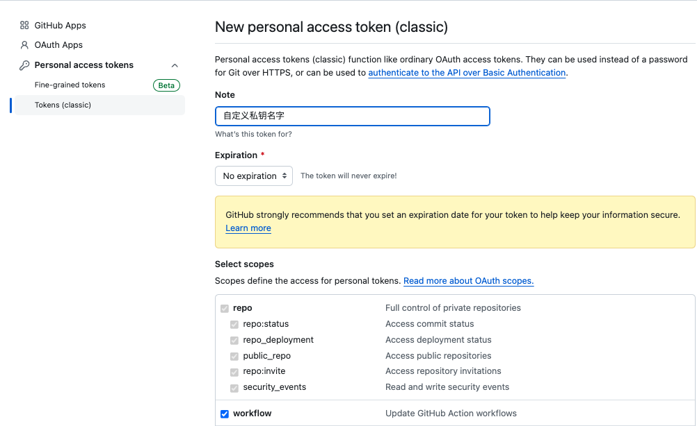
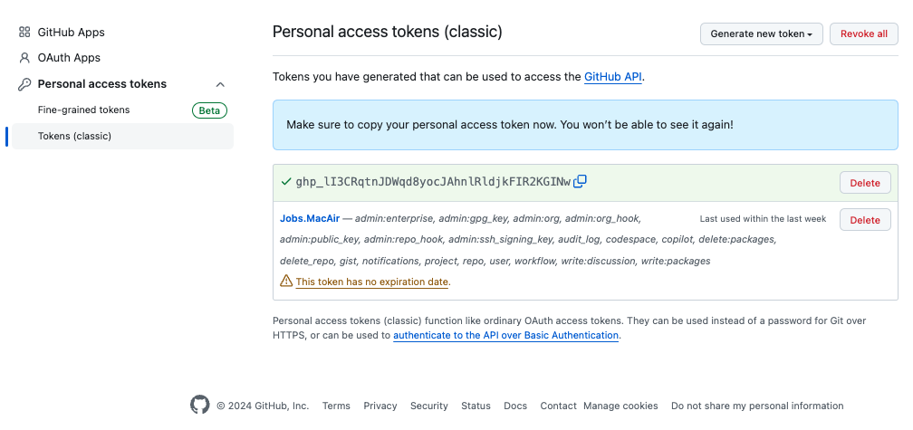
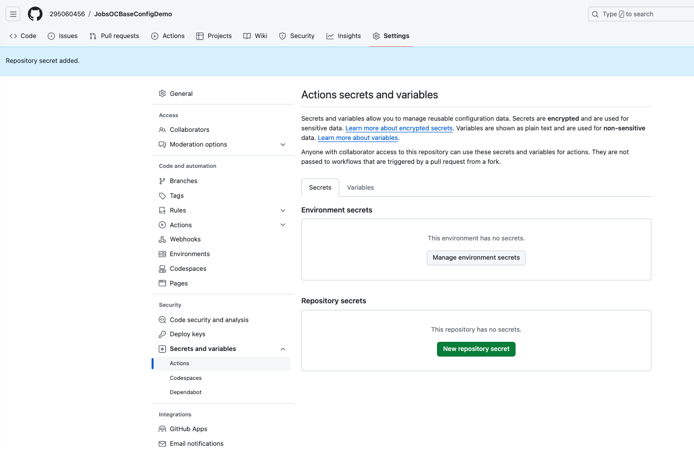
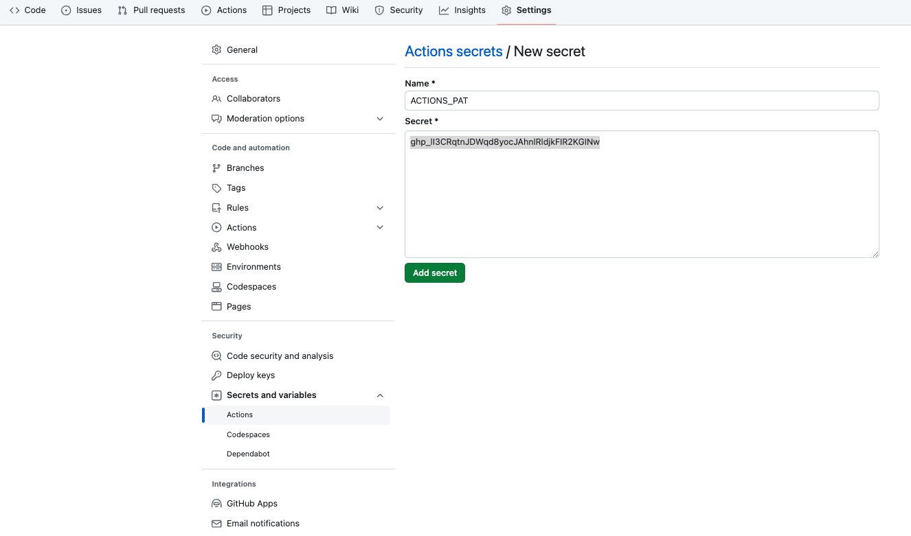

# Github.workflow（工作流）的使用

* 在项目根目录建立**`.github`**→**`workflows`**→**`generate_diagrams.yml`**

  * `generate_diagrams.yml`

    ```yml
    name: Generate Mermaid Diagrams
    
    on:
      push:
        branches:
          - main  # 或者您希望的其他分支
      workflow_dispatch:  # 允许手动触发
    
    jobs:
      build:
        runs-on: ubuntu-latest
    
        steps:
        - name: Checkout repository
          uses: actions/checkout@v2
    
        - name: Setup Node.js
          uses: actions/setup-node@v3
          with:
            node-version: '20'  # 使用最新版本的 Node.js
    
        - name: Install mermaid-cli
          run: npm install -g @mermaid-js/mermaid-cli
    
        - name: Generate Diagrams
          run: |
            echo "Current directory:"
            pwd
            echo "List files in current directory:"
            ls -al
            mkdir -p diagrams
            echo "List files in diagrams directory before generating diagram:"
            ls -al diagrams
            npx mmdc -i README.md -o diagrams/diagram.png -b transparent
            echo "List files in diagrams directory after generating diagram:"
            ls -al diagrams
            if ls diagrams/diagram-*.png 1> /dev/null 2>&1; then
              echo "Diagrams generated successfully"
            else
              echo "Diagram generation failed"
              exit 1
            fi
    
        - name: Commit and push diagram
          if: success()
          env:
            ACTIONS_PAT: ${{ secrets.ACTIONS_PAT }}
          run: |
            git config --global user.name 'github-actions'
            git config --global user.email 'github-actions@github.com'
            git add diagrams/diagram-*.png
            git commit -m 'Generate Mermaid diagram'
            git push https://${{ secrets.ACTIONS_PAT }}@github.com/${{ github.repository }}.git HEAD:main
    
    ```

* 只会在Github云上执行，而不是本地机器执行。最后将执行结果`git pull`下来

  ```shell
  ➜  JobsOCBaseConfigDemo git:(main) git add .github/workflows/generate_diagrams.yml
  git commit -m "Update GitHub Actions workflow to use PAT for pushing changes"
  git push origin main
  
  [main 148dab7] Update GitHub Actions workflow to use PAT for pushing changes
   1 file changed, 2 insertions(+), 3 deletions(-)
  Enumerating objects: 9, done.
  Counting objects: 100% (9/9), done.
  Delta compression using up to 8 threads
  Compressing objects: 100% (3/3), done.
  Writing objects: 100% (5/5), 494 bytes | 494.00 KiB/s, done.
  Total 5 (delta 2), reused 0 (delta 0), pack-reused 0
  remote: Resolving deltas: 100% (2/2), completed with 2 local objects.
  To github.com:295060456/JobsOCBaseConfigDemo.git
     79dd87d..148dab7  main -> main
  ```
  
* 
  
* 获得与本机相关联的私钥
  
  * `https://github.com/settings/profile`→`https://github.com/settings/apps`→`https://github.com/settings/tokens`
  
  * workflow选项打钩✅
  
    
  
  * <font color=red>**得到私钥（牢记，不得外泄）**</font>
  
      

* 在Github云中，具体的项目里面进行配置。点按`New repository secret`按钮

  

* 填写`Actions secrets`。Git Actions机器人需要有操作权限
  
  
  * `Name`中填写`ACTIONS_PAT`;
  * `Secret`中填写秘钥
  
  
  
  
