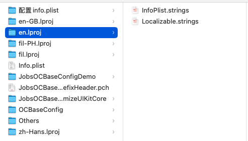

# iOS 多语言环境设置

## 目标

* App语言跟随当前手机系统语言
* 用户主动切换当前App语言，即：App语言不同于手机系统语言

## 参考资料

* [**3分钟实现iOS语言本地化/国际化（图文详解）**](https://cloud.tencent.com/developer/article/1143302)
* [**iOS App内语言切换（国际化）**](https://blog.csdn.net/shanghaibao123/article/details/107323395)
* [**在iOS App内优雅的动态切换语言**](https://www.jianshu.com/p/b4288e5e6e4c)
* [**iOS国际化 （多语言）**](https://juejin.cn/post/6966232778987798558)
* [**Demos-LanguageSettingsDemo**](https://github.com/DarkAngel7/Demos-LanguageSettingsDemo/)

## 特别说明

* 经实践证明，如果配置多语言化，那么xcode将会刷新`Info.plist`,导致里面的注释消失。正确的做法是，对`Info.plist`进行备份，随时进行替换

## 配置流程

### xcode 中的配置

* 选中 **project** → **Info** → **Localizations**，然后点击"+"，添加需要国际化/本地化的语言

  * 默认勾选`Use Base Internationalization`
    
    
  * 如果不勾选`Use Base Internationalization`
    
    
  * 添加语言：简体中文/标准英语/菲律宾他加禄语言
    

  * `zh-Hans`和`zh-Hant`是简体中文和繁体中文的缩写。这是标准的缩写。H可大写也可小写。
    
  * 如果弹出如下对话框，直接点击finish
    
### 应用名称本地化/国际化（`InfoPlist.strings`）
* 是指同一个App的名称，在不同的语言环境下（也就是手机设备的语言设置）显示不同的名称；
  比如，微信在简体中文环境下App名称显示为**微信**，在英语环境下显示为**weChat**
  * 新建 **`Strings File`** 文件
    
  * <font color=red>**保存的文件名`InfoPlist.strings`为系统所需，不可更改**</font>
    
  * 新生成的`InfoPlist.strings`在<u>当前电脑上的实际路径</u>，其实是在`en.lproj`文件夹下。其中`en.lproj`和此工程项目的`Info.plist `处于同一文件层级；
    
  * 但是，<u>在xcode目录索引中</u>，新生成的`InfoPlist.strings` 必须和 此工程项目的`Info.plist `处于同一文件层级。<font color=red>**否则，无法被正常检出读取**</font>
  * 当删除磁盘上的语言包`*.lproj`文件夹，项目工程xcode目录索引还有引用，也需要一并删除。在xcode右侧的文件选项卡中，移除勾选。弹出框选择`Remove`
  * 
  * <font id=Localize color=blue>**Localize流程**</font>：选中新生成的`InfoPlist.strings`，在xcode的File inspection（xcode右侧文件检查器）中点击Localize，目的是选择我们需要本地化的语言
  * 点击Localize后，会弹出一个对话框，展开对话框列表，发现下拉列表所展示的语言正是我们在上面配置的需要国际化的语言，选择我们需要本地化的语言，然后点击对话框的Localize按钮
    
    
  * <font color=red>注意：如果我们没有在 PROJECT 中配置需要国际化的语言（**project** → **Info** → **Localizations**，然后点击"+"），上图下拉列表中将只会出现`Base`和`English`选项，English语言是系统默认的语言，其他需要国际化的语言（例如中文简体、法语）必须通过上面的**配置本地化语言**那一步手动添加。</font>
  * 添加了`InfoPlist.strings`在 **project** → **Info** → **Localizations** 下可以看到有文件被检测到关联：
    
  * <font color=red>**如果项目曾经有做过过多语言化的处理，则右侧选项卡不会`Localize`按钮，也不会弹出`Do you want to localize this file`对话框**</font>
  * <font id=在xcode右侧选项卡进行点选>**对`InfoPlist.strings`在 xcode 右侧选项卡进行点选**</font>：
    `InfoPlist.strings`会化身为一个大的文件夹，下面包含各种语言包的子`InfoPlist.strings`     <font color=red>点一个加入一个</font>
    
  
* 对`Info.plist`的修改：

  * 向下兼容：

    ```xml
    <key>LSHasLocalizedDisplayName</key>
    <true/>
    ```

    

### 代码中字符串的本地化（`Localizable.strings`）

* 指App内的字符串在不同的语言环境下显示不同的内容；
* <font color=red>**保存的文件名`Localizable.strings`为系统所需，不可更改**</font>
* 像创建 `InfoPlist.strings` 一样，新建 `Localizable.strings` 文件，包括[**Localize流程**](#Localize)；
* 新生成的`Localizable.strings`文件，位于`en.lproj`文件夹之下，和`InfoPlist.strings`平行；
  
* 对新生成的`Localizable.strings`文件，在xcode右侧选项卡进行点选，[**和`InfoPlist.strings`的操作一样**](#在xcode右侧选项卡进行点选)；

### 图片本地化

* 方式一：和本地化代码中的字符串一样，通过NSLocalizedString(key,comment)来获取相应的字符串，然后根据这个字符串再获取图片。
  ```objective-c
  NSString *imageName = NSLocalizedString(@"icon", nil);
  UIImage *image = [UIImage imageNamed:imageName];
  self.imageView.image = image;
  ```

* 方式二：

### 第三方支援

*CLLanguageManager.h*

```objective-c
#import <Foundation/Foundation.h>
#import "NSString+Judgment.h"

NS_ASSUME_NONNULL_BEGIN

@interface CLLanguageManager : NSObject
/**
 用户自定义使用的语言，当传nil时，等同于resetSystemLanguage
 */
@property(class,nonatomic,strong,nullable)NSString *userLanguage;
/**
 重置系统语言
 */
+(void)resetSystemLanguage;

@end

NS_ASSUME_NONNULL_END
```

*CLLanguageManager.m*

```objective-c
#import "CLLanguageManager.h"

static NSString *CLUserLanguageKey = @"CLUserLanguageKey";

@implementation CLLanguageManager

+(void)setUserLanguage:(nullable NSString *)userLanguage{
    //跟随手机系统
    if ([NSString isNullString:userLanguage]) {
        [self resetSystemLanguage];
        return;
    }
    //用户自定义
    [NSUserDefaults.standardUserDefaults setValue:userLanguage forKey:CLUserLanguageKey];
    [NSUserDefaults.standardUserDefaults synchronize];
}

+(nullable NSString *)userLanguage{
    return [NSUserDefaults.standardUserDefaults valueForKey:CLUserLanguageKey];
}
/**
 重置系统语言
 */
+(void)resetSystemLanguage{
    [NSUserDefaults.standardUserDefaults removeObjectForKey:CLUserLanguageKey];
    [NSUserDefaults.standardUserDefaults synchronize];
}

@end
```

### 相关调用

* 原理：应用启动时，首先会读取**NSUserDefaults**中的key为AppleLanguages对应的value，该value是一个String数组。也就是说，我们访问这个名为AppleLanguages的key可以返回一个string数组，该数组存储着APP支持的语言列表，数组的第一项为APP当前默认的语言。

  ```objective-c
  NSArray *languages = [[NSUserDefaults standardUserDefaults] valueForKey:@"AppleLanguages"];
  NSString *currentLanguage = languages.firstObject;
  NSLog(@"模拟器当前语言：%@",currentLanguage);  查看/切换本地语言
  ```

* 同理，既然我们可以通过AppleLanguages这个key从**NSUserDefaults**中取出语言数组，那么我们也可以给AppleLanguages这个key赋值来达到切换本地语言的效果，从此以后，我们就无需频繁的去模拟器的设置->通用->语言与地区 中切换语言。

  ```objective-c
  // 切换语言前
  NSArray *langArr1 = [[NSUserDefaults standardUserDefaults] valueForKey:@"AppleLanguages"];
  NSString *language1 = langArr1.firstObject;
  NSLog(@"模拟器语言切换之前：%@",language1);
  // 切换语言
  NSArray *lans = @[@"en"];
  [[NSUserDefaults standardUserDefaults] setObject:lans forKey:@"AppleLanguages"];
  // 切换语言后
  NSArray *langArr2 = [[NSUserDefaults standardUserDefaults] valueForKey:@"AppleLanguages"];
  NSString *language2 = langArr2.firstObject;
  NSLog(@"模拟器语言切换之后：%@",language2);
  ```


### 总结

* 其实是操作语言包文件夹`*.lproj`内的`InfoPlist.strings`和`Localizable.strings`。所以一定确保这两个文件一定是包含在工程文件里（需要进入编译期）
* 语言包文件夹`*.lproj`的名字，就是每个语言对应的索引；
* `InfoPlist.strings`：App名字的多语言化
* `Localizable.strings`：App内容的多语言化
