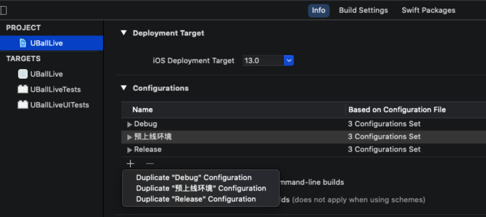
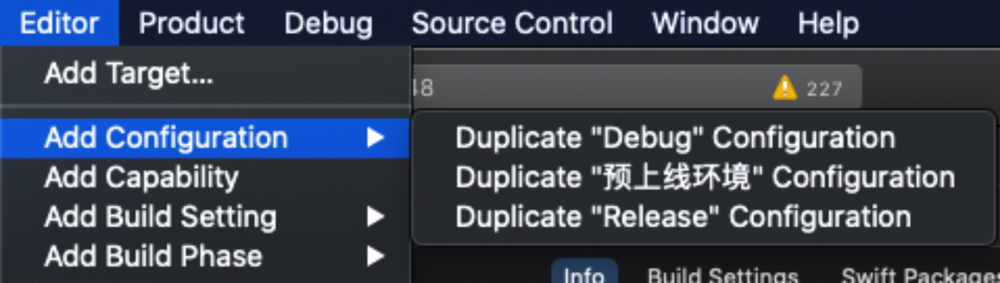
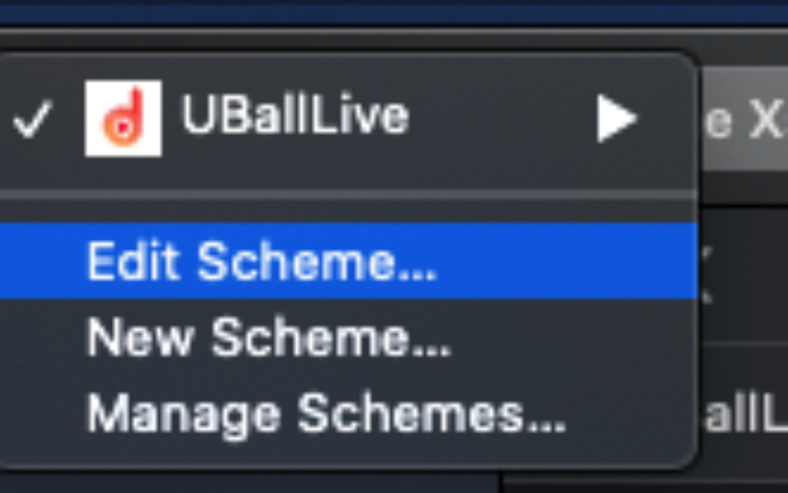
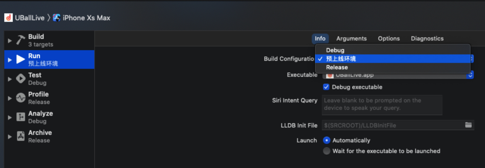
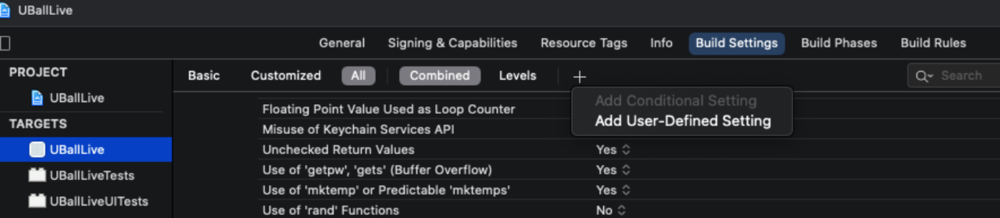
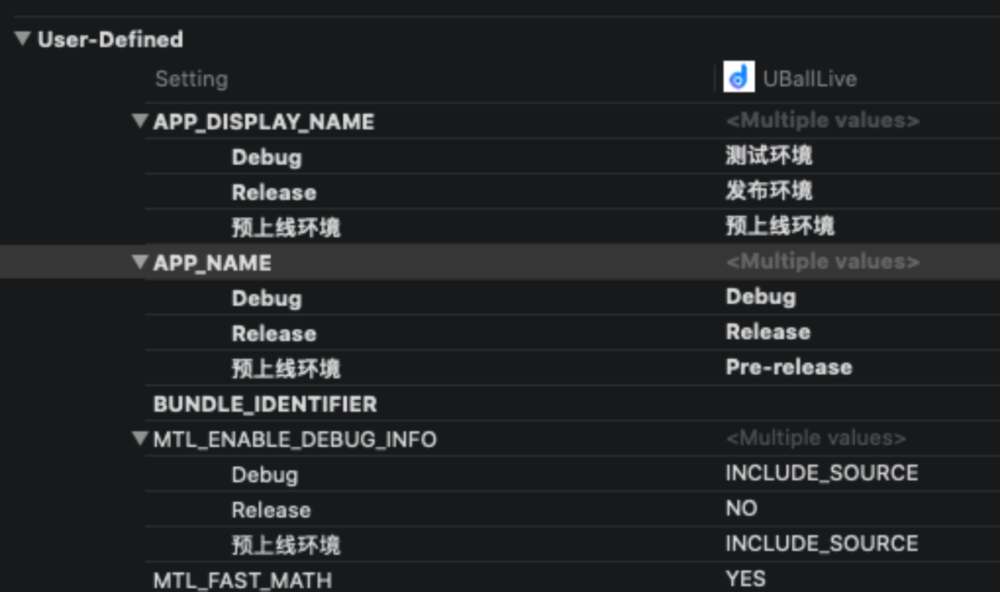
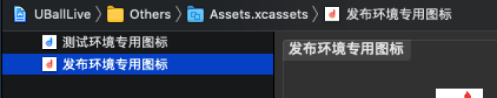
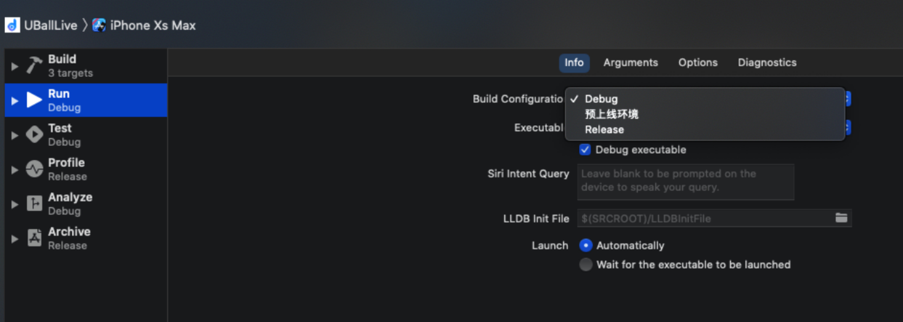
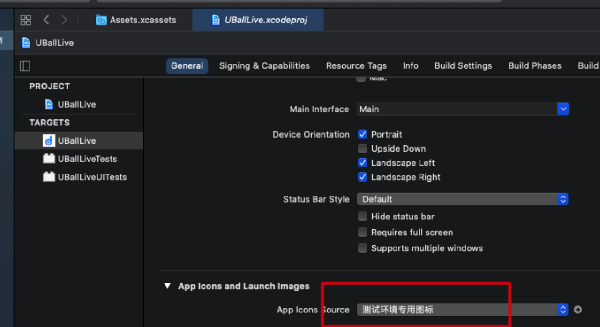

# 同一应用设置不同图标和名称

## 1、前言

```
同一个App，在不同环境下，显示不同的包名和icon
前提和必要性：根据生产和开发经验，App拥有至少下列几种环境：
1、本地测试环境；
2、UAT预上线环境（1、2、3、4...）；
3、线上生产环境（可能存在的来自不同渠道的环境1、2、3、4...）；
...

GUI图形化界面的一个优势就是对其进行区分，加快效率和过滤中间繁琐环节...
一般的iOS开发都没有去关心这一块内容，但是我又觉得有实际应用的必要，故在阅读大量文献和实践总结以后，对其知识点进行归纳和总结：
```

## 2、先决理论知识

```
xcode在建立一个工程的时候，默认给出了debug和release两种模式，实际上程序员可以根据实际条件进行自定义；
然后进行关联（你不关联你的配置文件就进不去）；
```

附：[iOS动态修改App图标icon](https://www.jianshu.com/p/69313970d0e7)

## 3、具体的操作实践

*打开xcode，在xcode里面选中 “工程名..xcodeproj”,右边菜单栏选择Project -> info*

*方法一*



*方法二*



**1、选择一个 duplicate ;此时在工程的**





*这里面将出现您上一步duplicate 的东西；*

**现在自定义你的一些配置文件：**

**2、选择Targets，主工程（而不是测试工程），点击右边➕，如下图所示：**



**新增的自定义文件将出现在此页面最下部**

*比如我新增字段为APP_DISPLAY_NAME、APP_NAME*



```
这些字段仿佛是自己定义的，而非系统的全局字段，如果不小心写错需要删除直接按键盘的del键进行删除。对这些字段进行取值固定的写法为：
例如上面我们定义的APP_DISPLAY_NAME、APP_NAME
${APP_DISPLAY_NAME} 和 ${APP_NAME}
并在里面填入不同环境的不同包名
```

**3、icon图标用Assets.xcassests 进行管理，支持中文定义**



**4、配置好了以后，下次进行发布的时候，急着改两个地方，以实现不同环境下同一个App不同icon和包名**






